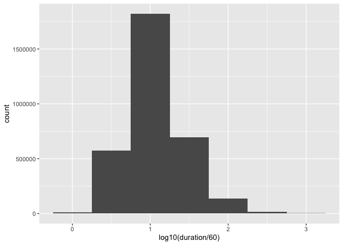
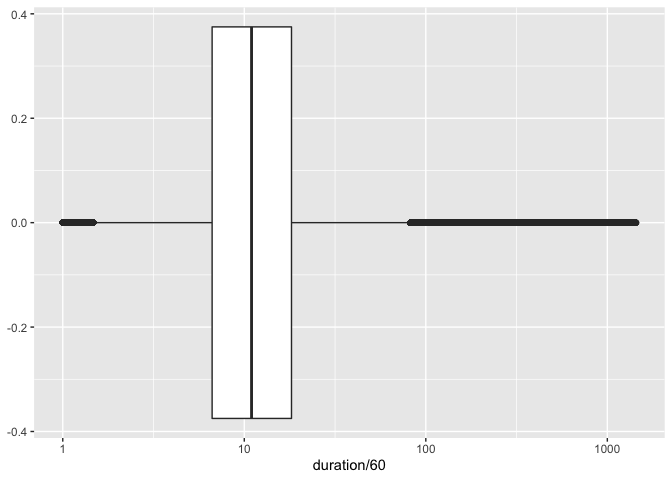
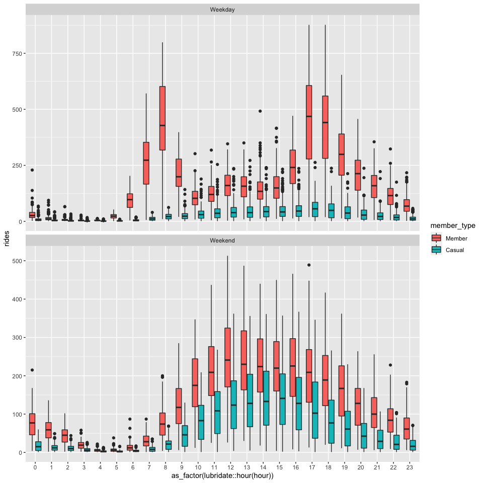

Homework 3: Bike Sharing Data Wrangling
================
YOUR NAME
TODAY’S DATE

Load Data
---------

    # Read the file, specifying data types for each column.
    rides_2011 <- read_csv("data/rides_2011.csv.gz", col_types = cols(
      start_time = col_datetime(),
      duration = col_double(),
      member_type = col_factor()
    ))
    rides_2012 <- read_csv("data/rides_2012.csv.gz", col_types = cols(
      start_time = col_datetime(),
      duration = col_double(),
      member_type = col_factor()
    ))

Exercise 1
----------

    rides <- bind_rows(
      rides_2011,
      rides_2012
    )

There are 3255678 rides in this dataset.

Exercise 2
----------

`duration` is probably measured in seconds.

    median_ride_duration <- median(rides$duration)

1.  The median of `duration` is 658.
2.  If duration were measured in seconds, the median ride duration would
    be 658 sec / (60 sec/min) = 10.97 minutes (i.e., half of all rides
    would be shorter than 11 minutes).
3.  If duration were measured in the next smaller unit (milliseconds),
    the median ride length would be 0.658 seconds.
4.  If duration were measured in the next larger unit (minutes), half of
    all rides would be longer than 658 min / (60 min / hr) = 10.97
    hours.
5.  Of these possibilities, 10 minutes is the most plausible, given my
    own experience riding bikes (1 sec isn’t long enough to get
    anywhere, and 11 hours is a very long ride).
6.  Since interpreting duration as being reported in seconds gave the
    most realistic median ride duration when compared with both the next
    smaller and larger common units, I infer that seconds is the most
    plausible unit.

Some rides are as short as 60 seconds (1 minute), and others are as long
as 86,355, which is most of a day (86,400 seconds).

We can also visualize the order of magnitude of duration using a
histogram of the base-10 log of the duration. We’ll go ahead and divide
by 60 so the scale is in minutes:

    rides %>% 
      ggplot(aes(x = log10(duration / 60))) +
        geom_histogram(binwidth = .5)

<!-- -->

or a boxplot drawn on a log scale:

    ggplot(rides, aes(x = duration / 60)) +
      geom_boxplot() +
      scale_x_log10()

<!-- -->

Let’s also look at the quantiles (the edges of the box) directly:

    quantile(rides$duration / 60, c(.25, .75))

    ##   25%   75% 
    ##  6.65 18.20

If we assume that duration is measured in seconds, both graphs show us
that the bulk of rides were between 6 and 20 minutes, which seems very
reasonable.

Exercise 3
----------

    rides %>%
      count(member_type)

    ## # A tibble: 3 x 2
    ##   member_type       n
    ##   <fct>         <int>
    ## 1 Member      2636066
    ## 2 Casual       619591
    ## 3 Unknown          21

Exercise 4
----------

    hourly_rides <- rides %>%
      group_by(start_hour = floor_date(start_time, unit = "hours")) %>% 
      count()

Exercise 5
----------

    hourly_rides <- rides %>%
      group_by(hour = floor_date(start_time, unit = "hours"), member_type) %>% 
      summarize(rides = n())

Exercise 6
----------

    daily_rides <- rides %>%
      group_by(day = floor_date(start_time, unit = "days"), member_type) %>% 
      summarize(rides = n())

Exercise 7
----------

    hourly_rides %>%
      filter(member_type != "Unknown") %>% 
      ggplot(aes(x = wday(hour, label = TRUE), y = rides, fill = member_type)) +
      geom_boxplot() +
      labs(y = "Rides", x = "Day of Week", fill = "Type of Rider")

<!-- -->

Exercise 8
----------

| weekday | Member | Casual |
|:--------|-------:|-------:|
| Sun     |     88 |     27 |
| Mon     |    111 |     18 |
| Tue     |    120 |     18 |
| Wed     |    121 |     17 |
| Thu     |    128 |     18 |
| Fri     |    134 |     21 |
| Sat     |     99 |     29 |

Exercise 9
----------

    hourly_rides %>% 
      filter(member_type != "Unknown") %>% 
      mutate(is_weekend = if_else(
        wday(hour, label = TRUE) %in% c("Sat", "Sun"),
        "Weekend", "Weekday")) %>% 
      ggplot(aes(x = as_factor(lubridate::hour(hour)), y = rides, fill = member_type)) + 
        geom_boxplot() +
        facet_wrap(~ is_weekend, scales = "free_y", nrow = 2)

<!-- -->
