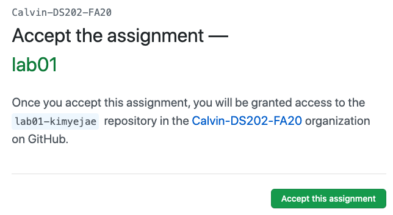
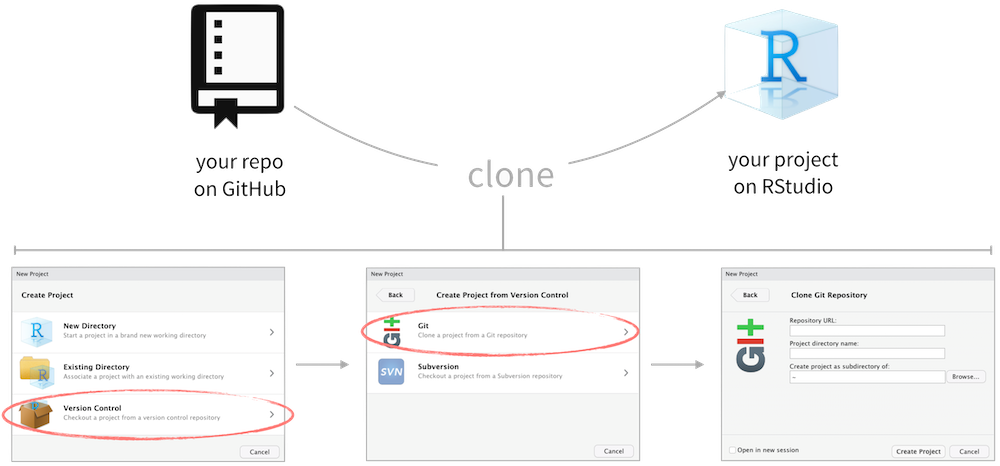
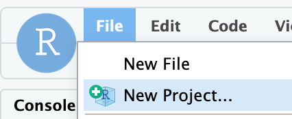

```{r setup, include=FALSE}
knitr::opts_chunk$set(echo = TRUE)
```

## How Guided Exercises work

We will do these guided "lab" exercises in pairs, typically in the computer lab. The format will be reminiscent of the POGIL exercises that many students did in CS 106 or 108.

Today's exercise is all about getting started, so each student will need to do all the setup steps. But you should discuss and answer the reflection questions together. For today we won't assign specific roles to specific students, but we will do that in the future.

## Configuring SSH and GitHub

We'll be using GitHub for distributing and collecting assignments in this class. It's a complex tool (perhaps overly so!), but it's worth putting in the effort to learn it for at least 3 reasons:

1.  It's *very* commonly used in both industry and academia,
2.  It embodies our values of integrity and transparency, and
3.  It enables structured collaboration.

Getting it set up requires crossing a number of hurdles. Thankfully, almost all of these we only need to do once! So don't worry about understanding or memorizing the details in this section.

### Create a GitHub account

Go to [github.com](https://github.com/) and create an account (unless you already have one).

Below are some tips for selecting a username:^[[Happy git with R](http://happygitwithr.com/github-acct.html#username-advice) by Jenny Bryan]

- Reuse username from other contexts, e.g. Twitter.
- Incorporate your actual name
- Pick a username you will be comfortable revealing to your future boss.
- Shorter is better than longer.
- Be as unique as possible in as few characters as possible.
- Make it timeless. Don’t highlight your current university, employer, etc.

### Get your starter code

- Go to https://classroom.github.com/a/zUP1ptqo to accept your exercise "assignment". Since this is the first assignment, clicking on this link will also allow you to join the course GitHub organization. Log in with your GitHub username and password and click on **Authorize GitHub**.

- In the next screen you will see a course roster with names of students enrolled in this course. Select your name from the list. **Make sure you select the correct name!**

```{r github-classroom, fig.margin = TRUE, echo = FALSE}

```

- Then, in the next screen, click on **Accept this assignment**. This will create the GitHub repo for the assignment. This repo contains a template you can build on to complete your assignment. Click on the repository link created for you to get started.

### Log into RStudio

Go to https://rstudio.calvin.edu/ (or click the link on Moodle). Bookmark this page; it will be the main tool you use in this class.

Log in using your Calvin username (your email before the `@students` part) and password.

### Connect RStudio to GitHub

GitHub very recently stopped letting us use a username and password, so we'll have to jump through a few hoops. Fortunately you'll only need to do this once.

1. Type `credentials::ssh_setup_github()` into the RStudio Console (on the left side of RStudio, possibly at the bottom) and press Enter.
2. Follow the instructions it gives. You'll need to answer yes to both questions (generate a key, open a browser) by entering `1`.
3. Copy and paste the key into GitHub. To do this: select the entire key (starting with `ssh-rsa` and going until the end, probably spanning several lines), press Ctrl-C (or Command-C on Macs), then go to the [GitHub Add SSH Key tab](https://github.com/settings/ssh/new) that should have opened and paste the key in the big text box there. You can title the key "Calvin RStudio Server".

If you're having trouble with these instructions, see [this guide](https://github.com/DukeStatSci/github_auth_guide), and ask a course staff member to get unstuck.

### Cloning the repo

Go back to the page for your starter code (if you closed the tab, click the link in "Get your starter code" above). This is called your **repo** (short for *repository*). You can edit it; only you and the course staff can see it.

#### Get the repo's *SSH* URL

Click the green **Code** button. Click **SSH** in the popup, and you'll see a URL that starts with `git@github.com:...`. Click the button next to that URL to copy the whole thing.

### Clone the repo on RStudio

And finally we clone the GitHub repo into an RStudio project.

```{r clone-repo-rstudio, fig.fullwidth=TRUE, echo = FALSE}

```

```{r fig.margin = TRUE, echo = FALSE}

```


- In RStudio, click on File > New Project
- In the next window, select Git
- In the final window:
  - Repository URL: Paste the repo URL you grabbed from GitHub here
  - Press the tab key on your keyboard, and the project name will be filled in for you
  - Click Create Project.

## Inquiry 1: the GitHub workflow

If you and your partner both got this far, do a little something to celebrate! (elbow bump, shout "Yay!", etc.)

Now start paying attention to what's going on, because this is an observation exercise.

For this exercise, you'll need to have your GitHub repo open in one tab/window and RStudio open in another.

For each question, write down your answers either on paper or in an electronic note.

1. In *GitHub*, open the file named `ex01.Rmd`. Notice that the first few lines of the file specify a title and author. **What does this file specify as the author name?**

2. In *RStudio*, open the file named `ex01.Rmd` (you'll see it in the Files tab on the bottom-right). **Does this file have the same contents as the one on GitHub?**

3. In *RStudio*, click the **Knit** button on the toolbar above the file editor. **What shows up where when you press Knit?**

4. Change the author name to your name. **What action is required for changes in the Source editor to be reflected in the generated report?**
	- Look on GitHub. Have the changes been made there yet?
	- Look on the Git tab. What do you notice there?
	- Commit. (stage) Use this message: "..."
		- Look on GitHub; has it changed?
		- What message do you see in the Git tab?
	- Click Push. Check GitHub. What do you see now
	- Apply
		- Change the title of the report. Get the new title to appear on GitHub.
		- List the steps in the process of making a change in GitHub.
		- Describe what the Git tab in RStudio looks like when the changes you've made show up on GitHub.
- model 2: An RMarkdown document
	- What is the name of the first code cell? Second code cell?
	- Run individual cells. (e.g., an increment cell)
		- What happens if you run cells out of order? repeatedly?
		- What happens when you Knit?
	- Which of the following causes a value to be displayed? expression; assignment statement; assignment statement followed by expression?
		- Describe why an output is shown under cell 2 vs cell 3
	-
