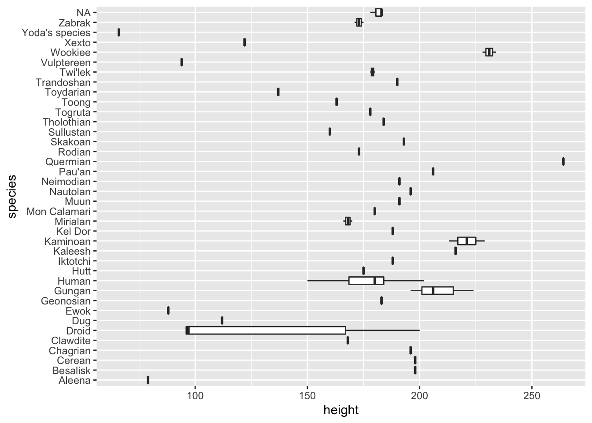
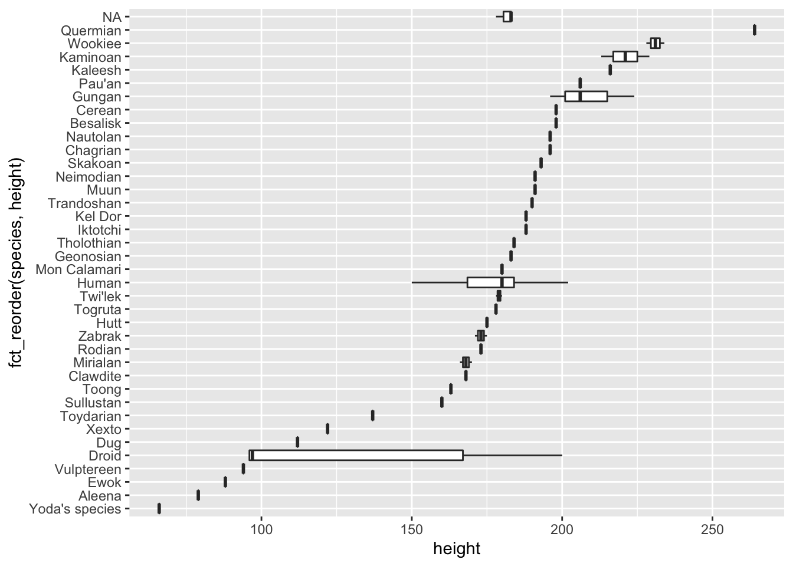
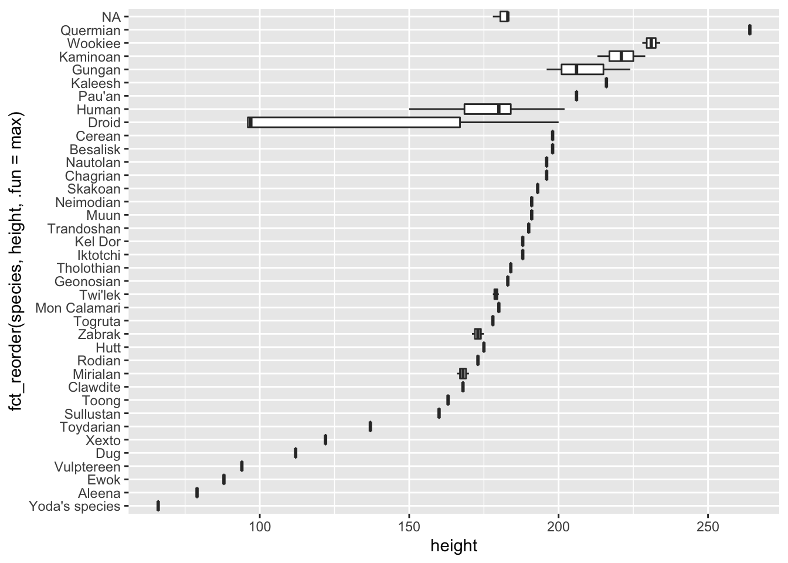
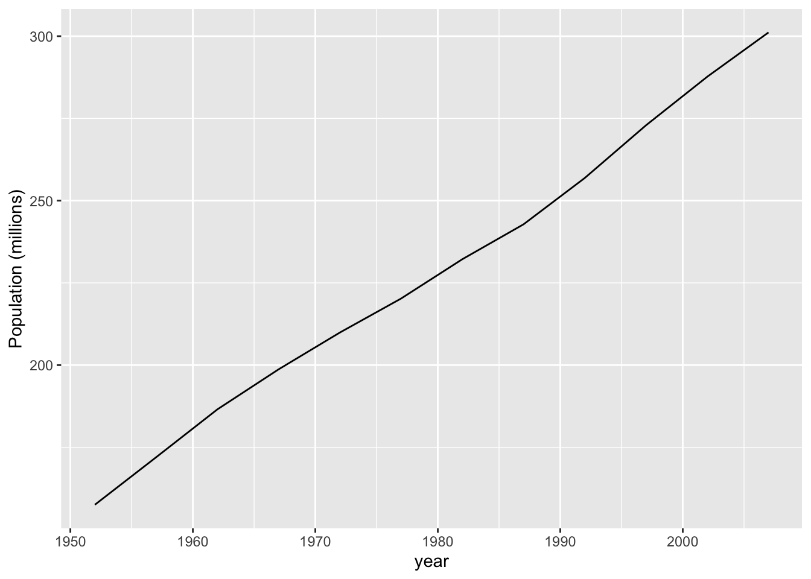
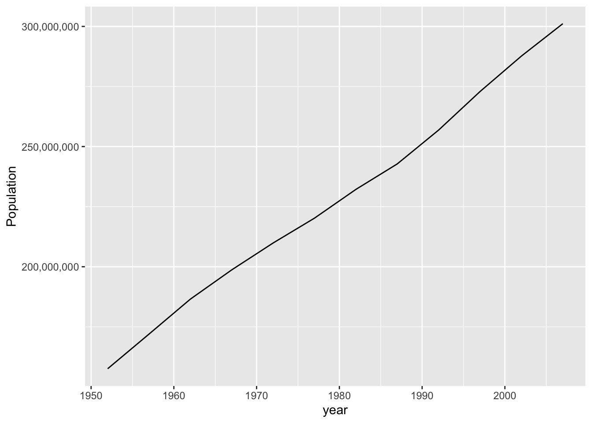
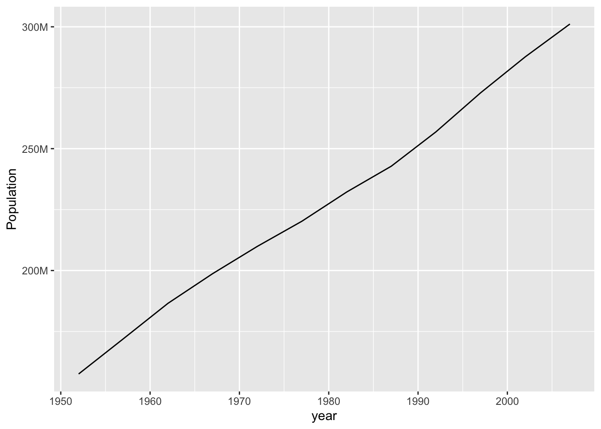

# Visualization

We start with visualization because, well, you can see the results.

## Reading

To design good visuals, you need both *why*s and *how*s. You may have come here for the *how*s, but both are important. Our tools are changing more rapidly than ever, so if we want knowledge that lasts, we really need to know the *why*.

### Why

Read **[Look at Data](https://socviz.co/lookatdata.html)** from Healy "Data Visualization".

The text is wordy but well organized, so your speed reading skills should work well. Look at the examples: can you explain to someone else what those examples show?

### How

Read [**Data Visualization**](https://moderndive.com/2-viz.html) from ModernDive.

Try to actually answer the "Learning Check" questions for yourself. Yes this takes longer than just skimming right past them. But they may show up on a quiz...

## Application

* You did some visualization in Lab 1. How did that exercise relate to the "why" reading?

## References

* If you're the slides type, [here's some slides](https://datasciencebox.org/exploring-data.html#slides-application-exercises).
We got to most of this material but not quite all of it yet.
* <https://socviz.co/>
* [Fundamentals of Data Visualization](https://clauswilke.com/dataviz/)

## Tweaks

### Reordering bars in a bar plot

Use `fct_reorder` on the categorical variable.


```r
starwars %>% 
  drop_na(height) %>% 
  ggplot(aes(x = height, y = species)) +
  geom_boxplot()
```




```r
starwars %>% 
  drop_na(height) %>% 
  ggplot(aes(x = height, y = fct_reorder(species, height))) +
  geom_boxplot()
```




```r
starwars %>% 
  drop_na(height) %>% 
  ggplot(aes(x = height, y = fct_reorder(species, height, .fun = max))) +
  geom_boxplot()
```



For more info, see the [forcats vignette](https://cran.r-project.org/web/packages/forcats/vignettes/forcats.html).

### Tweaking scales

A common request: scientific notation vs not. A few options:

1. Use different units. e.g., millions of people.


```r
gapminder::gapminder %>% 
  filter(country == "United States") %>% 
  ggplot(aes(x = year, y = pop / 1e6)) +
  geom_line() +
  labs(y = "Population (millions)")
```



2. Use `scale_y_continuous` with `labels = scales::comma`.


```r
gapminder::gapminder %>% 
  filter(country == "United States") %>% 
  ggplot(aes(x = year, y = pop)) +
  geom_line() +
  scale_y_continuous(labels = scales::comma) + 
  labs(y = "Population")
```



3. Use `scales::label_number` for even more control (see the help page).


```r
gapminder::gapminder %>% 
  filter(country == "United States") %>% 
  ggplot(aes(x = year, y = pop)) +
  geom_line() +
  scale_y_continuous(labels = scales::label_number(scale = 1e-6, suffix = "M")) + 
  labs(y = "Population")
```


