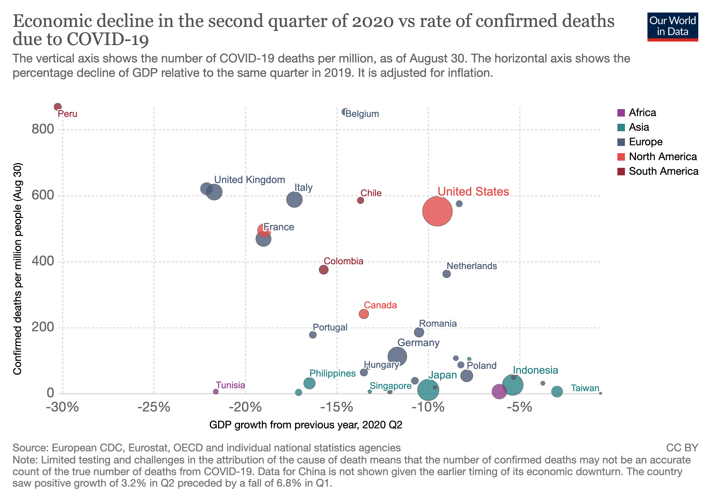
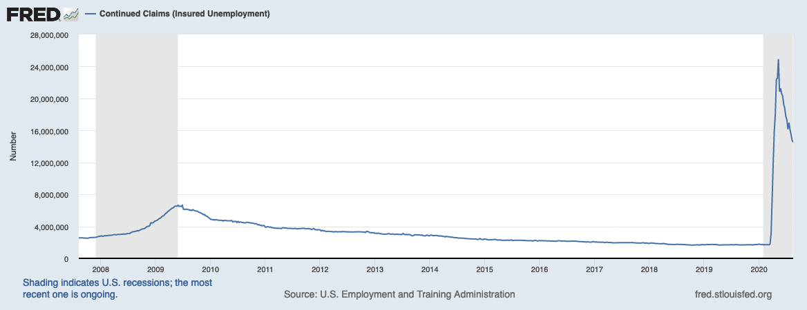
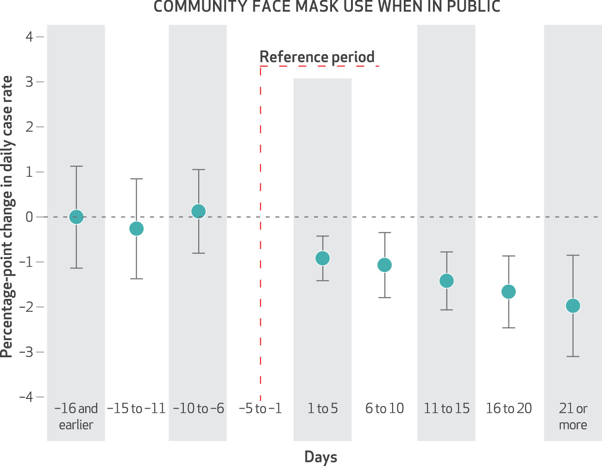
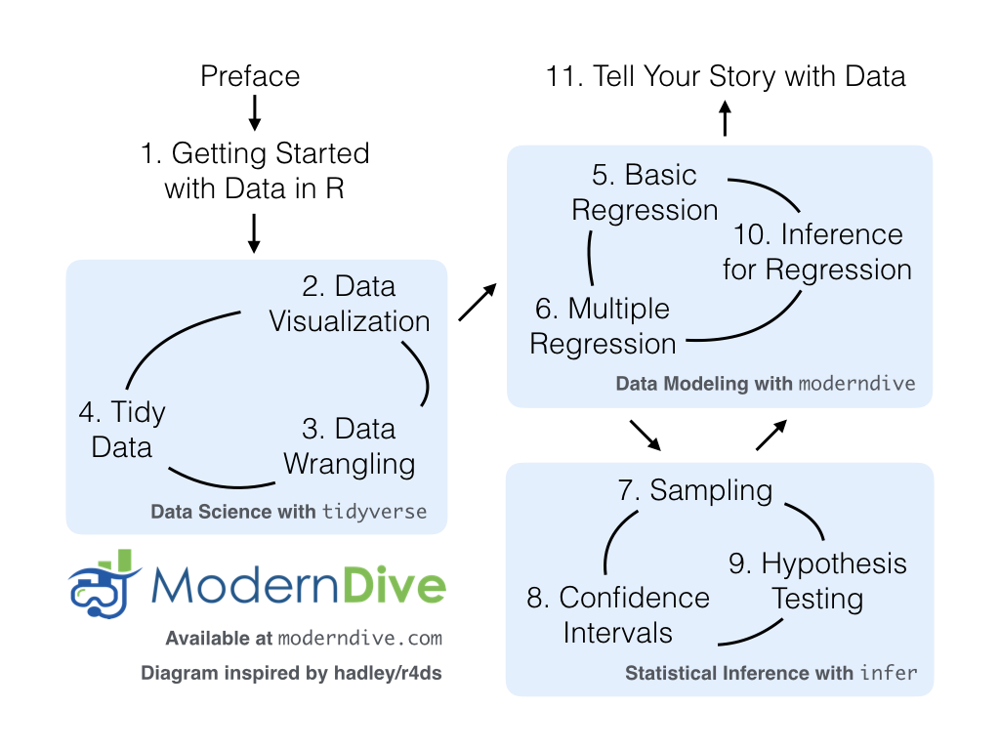

class: middle

## Pandemic!

1. Please show your *CampusClear* completion as you enter.

2. We need a volunteer: Remote Student Representative
  * Watch the Teams chat
  * Alert instructor to questions or problems

3. (remote) attendance policy

---

## Data Science: a lens for seeing

* **Data**: information, collected systematically
* **Science**: systematic study of that data

---

class: middle, center

## Visualization

---

```{r fig.align='center', echo=FALSE, alt="Health vs Economy?", out.width="90%"}

```

.small[
Source: https://ourworldindata.org/covid-health-economy
]

---

class: center, middle

```{r fig.align='center', echo=FALSE, alt="Unemployment", out.width="100%"}

```

.small[
Source: https://fred.stlouisfed.org/graph/?g=v4rP
]

---

## Inference

```{r fig.align='center', echo=FALSE, alt="Impact of Mask Policies", out.width="70%"}

```

.small[
Wei Lyu and George L. Wehby. *Community Use Of Face Masks And COVID-19: Evidence From A Natural Experiment Of State Mandates In The US*. https://doi.org/10.1377/hlthaff.2020.00818
]
---

## Prediction

```{r fig.align="center", echo=FALSE, alt="Frequently Bought With", out.width="50%"}

```

.small[
Source: https://tech.instacart.com/3-million-instacart-orders-open-sourced-d40d29ead6f2
]

---

## The DS Life Cycle

```{r fig.align='center', echo=FALSE, alt="Data Science Life Cycle", out.width="70%"}

```

.small[
Source: https://moderndive.com/preface.html
]

---


## Our Goals

* *Skill*: how to do these things
* *Knowledge*: understanding the underlying concepts
* *Character*: how to practice these skills wisely

---

## Character??

DS is a lens. We must learn to see rightly. Some areas:

* Humility
* Integrity / Honesty
* Hospitality
* Compassion and justice

---

## Humility

Challenge: data feels powerful, people listen to what you use it to say.

So we will practice:

* Citing all sources (for both data and process)
* Acknowledging limitations
* Transparent process
* Validation of results

---

## Integrity

It’s tempting to say something that isn’t entirely true, or to manipulate the collection/analysis/reporting process to yield the answer you want

So we will practice:

* Evaluating claims that others use data to make
* Clearly articulating our analysis decisions and rationale
* Using exploratory analytics to validate data against assumptions

---

## Hospitality

We can choose to use our tools to elucidate and clarify, rather than obscure.

So we will practice:

* Clear visual communication
* Clarity of code and process
* Writing explanations that are accessible and appropriate to audience.

---

## Compassion and Justice

Data Science can both cause harm and reveal it.

So we will:

* Study examples of how data might cause harm
* Study examples of how harm might be mitigated or revealed


---

## Where is this course?

<br><br><br><br>

.large[
.center[
[tiny.cc/data202](http://tiny.cc/data202)
]
]

---

## Who am I?

.pull-left[
```{r fig.align="center", echo=FALSE, alt="Ken", out.width="70%"}

```
]
.pull-right[
.midi[
- **Office:** NH 298
- **Office hours:** TBD (fill out the poll!)
- **Email:** ka37@calvin.edu (but post course questions on Teams!)
  ]
]

---

class: middle, center

## Let's do some data science!

Go [here](https://rsconnect.calvin.edu:3939/content/96/)


---

# Acknowledgments

Much of the first weeks of this course is adapted from [introds.org](https://introds.org/)
by the excellent [Dr. Mine Çetinkaya-Rundel](https://www2.stat.duke.edu/~mc301/) at University of Edinburgh.
