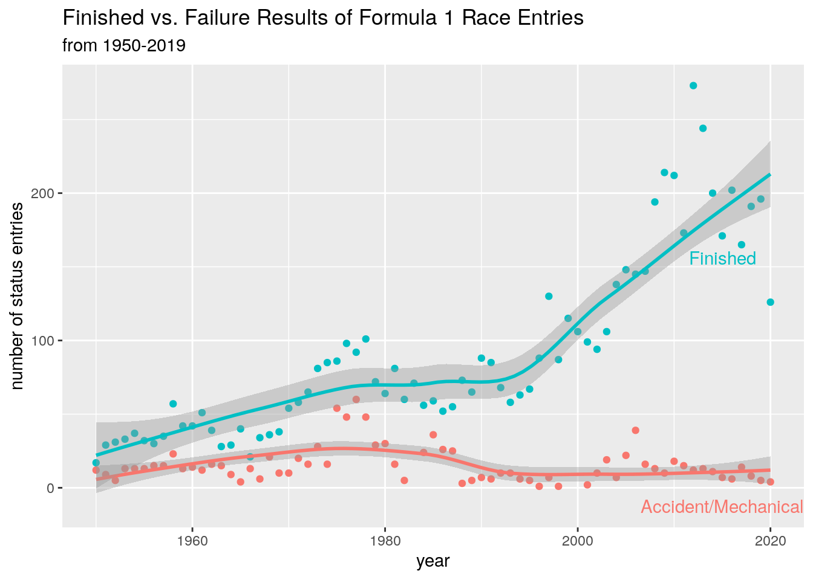
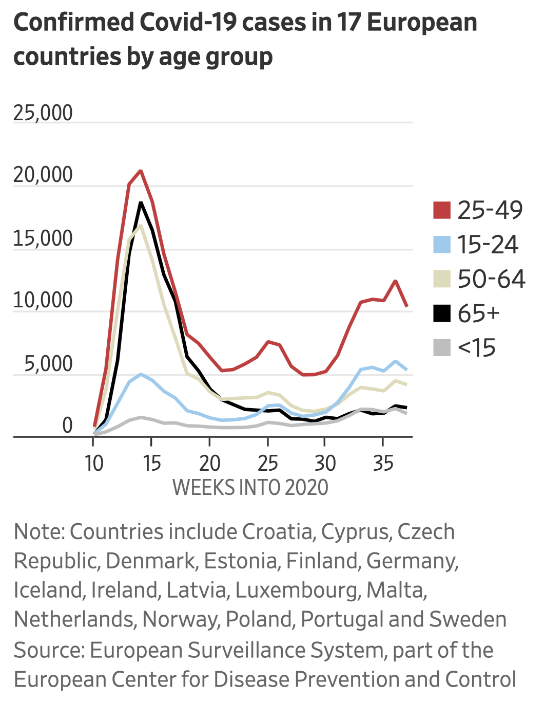

```{r setup, include=FALSE, message=FALSE}
source("../slides-common.R")
slideSetup()
library(tidyverse)
library(unvotes)
library(lubridate)
library(scales)
#if (!interactive()) knitr::opts_chunk$set(message = FALSE)
```


class: middle

# Opening Prayer

From the apostle Paul's letter to the Philippians:

> This is my prayer: <br>that your love may abound more and more<br> in knowledge and depth of insight,<br>so that you may be able to discern what is best and may be pure and blameless for the day of Christ, filled with the fruit of righteousness that comes through Jesus Christ—to the glory and praise of God.

---

class: middle

# What is Data Science?

--

* **Data**: information, collected systematically
* **Science**: systematic study of that data

---

# What is this course?

- **visualization**: communicating data to humans
- **modeling** and validation: using data to perform tasks
- but first, **data wrangling**: How to transform data into the structure you need for visualization and modeling

...using **computing** in the R language (`#rstats`) and occasionally other tools

---

# Where are we going?

.col2[
* Visualization Overview
* Visualization Details
* Wrangling (single-table)
* Wrangling (multiple tables)
* Tidy data
* Applications and Ethics
* Statistical Foundations Review
* Supervised Learning using Trees
* Unsupervised Learning
* Databases and APIs
* Other Supervised Learning Methods
* Parameter Tuning and Overfitting
* Text as Data
* Geospatial Data
]

---


```{r echo=FALSE, out.width="100%"}
knitr::include_graphics("img/f1-safety.png")
```

???
The original plot looked fancy, but was hard to read and made erroneous conclusions.

---

```{r echo=FALSE, out.width="75%"}

```

???
The student found the original data, noticed some nuances in the data that the
original vis author had overlooked.

Thoughtfully merged some race outcomes, plotted propertions, changed plot type...

much clearer, isn't it?

---

.pull-left[
```{r echo=FALSE, out.width="75%"}

```
]

.pull-right[
```{r echo=FALSE, out.width="100%"}
knitr::include_graphics("img/euro-covid-age-replication.png")
```
]

???

Original article used this visual to blame parties for COVID spread.

Student had trouble getting identical original data, but worked around it.

Reflected on original's design choice of red for young adults (pre-attentive processing); binning of ages (poor, but it was that way in the original data); whether data actually supports the claim (could be jobs etc.)

(kew24)

---

# Example final projects

* Predict how much a used car will sell for
* Forecast how much electricity will be used
* Predict how much a plane flight will cost


---

## Our Goals

* *Skill*: how to do these things
* *Knowledge*: understanding the underlying concepts
* *Dispositions*: wisdom in practicing these skills

---

class: middle, center

## Data Dispositions

---

## Humility

Challenge: data feels powerful, people listen to what you use it to say.

So we will practice:

* Citing all sources (for both data and process)
* Acknowledging limitations
* Noticing and reporting our analysis decisions and possible alternatives
* Validation of results

---

## Integrity

It’s tempting to say something that isn’t entirely true, or to manipulate the collection/analysis/reporting process to yield the answer you want.

<br>

So we will practice:

* Evaluating claims that others use data to make
* Clearly articulating our analysis decisions and rationale
* Reproducibility
* Using exploratory analytics to validate data against assumptions

---

## Hospitality

We can choose to use our tools to elucidate and clarify, rather than obscure.

So we will practice:

* Clear visual communication
* Clarity of code and process
* Writing explanations that are accessible and appropriate to audience.

---

## Compassion and Justice

Data Science can both cause harm and reveal it.

So we will:

* Study examples of how data might cause harm
* Study examples of how harm might be mitigated or revealed

---

## A worked example

```{r echo=FALSE}
un_uk_us_tr <- un_votes %>%
  mutate(
    country = case_when(
      country == "United Kingdom" ~ "UK",
      country == "United States" ~ "US",
      TRUE ~ country
    )
  ) %>%
  inner_join(un_roll_calls, by = "rcid") %>%
  inner_join(un_roll_call_issues, by = "rcid") %>%
  mutate(
    issue = fct_recode(issue,  "Nuclear weapons and material" = "Nuclear weapons and nuclear material")
  ) %>%
  filter(country %in% c("UK", "US", "Turkey")) %>%
  mutate(year = year(date)) %>%
  group_by(country, year, issue) %>%
  summarize(percent_yes = mean(vote == "yes"))
```

.floating-source[Erik Voeten "Data and Analyses of Voting in the UN General Assembly" Routledge Handbook of International Organization, edited by Bob Reinalda (published May 27, 2013)]

```{r}
un_uk_us_tr
```

---

.small[
```{r out.width = "80%", fig.asp = 0.45, fig.width = 10}
ggplot(un_uk_us_tr) #<<
```
]

---

.small[
```{r out.width = "80%", fig.asp = 0.45, fig.width = 10}
ggplot(un_uk_us_tr,
       aes(x = year, y = percent_yes)) #<<
```
]

---

.small[
```{r out.width = "80%", fig.asp = 0.45, fig.width = 10}
ggplot(un_uk_us_tr,
       aes(x = year, y = percent_yes)) +
  geom_point() #<<
```
]

---

.small[
```{r out.width = "80%", fig.asp = 0.45, fig.width = 10}
ggplot(un_uk_us_tr,
       aes(x = year, y = percent_yes)) +
  geom_point() +
  facet_wrap(~issue) #<<
```
]

---

.small[
```{r out.width = "80%", fig.asp = 0.45, fig.width = 10}
ggplot(un_uk_us_tr,
       aes(x = year, y = percent_yes, color = country)) + #<<
  geom_point() +
  facet_wrap(~issue)
```
]

---

.small[
```{r out.width = "80%", fig.asp = 0.45, fig.width = 10}
ggplot(un_uk_us_tr,
       aes(x = year, y = percent_yes, color = country)) +
  geom_point(alpha = 0.4) + #<<
  facet_wrap(~issue)
```
]

---

.small[
```{r out.width = "80%", fig.asp = 0.45, fig.width = 10}
ggplot(un_uk_us_tr,
       aes(x = year, y = percent_yes, color = country)) +
  geom_point(alpha = 0.4) +
  geom_smooth(method = "loess", se = FALSE) + #<<
  facet_wrap(~issue) 
```
]

---

.small[
```{r out.width = "80%", fig.asp = 0.45, fig.width = 10}
ggplot(un_uk_us_tr,
       aes(x = year, y = percent_yes, color = country)) +
  geom_point(alpha = 0.4) +
  geom_smooth(method = "loess", se = FALSE) +
  facet_wrap(~issue) +
  labs( #<<
    title = "Percentage of 'Yes' votes in the UN General Assembly", #<<
    subtitle = "1946 to 2015", #<<
    y = "% Yes", x = "Year", color = "Country" #<<
  ) #<<
```
]

---

.small[
```{r out.width = "80%", fig.asp = 0.45, fig.width = 10}
ggplot(un_uk_us_tr, 
       aes(x = year, y = percent_yes, color = country)) +
  geom_point(alpha = 0.4) +
  geom_smooth(method = "loess", se = FALSE) +
  facet_wrap(~issue) +
  labs(
    title = "Percentage of 'Yes' votes in the UN General Assembly",
    subtitle = "1946 to 2015",
    y = "% Yes", x = "Year", color = "Country"
  ) +
  scale_y_continuous(labels = label_percent()) #<<
```
]

