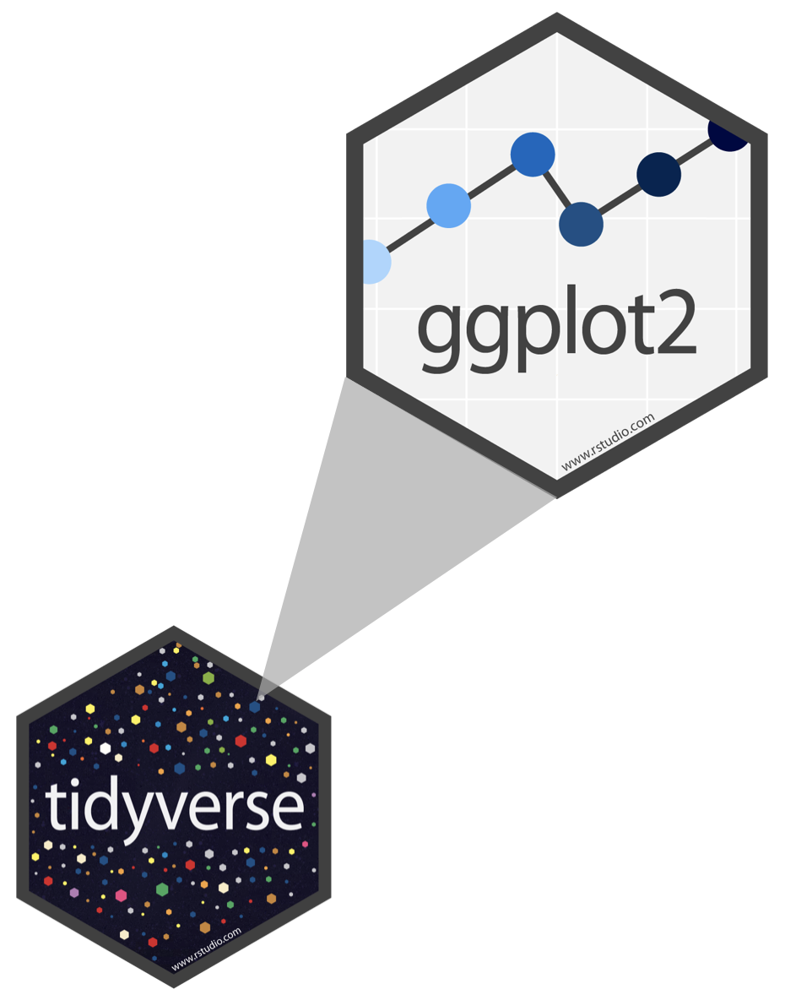
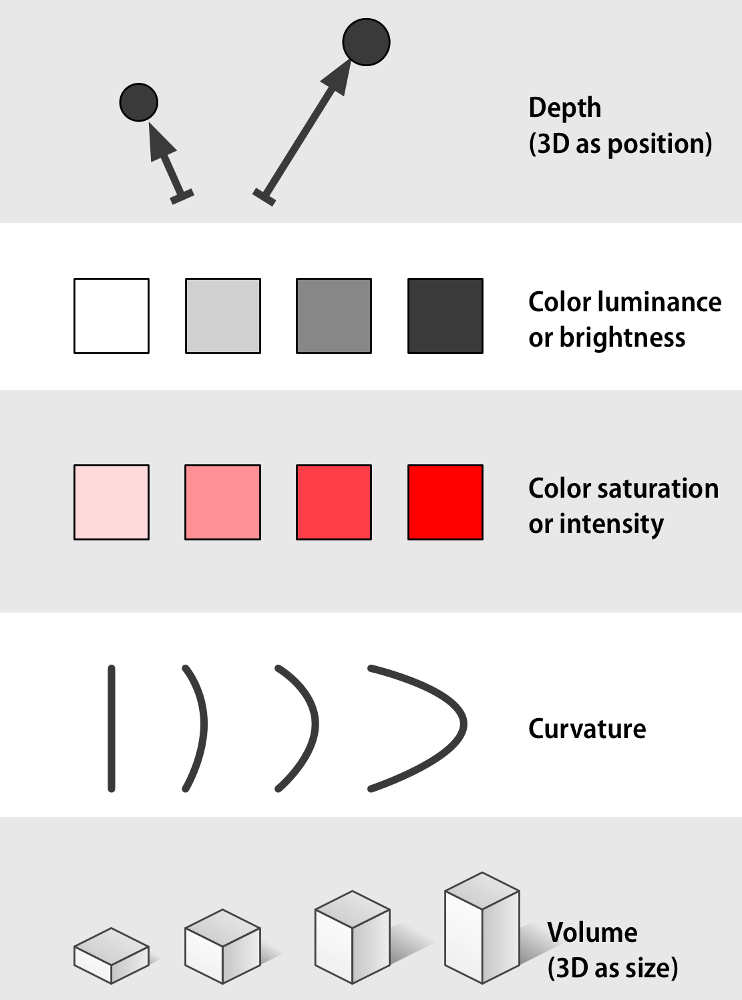

```{r include=FALSE, message=FALSE}
source("../slides-common.R")
slideSetup()
# remotes::install_github("EvaMaeRey/flipbookr")
library(flipbookr)
```

## Review

What do each of the following operations do in RStudio?

* Save
* Run Cell
* Knit
* Commit
* Push

Think-Pair-Share.

---

## Quiz 1

* Covid examples: 

---

## Problem of Diverse Audiences

* Some of you have seen R, visualization, etc. before.

> "This is still just review" -- says several people

* Some of you vaguely remember CS 108 or 106 from years ago...

> "I'm totally lost" -- many people think, few say

-> My office hours **Wed 2:30-3:30 in Gold Lab** or by request.

---

## Q & A

> *When to use Console vs Rmarkdown?*

* **RMarkdown** is your source of truth. Use Console just to explore.
* Something broke? **Restart R and Run All**

> *Why two assignment operators?*

* `<-` assigns variables in *current environment*: `data <- read_csv()`
* `=` labels arguments to *functions*: `ggplot(data = dino_data)`
* You can use `=` instead of `<-`, but we won't.

---


class: center, middle

`r emo::ji("yarn")` **knit**

`r emo::ji("white_check_mark")` **commit**

`r emo::ji("arrow_up")` **push**


---

class: center, middle

<iframe width="560" height="315" src="https://www.youtube.com/embed/Z8t4k0Q8e8Y" frameborder="0" allow="accelerometer; autoplay; encrypted-media; gyroscope; picture-in-picture" allowfullscreen></iframe>


---

```{r}
library(tidyverse)
library(gapminder)
```

```{r}
gapminder %>% head(5) %>% knitr::kable()
```

---

### We'll make this chart

```{r health-and-wealth, echo=FALSE, out.width="50%", fig.align='center'}
gapminder %>% 
  filter(year == 2007) %>% 
  ggplot() +
    aes(x = gdpPercap, y = lifeExp) +
    geom_point() + 
    aes(color = continent) +
    aes(size = pop) + 
    coord_cartesian(ylim = c(20, 90)) + 
    scale_x_continuous(
      breaks = c(400, 4000, 40000),
      trans = "log10") +
    labs(x = "GDP per Capita") +
    labs(y = "Life Expectancy (years)") +
    labs(color = "Continent") +
    labs(size = "Population") +
    scale_size_area(labels = function(breaks) format(breaks, big.mark = ",", scientific = FALSE)) +
    theme_bw() + 
    annotation_logticks(sides = "b")
```

---

`r flipbookr::chunk_reveal("health-and-wealth", chunk_options="out.width=\"100%\"")`

---

## ggplot2 $\in$ tidyverse

.pull-left[
```{r echo=FALSE, out.width="80%"}
#
```
]
.pull-right[
- **ggplot2** is tidyverse's data visualization package
- The `gg` in "ggplot2" stands for Grammar of Graphics
- It is inspired by the book **Grammar of Graphics** by Leland Wilkinson
]
---

## Grammar of Graphics

Concisely describe the components of a graphic

```{r echo=FALSE, out.width="70%", fig.align='center'}
#knitr::include_graphics("img/grammar-of-graphics.png")
```

.tiny[ 
Source: [BloggoType](http://bloggotype.blogspot.com/2016/08/holiday-notes2-grammar-of-graphics.html)
]

---

.pull-left[
```{r echo=FALSE, out.width="90%"}
#knitr::include_graphics("img/channels-continuous-part1.png")
```
]

.pull-right[
```{r echo=FALSE, out.width="90%"}
#
```
]

.tiny[
Source: https://socviz.co/lookatdata.html#channels-for-representing-data
]

---
