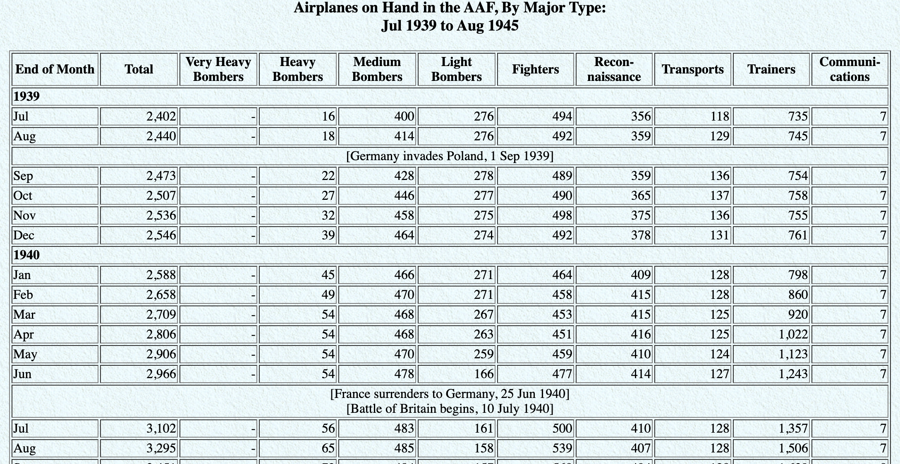

```{r include=FALSE, message=FALSE}
source("../slides-common.R")
slideSetup()
```

## Week 3

* Office Hours: [kca] Mon 8-9am, Fri 3-4pm; [yk] Wed 4:30-5:30pm

---

## Code Style

>"Good coding style is like correct punctuation: you can manage without it, butitsuremakesthingseasiertoread."
>
>Hadley Wickham

- Recommended: Tidyverse style guide <https://style.tidyverse.org/>

---

## Summary

* File names and code chunks: `data-wrangling`, not `Data Wrangling`.
* Variable names: `hourly_rides`, not `hourlyRides` or `hourly.rides` or `rides_by_hour_with_weather`
  * Informative but short. Don't reuse.

---

## Spacing

- Put a space before and after all infix operators (=, +, -, <-, etc.), and when 
naming arguments in function calls
- Always put a space after a comma, and never before (just like in regular English)

```{r eval = FALSE}
# Good
average <- mean(feet / 12 + inches, na.rm = TRUE)

# Bad
average<-mean(feet/12+inches,na.rm=TRUE)
```

---

## ggplot2

- Always end a line with `+`
- Always indent the next line

```{r eval = FALSE}
# Good
ggplot(diamonds, mapping = aes(x = price)) +
  geom_histogram()

# Bad
ggplot(diamonds,mapping=aes(x=price))+geom_histogram()
```


---

class: center, middle

# Tidy data

---

## Tidy data

>Happy families are all alike; every unhappy family is unhappy in its own way. 
>
>Leo Tolstoy

--

.pull-left[
**Characteristics of tidy data:**

- Each variable forms a column.
- Each observation forms a row.
- Each type of observational unit forms a table.
]
--
.pull-right[
**Characteristics of untidy data:**

!@#$%^&*()
]

---

## 

.question[
What makes this data not tidy?
]

```{r hyperwar-airplanes-on-hand, echo=FALSE, out.width="90%", fig.align = "center", caption = "WW2 Army Air Force combat aircraft"}

```

.footnote[
Source: [Army Air Forces Statistical Digest, WW II](https://www.ibiblio.org/hyperwar/AAF/StatDigest/aafsd-3.html)
]

---

.question[
What makes this data not tidy?
]

<br>

```{r hiv-est-prevalence-15-49, echo=FALSE, out.width="95%", fig.align = "center", caption = "Estimated HIV prevalence among 15-49 year olds"}
knitr::include_graphics("img/untidy-data/hiv-est-prevalence-15-49.png")
```

.footnote[
Source: [Gapminder, Estimated HIV prevalence among 15-49 year olds](https://www.gapminder.org/data)
]

---

.question[
What makes this data not tidy?
]

<br>

```{r us-general-economic-characteristic-acs-2017, echo=FALSE, out.width="95%", fig.align = "center", caption = "US General Economic Characteristics, ACS 2017"}
knitr::include_graphics("img/untidy-data/us-general-economic-characteristic-acs-2017.png")
```

.footnote[
Source: [US Census Fact Finder, General Economic Characteristics, ACS 2017](https://factfinder.census.gov/faces/tableservices/jsf/pages/productview.xhtml?pid=ACS_17_5YR_DP03&src=pt)
]


---

class: center, middle

# Data wrangling and summarizing 
# with **dplyr**

---

## A grammar of data wrangling

Functions as verbs that manipulate data frames

.pull-left[
```{r dplyr-part-of-tidyverse, echo=FALSE, out.width="80%", fig.align = "center", caption = "dplyr is part of the tidyverse"}
knitr::include_graphics("img/dplyr-part-of-tidyverse.png")
```
]
.pull-right[
.midi[
- `select`: pick columns by name
- `arrange`: reorder rows
- `slice`: pick rows by index(es)
- `slice_sample`: randomly sample rows
- `filter`: pick rows matching criteria
- `distinct`: filter for unique rows
- `mutate`: add new variables
- `summarize`: reduce variables to values
- `pull`: grab a column as a vector
- ... (many more)
]
]

---

## Rules of *dplyr* functions

- First argument is *always* a data frame
- Subsequent arguments say what to do with that data frame
- Always return a data frame
- Don't modify in place
