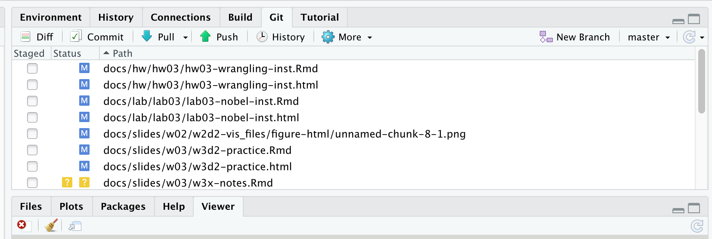

```{r include=FALSE, message=FALSE}
source("../slides-common.R")
slideSetup()
```

## Q&A

> How to sort in descending order?

`?arrange` says: "Use `desc()` to sort a variable in descending order."

> When to fix data types?

Lecture forthcoming :)

> ggformula?

Our books don't cover it, but you're welcome to use it.

---

class: middle

## The RStudio Server...

... has been giving us trouble.

### Workarounds

* Install on your own computer 
* [`remote.cs.calvin.edu`](https://remote.cs.calvin.edu/)

---

## `learnr` tutorials

* **Initial setup**:
`install.packages(c("learnr", "remotes"))`

* **Update**: `remotes::install_github("CalvinData/ds202calvin")`

* **Run**:

```{r eval=FALSE, echo=TRUE}
learnr::available_tutorials("ds202calvin")
learnr::run_tutorial("hotels-wrangling", package = "ds202calvin")
```


---

layout: true

## Proposed Structure Changes

Feedback welcome!

---

---

* Lab
  * still due on Monday
  * But instead of working on it only on Fridays...
  * we'll be working a little each class meeting.
  
---

* Lab
* Quizzes
  * Prep quiz: unlimited attempts, categorized as Prep
  * Post-class quizzes will sometimes include add an easy but graded question from the day's Lab,
    closes beginning of next class meeting (unless you ask me)
  * "Real" quiz: one attempt, closes Friday

---

* Lab
* Quizzes
* New semester-long discussion forums
  * *enrichment activities*: Do one or two optional activities throughout the semester, report back to the class
      * [ICPSR Data Fair](https://www.icpsr.umich.edu/web/pages/membership/datafair/index.html) next week, ["Philosophy of Data Science" podcast](https://www.podofasclepius.com/philosophy-of-data-science), propose others!
  * *Data Science in the News*: share current events related to DS
      * Articles that *use* data science to tell a story
      * Articles *about* data science

---
layout: false

## Resources

* [Cheatsheets](https://rstudio.com/resources/cheatsheets/)
  * [Data Transformation](https://github.com/rstudio/cheatsheets/raw/master/data-transformation.pdf) (dplyr)
  * [Data Visualization](https://github.com/rstudio/cheatsheets/raw/master/data-visualization-2.1.pdf)
  * [R Markdown](https://github.com/rstudio/cheatsheets/raw/master/rmarkdown-2.0.pdf)

---

## Weekly Labs

* This week: [Nobel Laureates](../lab/lab03-nobel/)
* Next week: Covid-19 cases

Propose datasets or analyses you're interested in!

---

class: center, middle

## Friday

---

## Q&A

> Grading? Feedback?

We're catching up. HW1 is done.

> New structure? Grading?

We'll implement slowly. By default everything is same. No changes to due dates 
or grading distribution

> (When) do I need to physically attend class?

Physical attendance always optional (see policy). We'll try in-person every day and see
how that goes.

---

## Q&A

> When Python?

In a couple weeks.

---

## Git Tab

No:

```{r echo=FALSE, out.width="100%"}

```


---

class: center, middle

## How to contribute to a GitHub package


*demo*
