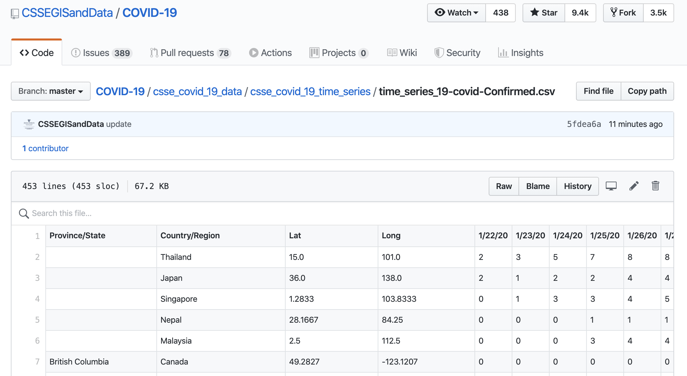

```{r setup, include=FALSE, message=FALSE}
source("../slides-common.R")
slideSetup()
knitr::opts_chunk$set(echo = TRUE)
library(tidyverse)
library(janitor)
library(lubridate)
# Disable a warning message.
options(dplyr.summarise.inform = FALSE)

```

## Facial Recognition

---

## Tidying and Joining Data

Outline:

* the dataset
* tidying
* joining
* plotting

Data wrangling often takes a *lot* of time and effort, so buckle in.

---

## JHU COVID-19 data

As you might imagine, keeping a comprehensive list of all COVID-19 cases
worldwide involves pulling data from numerous sources (and frequent updating).
Fortunately, some folks at Johns Hopkins have been doing that work and putting
the resulting data into a github repository that anyone can access.

---

### Navigating the GitHub Repo

You can visit their github project at <https://github.com/CSSEGISandData/COVID-19>.
There you will find 

* details about what sources were used for the data,
* what sorts of data are available, and 
* some places the data have been used

You will also see this note:

> The Website relies upon publicly available data from multiple sources, that do not always agree. 

---

### Finding some data

You could clone the repository, but you also just pull the data directly 
from their repository. They've split the data into "daily reports" (one CSV per
day, all measures) and "time series" (one CSV per measure, all days).
Here is an example page showing 
[one of the data sets](https://raw.githubusercontent.com/CSSEGISandData/COVID-19/master/csse_covid_19_data/csse_covid_19_time_series/time_series_covid19_confirmed_global.csv)
available to you.




---

### We want raw data

GitHub renders CSVs in a fancy way, but you can get the plain old CSV if you click the Raw button.
We're mostly interested in the URL for this file, since that will let us pull the data into R.

```{r}
base_url <-           # it's long, so I'm pasting it together to avoid ugly long lines
  paste0('https://raw.githubusercontent.com/',
         'CSSEGISandData/COVID-19/master/',
         'csse_covid_19_data/csse_covid_19_time_series/')

# not done yet, now we need to add the file name from that folder
filename <- 
  paste0('time_series_covid19_', c('confirmed', 'deaths', 'recovered'), '_global.csv')

# OK. Let's put it all together
url <- paste0(base_url, filename)
url
```

Let's read in the first one. (We could be fancier and read all three at once.)

```{r read_confirmed}
confirmed_global <- url[1] %>% 
  pins::pin() %>% 
  read_csv(col_types = cols(
    .default = col_double(),
    `Province/State` = col_character(),
    `Country/Region` = col_character()
  )) %>%
  rename(
    country_or_region = `Country/Region`,
    province_or_state = `Province/State`
    )
```

---

### Exploring the data

Let's a take a look at what we have:

```{r explore-data}
reactable::reactable(confirmed_global, searchable = TRUE)
```

Notice that each day's count of confirmed cases is in a separate column.

Suppose we want to plot the number of cases over time. What problems might come up?

--

How many observations does each row represent?

---

### Tidying Step 1: `pivot_longer`

* We have: Lots of observations per row
* We want: one observation per row.
* So: we're gonna need a *longer* (and narrower) dataset.

*enter* `pivot_longer`!

---

```{r pivot-longer-1}
confirmed_global %>% 
  pivot_longer(
    -(1:4)   # the first 4 columns are not part of the pivot
  )
```

---

```{r pivot-longer-2}
confirmed_global %>% 
  pivot_longer(
    -(1:4),
    names_to = "date"
  )
```

---

```{r pivot-longer-3}
confirmed_global_long <- 
  confirmed_global %>% 
  pivot_longer(
    -(1:4),
    names_to = "date",
    values_to = "confirmed"
  )
```

---

```{r broken-date}
confirmed_global_long %>% 
  ggplot(aes(x = date, y = confirmed)) + geom_point()
```

???

---

```{r successful-parse-date}
"2020-02-01" %>% parse_date() %>% lubridate::month()
```

```r
"2/1/20" %>% parse_date() #<< Fail: date parser needs help!
```


```{r successful-parse-special-date}
"2/1/20" %>% parse_date_time("%m/%d/%y!*") %>% lubridate::month()
```

---

```{r}
confirmed_global_long <-
  confirmed_global %>% 
  pivot_longer(
    -(1:4),                        # the first 4 columns are not part of the pivot
    names_to = "date",             # names of the remaining columns will be put into a date column
    values_to = "confirmed") %>%   # values will be put into a column called confirmed
  mutate(date = lubridate::parse_date_time(date, "%m/%d/%y!*"))  # convert to date objects

confirmed_global_long
```

---

```{r explain-weird-plots}
confirmed_global %>%
  count(country_or_region) %>%
  filter(n > 1)
```

---

## Plotting the data

### Worldwide cases

To see the worldwide number of confirmed cases over time, we can group the data by date and 
add up all the confirmed counts.

```{r total-cases-by-date}
confirmed_global_long %>%
  group_by(date) %>% 
  summarize(confirmed = sum(confirmed)) %>% 
  ggplot(aes(x = date, y = confirmed)) +
    geom_line()
```

---

```{r cases-by-country-broken, fig.width=15, fig.height=7}
confirmed_global_long %>%
  filter(country_or_region %in% 
           c("US", "Canada", "China", "Japan", "Korea, South", "Italy", "Germany", "Spain", "United Kingdom")) %>%
  ggplot(aes(x = date, y = confirmed)) +
    geom_line() +
    facet_wrap(~ country_or_region, scales = "free_y")
```


---

```{r cases-by-country}
confirmed_global_long %>%
  filter(country_or_region %in% 
           c("US", "Canada", "China", "Japan", "Korea, South", "Italy", "Germany", "Spain", "United Kingdom")) %>%
  group_by(country_or_region, date) %>%   #<<
  summarize(confirmed = sum(confirmed)) %>%  #<<
  ggplot(aes(x = date, y = confirmed)) +
    geom_line() +
    facet_wrap(~ country_or_region, scales = "free_y")
```

---

### Per Capita?

A data source: the [World Bank](https://data.worldbank.org/indicator/SP.POP.TOTL).

```{r get-population}
population <- wbstats::wb_data(
  "SP.POP.TOTL",
  mrnev = 1 # most recent non-empty value
) %>% 
  select(iso2c, iso3c, country, population = SP.POP.TOTL)
population %>% reactable::reactable()
```

---

```{r try-join}
cases_with_population <- inner_join(
  confirmed_global_long %>% select(country = country_or_region, date, confirmed),
  population %>% select(country, population),
  by = "country"
)
```

---


```{r join-plot-broken}
cases_with_population %>%
  filter(country %in% 
           c("US", "Canada", "China", "Japan", "Korea, South", "Italy", "Germany", "Spain", "United Kingdom")) %>%
  group_by(country, date) %>%   #<<
  summarize(confirmed = sum(confirmed)) %>%  #<<
  ggplot(aes(x = date, y = confirmed)) +
    geom_line() +
    facet_wrap(~ country, scales = "free_y")
```

---

### Debugging a join

```{r join-debug}
anti_join(  #<<
  confirmed_global_long %>% select(country = country_or_region, date, confirmed),
  population %>% select(country, population),
  by = "country"
) %>%
  distinct(country)
```

---

## Recoding

```{r}

```


---


```{r, include = FALSE, eval = FALSE}
US <- readr::read_csv("../../data/USstates.csv") 

Confirmed_long %>%
  filter(country_or_region %in% c("US")) %>%
  filter(date > lubridate::ymd('2020-03-08')) %>%
  filter(confirmed > 0) %>%
  rename(state = `Province/State`) %>%
  left_join(US) %>%
  group_by(state, date, population2019) %>% 
  summarise(confirmed = sum(confirmed)) %>% 
  mutate(percap = 100000 * confirmed / population2019) %>%
  ungroup() %>%
  mutate(state = reorder(state, percap, max)) %>%
  # filter(population2019 > 8000000) %>%
  gf_line(percap ~ date, color = ~(state == "Michigan"), 
          group = ~state, show.legend = FALSE,
          size = 1, alpha = 0.8
          ) %>%
  gf_refine(scale_y_log10()) %>%
  gf_labs(title = "Per capita confirmed cases by state",
          subtitle = "MI highlighted",
          caption = "Source: JHU data repository")
```

