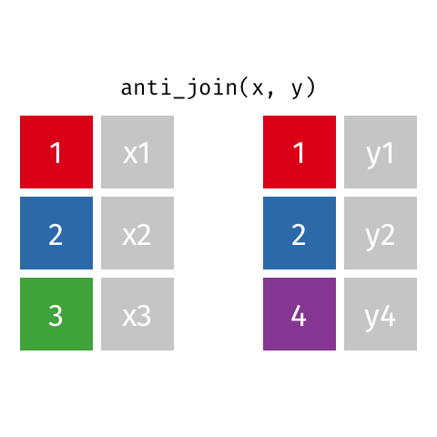

```{r child = "../slide-setup.Rmd"}
```

```{r packages, include=FALSE}
library(tidyverse)
```


## A note on `mutate`

* Badly named. Think "add_computed_column".
* **DON'T** think of it operating on a variable ("mutate the ride's start time").
* **DO** think of it operating on a data frame ("add a column computed by
flooring the start time)

---

## Q&A

> `select` vs `filter`?

Maybe should have been named `select_columns` and `select_rows`.

> Where do I get the specific lines of code I need?

Good question *only if* you have a clear idea of what you want to do. Sketch out
a very specific example of the output you want.

---

## Joining data frames


* I have a data frame `x`
* I want extra information about things in `x`
* Some other table, `y`, has that information. "Joins" let me look it up.
* Needs a <span style="background: blue; color: white; padding: 5px;">key</span> : what has to match. Must match *exactly*.

```{r echo=FALSE, out.width="30%", fig.align='center'}
include_graphics("https://raw.githubusercontent.com/gadenbuie/tidyexplain/master/images/static/png/original-dfs.png")
```

.small[Graphics thanks to [tidyexplain](https://github.com/gadenbuie/tidyexplain)]


---

## Types of joins

What to do when things don't exactly line up? Start with all rows, but:

* **full** or **outer**: Leave blanks (`NA`) for mismatches
* **inner**: Drop rows with any mismatches
* **left** / **right**: Drop rows where one of the sides has a mismatch

---

## Setup

.pull-left[
```{r echo=FALSE}
x <- tibble(key = c(1, 2, 3), xdata = paste0('x', key))
y <- tibble(key = c(1, 2, 4), ydata = paste0('y', key))
```

```{r}
x
y
```
]
.pull-right[
```{r echo=FALSE}
include_graphics("https://raw.githubusercontent.com/gadenbuie/tidyexplain/master/images/static/png/original-dfs.png")
```
]

---

## `full_join()`

All rows from both `x` and `y`. Leave `NA` for mismatches.

.pull-left[
```{r}
full_join(x, y, by = "key")
```
]
.pull-right[
```{r echo=FALSE}
include_graphics("img/full-join.gif")
```
]

---

## `inner_join()`

All matching rows. Drops mismatches.

.pull-left[
```{r}
inner_join(x, y, by = "key")
```
]
.pull-right[
```{r echo=FALSE}
include_graphics("img/inner-join.gif")
```
]


---

## `left_join()`

All rows from `x`.

.pull-left[
```{r}
left_join(x, y, by = "key")
```
]
.pull-right[
```{r echo=FALSE}
include_graphics("img/left-join.gif")
```
]


---

## `right_join()`

All rows from `y`.

.pull-left[
```{r}
right_join(x, y)
```
]
.pull-right[
```{r echo=FALSE}
include_graphics("img/right-join.gif")
```
]


---

## Summary

- `full_join()`: all rows from both `x` and `y`
- `inner_join()`: all *matching* rows from `x` where there are matching values in y. Multiple matches? Return all combinations.
- `left_join()`: all rows from x
- `right_join()`: all rows from y

^ are called *mutating joins* (by analogy to the `mutate` verb). Sometimes useful:
*filtering* joins and *nest* join:

- `semi_join()`: include a row from `x` only if there's some match in `y`
- `anti_join()`: include a row from `x` only if there's *no* match in `y`
- `nest_join()`: get bundles of all matching rows from `y` (most flexible)

---


---

## `semi_join()`

.pull-left[
```{r}
semi_join(x, y, by = "key")
```
]
.pull-right[
```{r echo=FALSE}
include_graphics("img/semi-join.gif")
```
]

---

## `anti_join()`

.pull-left[
```{r}
anti_join(x, y, by = "key")
```
]
.pull-right[
```{r echo=FALSE}

```
]

---

.question[
We want to keep all rows and columns from `confirmed_cases` and add a column for 
corresponding populations from `population`. Which join function should we use?
]

