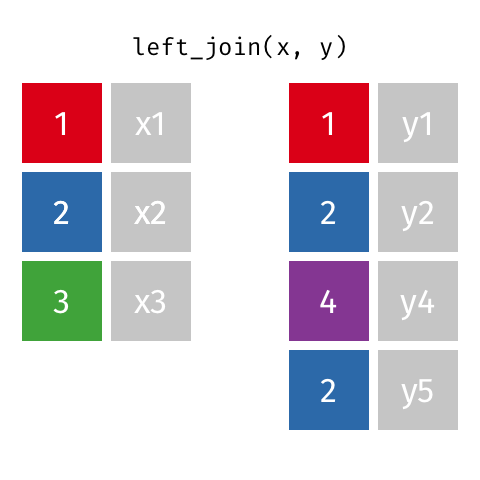

```{r child = "../slide-setup.Rmd"}
```

```{r packages, include=FALSE}
knitr::opts_chunk$set(comment = "")
options(dplyr.print_max = 10)

library(tidyverse)
xaringanExtra::use_freezeframe(overlay = TRUE)
```

## Reminders

- DS Firepit Tonight!

- Quiz 5 closes tonight
- Homework 3
- Discussion Forum replies

---

## Preview: replication project


---

## Gradescope trial

See Moodle.

---

## Relational Data

- Bring together data that may never have been brought together before
- Community, interdependence

---

## Example Applications

- Looking up abbreviations
- Connecting sales data to each customer's demographics
- Combining student data from Moodle, an online textbook, GitHub activity reports, ...

What others can you think of?

---

## Code Together: Flight Delays

```{r}
library(nycflights13)
```

```{r}
flights %>% 
  drop_na(arr_delay) %>% 
  group_by(carrier) %>% 
  summarize(avg_delay = mean(arr_delay)) %>% 
  arrange(desc(avg_delay)) %>% 
  left_join(airlines, by = "carrier") %>% 
  select(name, avg_delay)
```

---

# Multiple matches

.pull-left[
```{r echo=FALSE, out.width="30%", fig.align='center'}

```
]

---

## Revenue by item?

```{r include=FALSE}
purchases <- tibble::tribble(
               ~customer_id,          ~item,
                         "c1",        "bread",
                         "c1",         "milk",
                         "c1",       "banana",
                         "c2",         "milk",
                         "c2", "toilet paper"
               )

prices <- tibble::tribble(
           ~item, ~price,
       "avocado",    0.5,
        "banana",   0.15,
         "bread",      1,
          "milk",    0.8,
  "toilet paper",      3
  )
```


.pull-left[
```{r eval=FALSE}
purchases
```

.smaller-table[
```{r echo = FALSE}
purchases %>% kable()
```
]
]
.pull-right[
```{r eval = FALSE}
prices
```

.smaller-table[
```{r echo=FALSE}
prices %>% kable()
```
]
]


---

## Revenue by item?

For each item, look up all sales data.

```{r}
prices %>% 
  left_join(purchases)
```

Notice: multiple rows for each item. Where did each one come from?

Next: count how many purchases for each item.

---

## Revenue by item?

Count how many purchases for each item.

```{r}
prices %>% 
  left_join(purchases) %>% 
  group_by(item) %>%
  summarize(count = n())
```

--

Could have summarized `purchases` first. Advantages to that approach? This one?

--

Next: sum prices. (But where did the prices go?)

---

## Revenue by item?

*Thread* the prices along. (Check: any extra rows?)

```{r}
prices %>% 
  left_join(purchases) %>% 
  group_by(item, price) %>% #<<
  summarize(count = n())
```

What next?

---

## Revenue by item?

```{r}
prices %>% 
  left_join(purchases) %>% 
  group_by(item, price) %>%
  summarize(count = n(), revenue = price * count) #<<
```

Hmm... where did the multiple rows come from?

---

## Revenue by item?

Sum the prices, *weighted* by count.

```{r}
prices %>% 
  left_join(purchases) %>% 
  group_by(item, price) %>% #<<
  summarize(count = n(), revenue = sum(price * count)) #<<
```

---

## uh oh...

```{r include=FALSE}
purchases <- tibble::tribble(
               ~customer_id,          ~item,
                         "c1",        "bread",
                         "c1",         "milk",
                         "c1",       "bananas",
                         "c2",         "milk",
                         "c2", "toilet paper"
               )

prices <- tibble::tribble(
           ~item, ~price,
       "AVOCADO",    0.5,
        "BANANA",   0.15,
         "BREAD",      1,
          "MILK",    0.8,
  "TOILET_PAPER",      3
  )
```

.pull-left[
```{r echo = FALSE}
purchases %>% kable()
```
]
.pull-right[

```{r echo=FALSE}
prices %>% kable()
```

]

--

```{r}
purchases %>% 
  left_join(prices)
```

---

## Specifying keys

- Keys must match *exactly*
- Can join on multiple columns (first name **and** last name)
- Default join: columns with same names
- Specify what columns to use: `left_join(x, y, by = c("first_name", "last_name"))`
