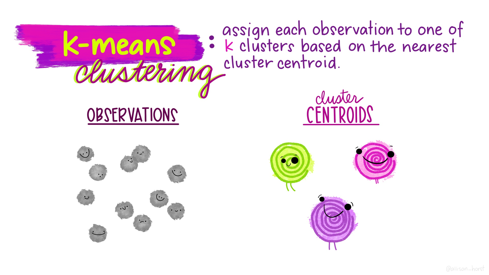
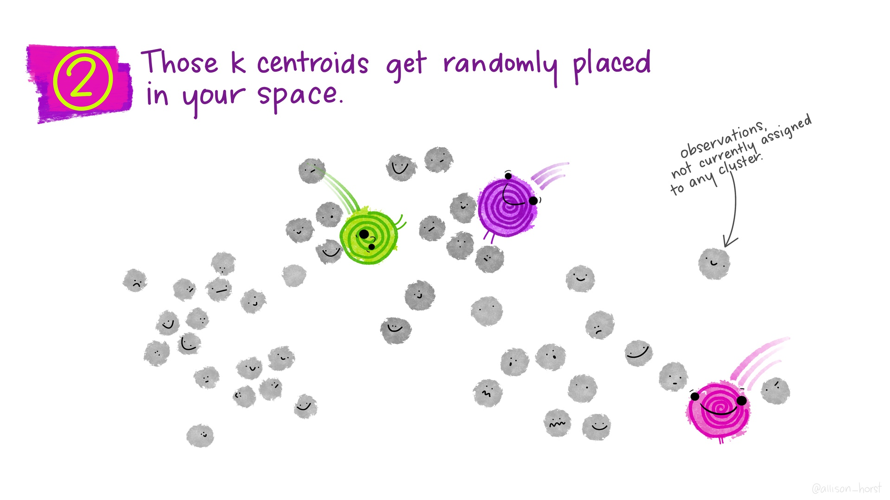
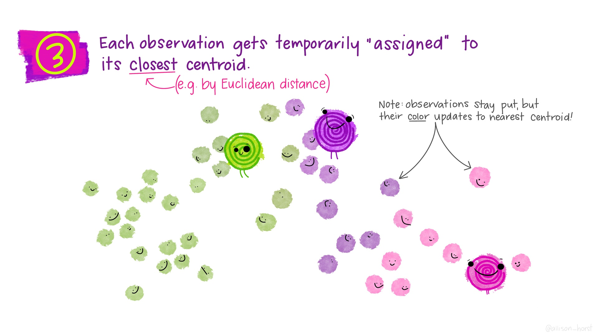
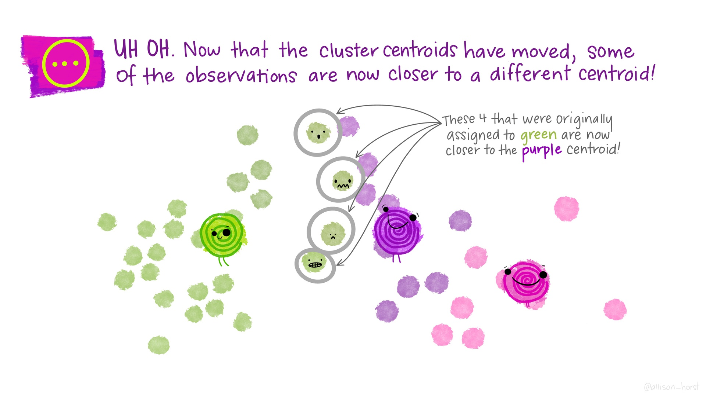
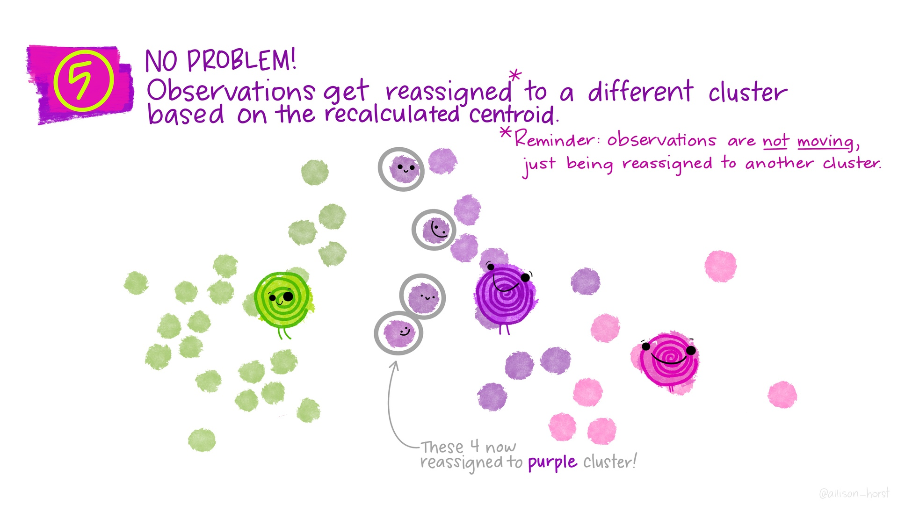
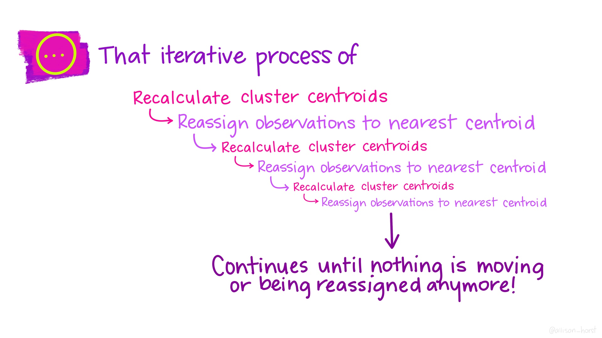
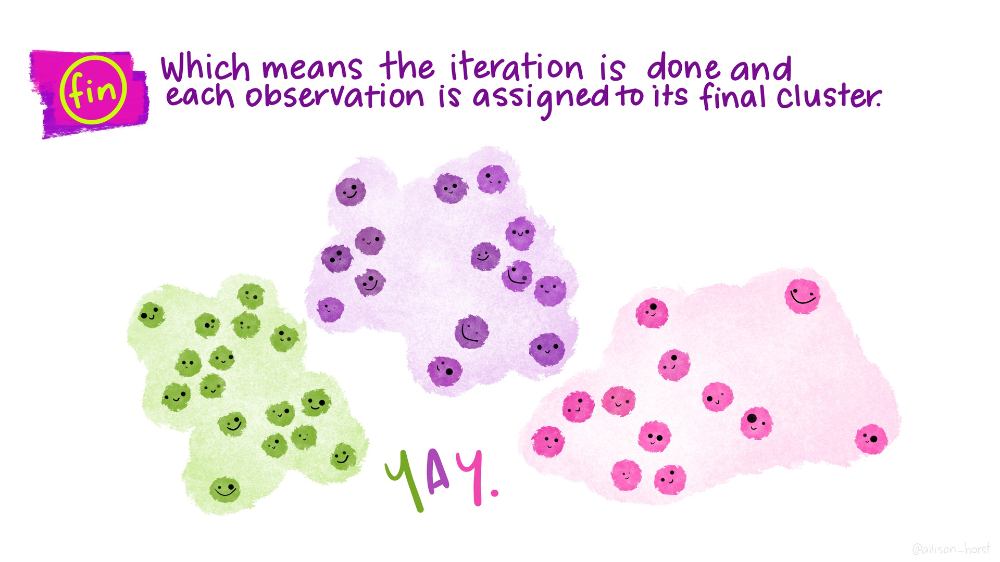

```{r setup, include=FALSE, message=FALSE}
source("../slides-common.R")
slideSetup()
knitr::opts_chunk$set(echo = TRUE)
theme_set(theme_bw())
```

## Q&A

* No quiz, no homework this week
* Project feedback is coming...


---

## Unsupervised Learning

* So far we have been doing *supervised* learning, where have a *target* we're trying to predict.
  * "How much will these homes sell for?"
  * "How long will this person spend watching this video?"
* **Unsupervised** learning works when we don't have an exact target to predict, or we want to explore relationships in the data.
  * "What general types of homes are on the market right now?"
  * "What are some different segments of our customer base?"
  * "[Are there distinct types of Covid-19 symptoms?](https://covid.joinzoe.com/us-post/covid-clusters)"
* **Clustering** is one very common type of unsupervised learning.

---

## Clustering

* Goal: put observations into groups
* Obs in the *same* group should be *similar to each other*
* Obs in *different* groups should be *different*.

Crucial questions:

* How many groups?
* How do we define "similar" / "different"?

---



.floating-source[Artwork by [@allison_horst](https://github.com/allisonhorst/stats-illustrations)]
---


---


---


---


---


---


---


---


---



---


---

## *Many* types of clustering algorithms


.floating-source[Source: [sklearn documentation](https://scikit-learn.org/stable/modules/clustering.html)]
---


```{r}
library(tidymodels)
```


```{r load-data, echo=FALSE}
#data(ames, package = "modeldata")
ames <- AmesHousing::make_ames()
ames_all <- ames %>%
  filter(Gr_Liv_Area < 4000, Sale_Condition == "Normal") %>%
  mutate(across(where(is.integer), as.double)) %>%
  mutate(Sale_Price = Sale_Price / 1000)
rm(ames)
```

```{r utilities, echo=FALSE}
kmeans_workflow <- function(data, recipe, nstart = 4, ...) {
  res <- recipe %>% 
    bake(new_data = data) %>% 
    kmeans(..., nstart = nstart)
  res$recipe <- recipe
  res$data <- data
  class(res) <- c("kmeans_workflow", "kmeans")
  res
}

tidy.kmeans_workflow <- function (x, col.names = colnames(x$centers)) {
  if (is.null(col.names)) {
    col.names <- paste0("x", 1:ncol(x$centers))
  }
  ret <- as.data.frame(x$centers)
  colnames(ret) <- col.names
  ret$.size <- x$size
  ret$.within_ss <- x$withinss
  ret$.cluster <- factor(seq_len(nrow(ret)))
  as_tibble(ret)
}

augment.kmeans_workflow <- function(kclust, data) {
  stopifnot(identical(data, kclust$data))
  data %>% 
    mutate(.cluster = as.factor(!!kclust$cluster))
}

get_centers <- function(kclust) { 
  kclust$centers %>%
    as_tibble() %>%
    mutate(.cluster = factor(row_number()))
}
```

1. What differences do you notice between the plot on the left and the plot on the right?
1. Try increasing the number of `centers`. What changes about both plots?
2. Try changing the formulat to `~ Year_Built` (removing latitude and longitude). What can you say about the age of homes in different parts of town?
2. Try adding `Gr_Liv_Area` to the recipe's formula (`Latitude + Longitude + Gr_Liv_Area`). What changes about both plots?
  Why are they different?
2. Try adding `step_range(Gr_Liv_Area, min = 0, max = 1)` to the recipe construction pipeline. What changes about both plots? Why?
2. Try adding a `step_range` for `Latitude` (but not `Longitude`). What changes and why?
2. Now add a `step_range` for `Longitude`. What changes and why?
2. Try changing `max` to `10` for `Gr_Liv_Area`. Then try `max = 0.1`. What changes and why?
2. Try adding `Year_Built`.

```{r}
ames_numeric_recipe <- 
  recipe( ~ Latitude + Longitude + Gr_Liv_Area, data = ames_all) %>% 
  step_range(Latitude, Longitude, min = 0, max = 1) %>% 
  step_range(Gr_Liv_Area, min = 0, max = 1) %>% 
  prep()

kclust <- 
  ames_all %>% 
  kmeans_workflow(recipe = ames_numeric_recipe, centers = 3)
```


```{r}
glance(kclust)
tidy(kclust)
```


```{r}
latlong_plot <- 
  kclust %>%
  augment(ames_all) %>% 
  ggplot(aes(x = Latitude, y = Longitude, color = .cluster, shape = .cluster)) +
  geom_point(alpha = .5) +
  theme(legend.position = "none")

year_area_plot <- 
  kclust %>% 
  augment(ames_all) %>% 
  ggplot(aes(x = Gr_Liv_Area,
             #y = factor(Bedroom_AbvGr),
             y = Year_Built,
             color = .cluster, shape = .cluster)) +
    geom_jitter(width = 0, alpha = .5)

cowplot::plot_grid(latlong_plot, year_area_plot, nrow = 1)
```

Do the patterns captured by these clusters also happen to relate to sale price?

```{r}
kclust %>%
  augment(ames_all) %>% 
  ggplot(aes(x = Sale_Price, y = .cluster)) + geom_boxplot()
```
