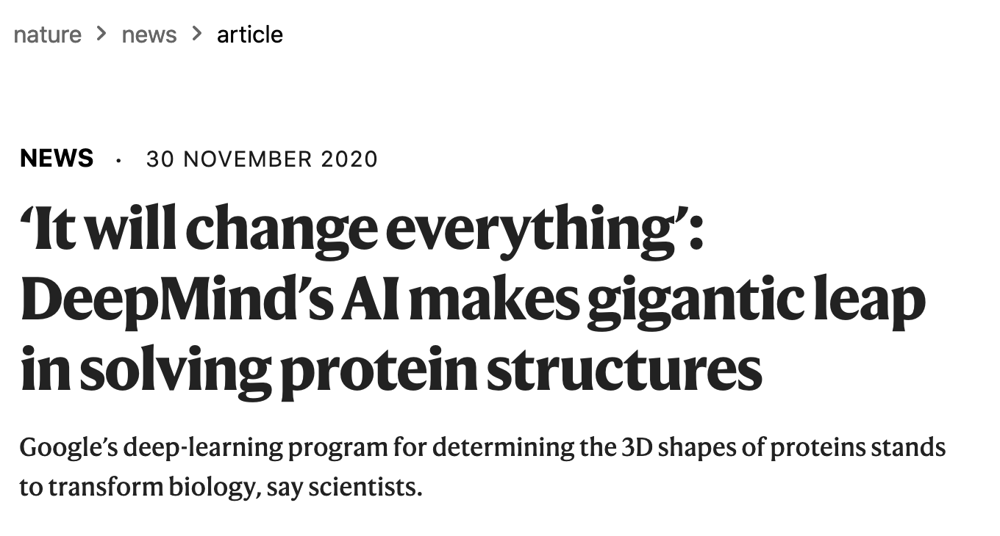

```{r setup, include=FALSE, message=FALSE}
source("../slides-common.R")
slideSetup()
knitr::opts_chunk$set(echo = TRUE)
```

## Q&A

> For final project, do we present by PowerPoint or by talking through our report?

Talking through report is fine! But if you want to do slides, check out Xaringan
(and `xaringanthemer`) that have powered all these slides.

> Do all good models require gigantic energy?

No! Simple methods are often good enough. And you can often leverage pre-trained models.

> If there're data ethicists in many big tech firms/ the tech world in general, why is there still so much bias with technology?

Ethics-washing.

---

## A clarification: calibration

* The sentiment classifier we saw last time was prone to extremes (at least on short sentences).
* The classifier was not *calibrated*: predicted confidence doesn't match reality.
* This can be *harmful* even if classifier is unbiased. Some details: [Calibration: the Achilles heel of predictive analytics](https://bmcmedicine.biomedcentral.com/articles/10.1186/s12916-019-1466-7)

Many classifiers have calibration problems, but this one was worse than usual.

---

## Data Science in the News



.floating-source[
Source: [Nature](https://www.nature.com/articles/d41586-020-03348-4)
]

---


---

## Modeling

* Capture complex patterns while minimizing over-fitting:
  * Random Forests
  * Boosting: XGBoost / LightGBM
  * MARS
* Leverage common perceptual patterns: deep learning pre-training
* Forecast the future of a time series
  * ARIMA
  * Prophet

---

## Random Forests

* Recall: decision tree can capture detailed patterns, but can *overfit* by capturing patterns that don't generalize.
* Idea: learn *lots of trees*, each on a different random sample of the observations and features.
* Often "just works" without pre-processing or configuration


.floating-source[
<a href="https://commons.wikimedia.org/wiki/File:Random_forest_diagram_complete.png">Venkata Jagannath</a>, <a href="https://creativecommons.org/licenses/by-sa/4.0">CC BY-SA 4.0</a>, via Wikimedia Commons
]

---

### Advanced Modeling in `tidymodels`

Shortcut: [`usemodels` package](https://usemodels.tidymodels.org/)

```{r eval=FALSE}
devtools::install_github("tidymodels/usemodels")
```


---

## Deep Learning Pre-training


---

```{r eval=FALSE}
install.packages(c("torch", "torchvision"))
```

```{r}
library(torch)
library(torchvision)
```

```{r}
model <- model_resnet18(pretrained = TRUE)
model$eval()

# Strip out the last layer of the model.
fc <- model$fc
model$fc <- torch::nn_identity()
```

---

## Load data

```{r include=FALSE}
yelp_photos_dir <- "~/Data/Yelp"
# head -n 1000 photos.json > photos-1k.json
yelp_photos <- jsonlite::stream_in(file(file.path(yelp_photos_dir, "photos-1k.json")), verbose = FALSE)
```


```{r}
load_img <- function(photo_id) {
  glue("{yelp_photos_dir}/photos/{photo_id}.jpg") %>% 
    base_loader()
}

example_photos <- 
  yelp_photos %>% select(photo_id, label) %>% head(10) %>% 
  rowwise() %>% 
  mutate(img = list(load_img(photo_id))) %>%
  ungroup()

example_photos %>% 
  select(img, label) %>% 
  pwalk(function(img, label) { 
    img %>% as.array() %>% as.raster() %>% plot()
    title(label)
    })
```

---

```{r}
img_features <- example_photos$img %>% 
  map(function(img) {
    img %>% 
      transform_to_tensor() %>% 
      transform_resize(256) %>% 
      transform_center_crop(224) %>% 
      transform_normalize(mean = c(0.485, 0.456, 0.406), std = c(0.229, 0.224, 0.225)) %>% 
      {.$unsqueeze(1)} %>% 
      model$forward() %>% 
      {.$squeeze(1)}
  })
```


```{r}
imagenet_classes <- jsonlite::fromJSON("imagenet_class_index.json")
```

```{r}
labels <- imagenet_classes %>% map_chr(2)
```


---

class: center, middle

## Forecasting

<https://business-science.github.io/modeltime/articles/getting-started-with-modeltime.html>

[Another example](https://www.business-science.io/code-tools/2020/11/25/commodities-demand-forecasting.html)
with the same package.
