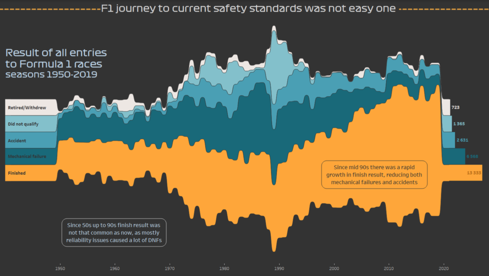
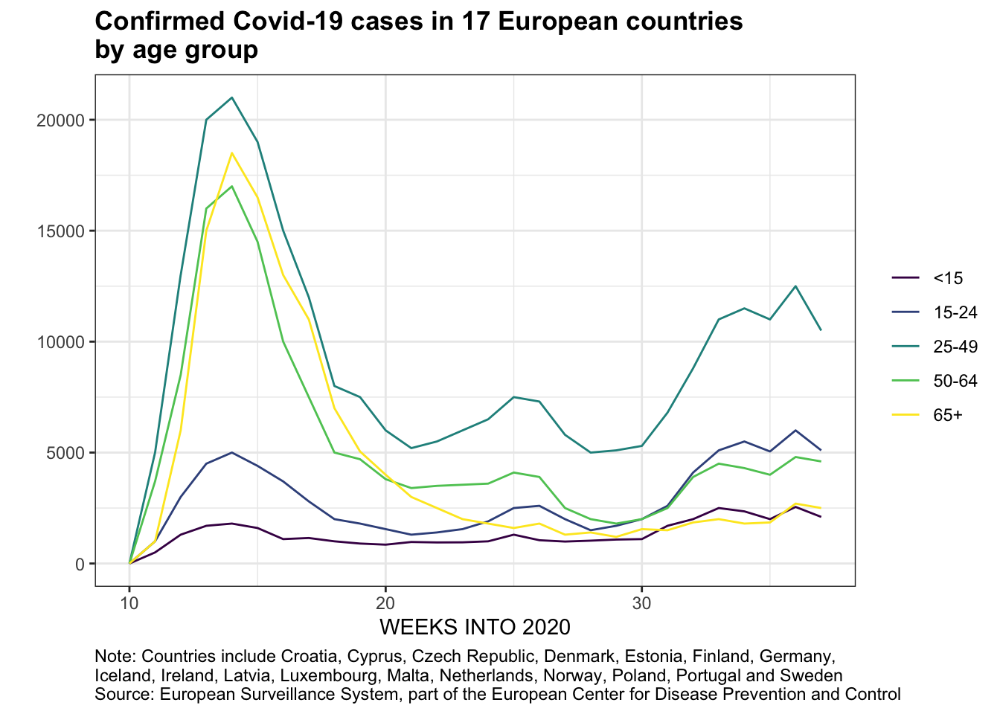

### As you enter...

- Make a **name card** (name on front *and back*)
- Sit next to someone you **don't know well**
- Introduce yourself. *Share either*:
  - Something you're passionate about outside of this class: a cause, a subject, a hobby, etc.
  - Something you're excited about for this semester

---

## What might this mean for us working with data? {.smaller}

> Seek good and not evil, that you may live, 
> and so the Lord, the God of hosts, will be with you, just as you have said.
> Hate evil and love good, and establish justice in the gate; 
> it may be that the Lord, the God of hosts, will be gracious to the remnant of Joseph.
>   ...  
> I hate, I despise your festivals, and I take no delight in your solemn assemblies.
> Even though you offer me your burnt offerings and grain offerings, I will not accept them,
> and the offerings of well-being of your fatted animals I will not look upon. ... 
> But let justice roll down like water and righteousness like an ever-flowing stream.

[Amos 5:14-15, 21-24 NRSV](https://www.biblegateway.com/passage/?search=Amos+5&version=NRSVUE&interface=print)

---

## Opening Prayer

From the apostle Paul's letter to the Philippians:

> This is my prayer:  that your love may abound more and more  in knowledge and depth of insight, so that you may be able to discern what is best and may be pure and blameless for the day of Christ, filled with the fruit of righteousness that comes through Jesus Christ—to the glory and praise of God.

---

## What is this course?

- **visualization**: communicating data to humans
- **modeling** and validation: using data to perform tasks
- but first, **data wrangling**: How to transform data into the structure you need for visualization and modeling

...using **computing** in Python and occasionally other tools

---

## Where are we going?

::: {.columns}
::: {.column width="50%"}
- Introduction (weeks 1 and 2)
- Vis Design (week 3)
- Vis Implementation (week 4)
- Wrangling (weeks 5 and 6)
- Midterm project: redesign and recreate a visualization (starts week 3, presentations and revision week 8)
:::
::: {.column width="50%"}
- Modeling: Design (week 9)
- Modeling: Neighbors and trees (week 10)
- Modeling: Other models (week 11)
- Validation (week 12)
- LLMs, other topics, and final project (weeks 13, 14 and 15)
:::
:::

Discussions on *ethics* and *perspectives* are woven in throughout the course.

---

## Optional material

- Clustering (Unsupervised Learning)
- Databases and APIs
- Text Data
- Geospatial Data
- Audio and Image Data

---

## Feedback from Prior Years

"What aspects of this course most helped your learning?"

> **Lab**. **Homework**. "forced our brains to work."

"What additional or different things could you have done to enhance your learning?"

> "gone to more office hours", "gone over the exercises and homework more"

---

## Weekly Rhythm

- **Monday** and **Wednesday** in classroom (mix of lecture, discussion, and activities)
- **Friday** in lab (mostly working on exercises or projects)

---

## Technology We'll Use

- **RStudio**: A powerful environment for working with data (even in Python!)
  - Most students will use Calvin's installation `https://r.cs.calvin.edu/`
  - You can also install it on your own computer like I do
- Perusall
  - Textbook reading assignments: **ask questions** so we know what to focus on in class
  - Announcement and Q&A forums; you can **post anonymously** if you want
  - Perspectival readings: **annotate** to share your thoughts

---

# Example Projects

---

{.r-stretch}

::: {.notes}
The original plot looked fancy, but was hard to read and made erroneous conclusions.
:::

---

{.r-stretch}

::: {.notes}
The student found the original data, noticed some nuances in the data that the
original vis author had overlooked.

Thoughtfully merged some race outcomes, plotted propertions, changed plot type...

much clearer, isn't it?
:::

---

::: {.columns}
::: {.column width="50%"}

:::
::: {.column width="50%"}

:::
:::

::: {.notes}
Original article used this visual to blame parties for COVID spread.

Student had trouble getting identical original data, but worked around it.

Reflected on original's design choice of red for young adults (pre-attentive processing); binning of ages (poor, but it was that way in the original data); whether data actually supports the claim (could be jobs etc.)

(kew24)

:::

---

## Example final projects

* Predict how much a used car will sell for
* Forecast how much electricity will be used
* Predict how much a plane flight will cost

---

## Our Goals

* *Skill*: how to do these things
* *Knowledge*: understanding the underlying concepts
* *Dispositions*: wisdom in practicing these skills

---

# Data Dispositions

---

## Humility

Challenge: data feels powerful, people listen to what you use it to say.

So we will practice:

* Citing all sources (for both data and process)
* Acknowledging limitations
* Noticing and reporting our analysis decisions and possible alternatives
* Validation of results

---

## Integrity

It’s tempting to say something that isn’t entirely true, or to manipulate the collection/analysis/reporting process to yield the answer you want.

 

So we will practice:

* Evaluating claims that others use data to make
* Clearly articulating our analysis decisions and rationale
* Reproducibility
* Using exploratory analytics to validate data against assumptions

---

## Hospitality

We can choose to use our tools to elucidate and clarify, rather than obscure.

So we will practice:

* Clear visual communication
* Clarity of code and process
* Writing explanations that are accessible and appropriate to audience.

---

## Compassion and Justice

Data Science can both cause harm and reveal it.

So we will:

* Study examples of how data might cause harm
* Study examples of how harm might be mitigated or revealed
