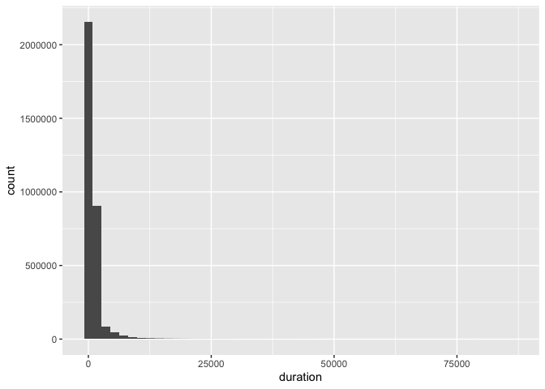

Homework 3: Bike Sharing Data Wrangling
================
YOUR NAME
TODAY’S DATE

Load Data
---------

    # Read the file, specifying data types for each column.
    rides_2011 <- read_csv("data/rides_2011.csv.gz", col_types = cols(
      start_time = col_datetime(),
      duration = col_double(),
      member_type = col_factor()
    ))
    rides_2012 <- read_csv("data/rides_2012.csv.gz", col_types = cols(
      start_time = col_datetime(),
      duration = col_double(),
      member_type = col_factor()
    ))

Exercise 1
----------

    rides <- bind_rows(
      rides_2011,
      rides_2012
    )

There are 3255678 rides in this dataset.

Exercise 2
----------

`duration` is probably measured in seconds, because most rides are less
than 30 \* 60 seconds (30 minutes), but some are as long as 86,355,
which is most of a day (86,400 seconds).

    rides %>% 
      ggplot(aes(x = duration)) +
        geom_histogram(binwidth = 30 * 60)

<!-- -->

Exercise 3
----------

    rides %>%
      count(member_type)

    ## # A tibble: 3 x 2
    ##   member_type       n
    ##   <fct>         <int>
    ## 1 Member      2636066
    ## 2 Casual       619591
    ## 3 Unknown          21

Exercise 4
----------

    hourly_rides <- rides %>%
      group_by(start_hour = floor_date(start_time, unit = "hours")) %>% 
      count()
