<style>
.exercise {
  border-radius: 10px;
  border-color: navy;
  border-style: solid;
  padding: 10px;
}
</style>

<style>
#math-in-quarto td
{
    padding:5px 10px 5px 10px;
}
</style>

## General Instructions

While you work through this tutorial, you will create a **Quarto document**.
Quarto is a simple document type for authoring documents (in many formats,
including HTML, PDF, and Word) that include code and results (including graphics)
in addition to text that you write.

It's like magic: you save all your text and code in a simple file;
when you're ready, push a button and it's rendered into an output
document with nicely formatted text, code (optional to include, but for
this class you always will), and 
**all the figures and tables generated by your code**.

Since all the data analysis and results are automatically included in
the compiled output document, your work is *reproducible* and it's easy
to re-do analysis if the data change, or if a mistake is uncovered. 

You can find *lots* of informaiton about quarto at 
[quarto.org](https://quarto.org).  Here are a few that you might be especially
useful for you early on.

* [Hello, Quarto](https://quarto.org/docs/get-started/hello/rstudio.html)
* [Markdown Basics](https://quarto.org/docs/authoring/markdown-basics.html)
* [A Gallery of examples](https://quarto.org/docs/gallery/)

::: {.callout-note title="There is a LOT of Quarto documentation"}

The Quarto documenation provides far more information than you will need for this course,
including how to use quarto with other programming languages (like python), and how to 
produce all sorts of document types (like web sites and books).  We just need to know the
basics of how markdown works and how to create simple documents. 
So don't get overwhelmed by all that is available.

On the other hand, if you are interested in learning more, feel free to explore
or reach out with questions.

:::


To create a Quarto documennt (`.qmd` file), you will have to work in RStudio.
So, as you work on this tutorial, you will
probably want to switch back and forth between this tutorial and an 
RStudio session where you are creating your document.

## `qmd` Files

### Create a Quarto file

In RStudio, navigate to **File > New File > Quarto Document**.

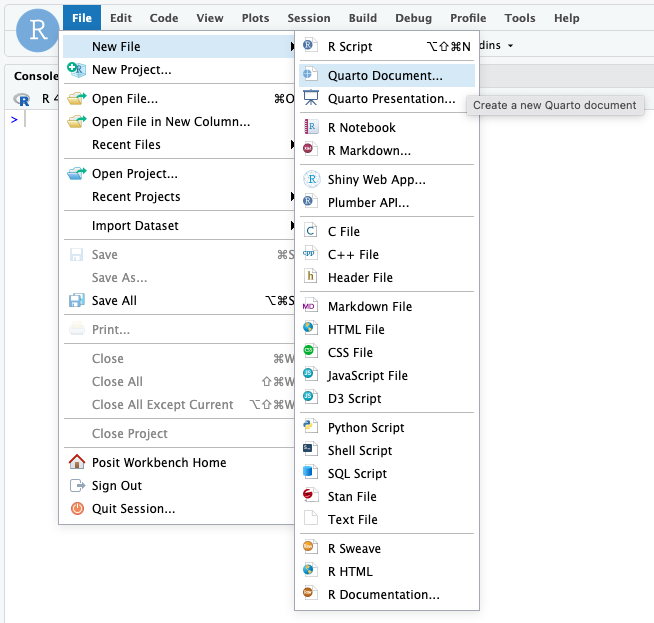{fig-align=center width="75%"}

Then give your document a title and click **Create**.

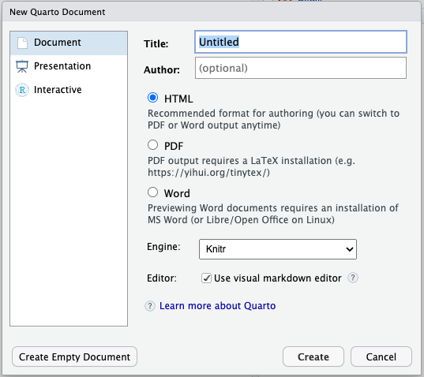{width="50%" fig-align=center}

### Save your qmd file

Save your file by clicking on the disk icon at the top of the file tab,
or going to **File > Save**. RStudio will append the extension `.qmd` to your 
file name.

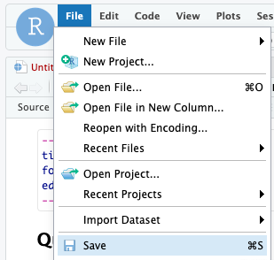{width="50%" fig-align=center}

Create a folder for your work and save your file inside that folder.

::: {layout-ncol=2}
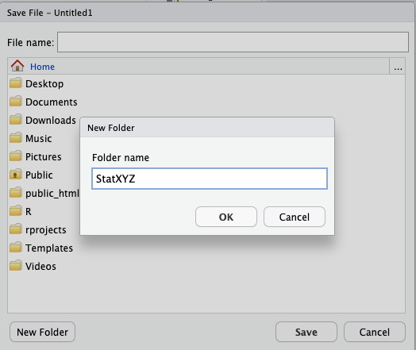

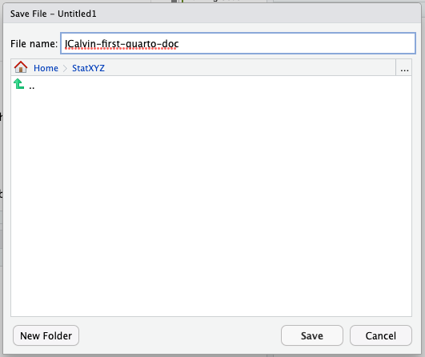
:::

::: {.callout-note}
#### Files are saved *on the server*

If you are working on the server, this file will be saved *on the server*, 
not on your local machine. (You can download it to your local machine if you
ever have a reason to do so.). 
You can find your files (or rename them, or move them, or copy them, etc.) 
by navigating the **Files** tab.

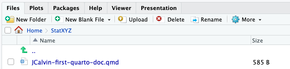

:::

::: {.callout-tip}

#### Always give your files good names

For a class, your filename should probably include your name and something that identifies
which assignment you are working on.  Perhaps something like `JCalvin-first-quarto-doc` or
`JCalvin-homework-1`. For other sorts of projects, you will need to come up with a naming scheme.
:::

:::{.callout-warning}
####  Avoid spaces and special characters in your file name

For certain operations, they are not allowed, and if you use them, it may *seem* to work 
but then stop working later. Just trust me -- **no spaces!**
:::

:::{.callout-note}
After you have opened a file on the RStudio server, 
that file will live in its own tab.  One one of the panes will be home
to all of these file tabs. If you close all of the files, this pane goes away to make
more room for other panes.
:::

### Render

How do `qmd` files actually work? What's so cool about them?

Click on the **Render** (there is a blue arrow icon next to it).

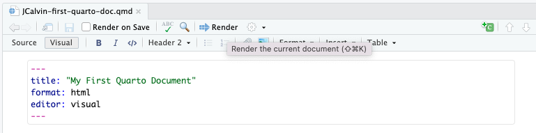{width="50%" fig-align=center}

When you do this, a new document is created (HTML, Word, PDF, etc.) from
your Quarto document.  By default, you will get an HTML document in your
**Vewer** tab.

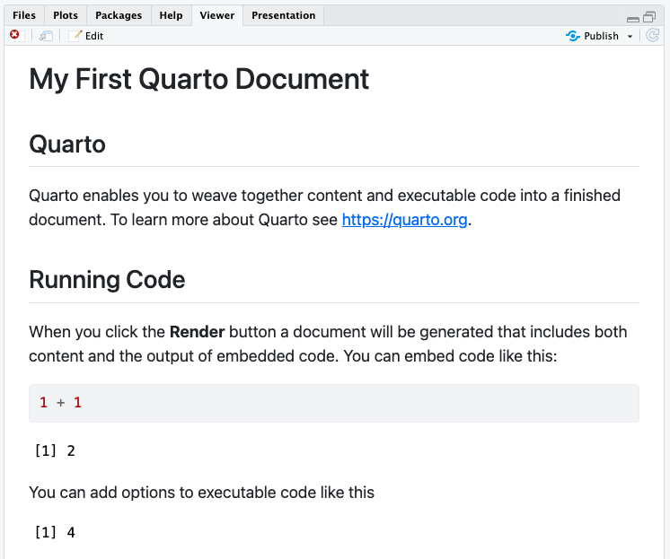{width="90%" fig-align=center}

:::{.callout-tip}
#### Viewing in a separate window

If you prefer to have your rendered file in a separate window, you can change your settings
in **Tools > Global Options > R Markdown**.  Select a "Window" for "Show output preview in:"
to have your rendered document show up in a new window. (This can be useful if your screen is small.)

*R Markdown was the predecessor of Quarto. You may see the old name in some places.*

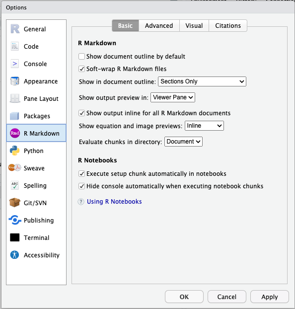
:::

:::{.callout-tip}
#### Pop-up blockers

If you have a **pop-up blocker**, you will be asked to approve every time RStudio
tries to open a new window. You can give blanket permission to RStudio to open new
windows to avoid this, and I recommend that you do.

Instructions for doing this vary a bit from browser to browser and operating system to
operating system. If you don't know how to turn off your pop-up blocker, google 
"turn off pop-up blocker chrome mac" or something similar for your browser and
operating system.
:::

## `qmd` file anatomy

### The YAML header

YAML stands for Yet Another Markup Language.  The YAML header is right
at the top of the document and begins and ends with three dashes.

In the YAML header, you can enter an appropriate title, author(s),
a date, and various other information that controls out your document
will be processed.

::: {#exr-edit-yaml}
Edit your YAML to look like this (but use your name instead of John Calvin):

```yaml
---
title: "My First Quarto Document"
author: "John Calvin"
date: last-modified
editor: visual
---
```

Now render again. Your name and the date should be included at the top of the file.

:::

:::{.callout-warning}
#### Edit the YAML header with care

If you accidentally delete a quotation mark or mess up the indentation, for example, 
then your file will probably not render properly. 
When this happens, you will typically get an error message with YAML or yaml in it 
somewhere.  That's a clue to look at the YAML header to see what happened.

Can't figure it out? Create a new document (or open a document you created before) 
and copy and paste its YAML header into your current document to start fresh.

Don't forget that the YAML header must begin and end with `---`.
:::


### Text

Below the YAML header is where the content of your document lives. Some of 
this is just text that you write. You can format the text much like you would 
in Word using the tool bar at the top of the file.

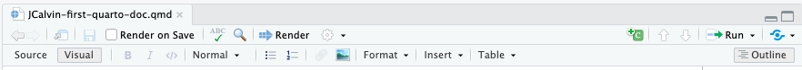

There are also a number of shortcuts for this formatting.
For example, enclosing a word in asterisks will
generate italics, so \*my text\* will become *my text*
Using two asterisks instead of one will generate boldface,
so \*\*my text\*\* becomes **my text**. You can also make bulletted
lists, numbered lists, section headers, and more. For example,

```
#### Some Text
```

becomes a subsection header like this:

#### Some Text

Fewer hashtags make the text even larger, and more make it smaller.

The system for these shortcuts is called Markdown. If you toggle from 
Visual to Source in the toolbar above, you can see what the file looks 
like with all the shortcuts visible.  You may edit in either format
and switch back and forth as you like. If you are curious to see learn
more about working directly in Markdown, see this from RStudio:

* [Markdown Basics](https://quarto.org/docs/authoring/markdown-basics.html)

:::{.callout-note title="Shared Projects"}
RStudio allows you to share projects to work together. But unfortunately the current version of RStudio doesn't support the visual editor when working on shared projects. So if you are working on a shared project, you will have to work in the source editor.
:::

::: {#exr-edit-text}
Before moving on, try a few of the tricks you just learned in your qmd
file. 

* Add a new section (using `##` or Header 2) just below the YAML header

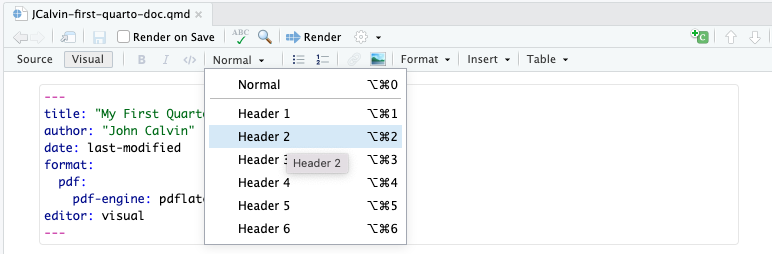

* Write a short paragraph below your new section header.

* Add some bold and italics.

* Experiment with some of the other things as you like.

* Render your document so you can see the results as a PDF (or HTML).
:::

### Code chunks

### Executing code

You can *do* things in R or Python by typing commands in the *Console* panel;
**however, working that way makes it hard to keep a record of your work
(and hard to redo things if anything changes or if a mistake was
made)**. 
For this class, you will instead 
**work in Quarto files, which can contain text, code, and output (including figures)**.

### Python in RStudio

As its name suggests, RStudio's native language is R. So in various places, R will be the default. But it's easy to switch to Python.


A `qmd` file can contain one or more **code chunks.** These
sections of the file have a grey background onscreen.

Depending on how you created your document, you may have one or more example code chunks in your file already.


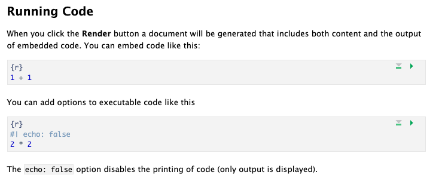{width="60%" fig-align=center}

::: {#exr-edit-rchunk}

a. Edit the R code in one of the R code chunks. 
b. Click on the green "run" button in the chunk to execute the code.
c. Render the document to see the results there as well.
:::

#### Inserting new R code chunks

You can add new code chunks using **Insert Chunk**

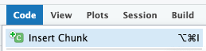

(There is also a separate little icon in the tool bar, and a keyboard shortcut.)

:::{.callout-warning}
Your first code chunks might default to R, not Python. To fix that, replace the `r` in the header with `python`:

```{python}
2 + 2
```

#### Chunk settings

In the example file, you will see at the top of one of the chunks a special
comment:

```
#| echo: false
```

This tells Quarto to run the code, but not to display the code -- only the 
results will appear when rendered. This is very useful
if you are creating a report for someone who is not interested in the code, just
the results. **For class, I generally want to see your code.**

Here are a few other options that may be interesting to you:

* `#| include: false` -- Run the code, but don't show the code or its results.

    This is mainly useful for loading packages and the like, which often leads 
    to lots of unwanted messaging.
    
* `#| eval: false` -- Don't run the code.

    This is mainly useful if something is broken.  You can temporarily leave
    the code unevaluated to check on other things and then come back and fix it 
    later.
    
* `#| fig-width: 5` -- Set the width of figures created in this chunk. 
`fig-height` works the same way.

* `#| layout-ncol: 2` -- Put figures into two columns.

    If your R code produces more than one figure, you might like to arrange
    them in 2 (or 3) columns to save some space and make things easier to read.
    
* `#| fig-cap: This is a cool caption!` -- Add a caption to your figures!


::: {#exr-cleaning-up}

#### Clean Up

At this point, you probably want to get rid of all the extra content in
the template and start fresh.

Delete **everything** from the original file that comes ***after*** the new section
you added. That is, delete the example stuff that appeared when we you first
created the file.

Now the clutter is gone and you have space to include your own R code
and text.
:::


### Quick recap

Quarto documents have 3 main kinds of components

* The YAML header

* Text sections

* R code chunks

When we render, the settings in the YAML header control the type and style of 
the document that is created. Code in the code chunks is executed, and the results
are included in the document (unless we specify not to do that).


## Running the code in a Quarto document

There are multiple ways to run and test code from a Quarto file.
Sometimes you want to render the whole file and get the HTML; other
times you want to run just a specific bit of code to make sure it's
working correctly.

### *Render* to run all the code

Every time you render the file, all code will be run automatically.
This is the safest way to make sure everything is working correctly.

### Using the *Run* Menu

The run menu allows you select individual chunks or selected lines,
or all chunks up to a certain point, etc. and have them run in the console.
You can even choose to run all the chunks.

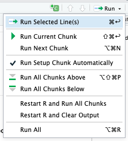{width="40%" fig-align=center}


### Using the "Play" button

Here is another way to run the code in an individual chunk:
Click on the green arrow at the upper right of a code
chunk to run the chunk. (The downward-pointing triangle can be used
to run all the code *above* the current chunk.)

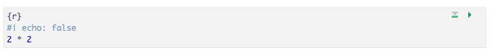

## Quarto files stand alone!

Every Quarto file (`qmd` file) must be completely stand-alone. It
doesn't share any information with the *Console* or the *Environment*
that you see in your RStudio session. **All** code that you need to do
whatever you are trying to do must be included in the qmd file itself!

For example, if you use the point-and-click user interface in the
RStudio *Environment* tab to import a data file, the read-in dataset
will *not* be available for use within your qmd file.

Keep your qmd files stand-alone! (You have no choice, actually...) This is actually a
good thing, you wouldn't want your document to change based on things not in the document,
that would be very confusing and make it very hard to share reliably.

## Downloading files from RStudio

You will have to download your files if you want a copy on your own
computer (for example so you can print it or turn it in electronically).

To download, go to the *Files* tab, check the box for the file you want,
then select **More > Export** from the menu at the top of the *File* tab.

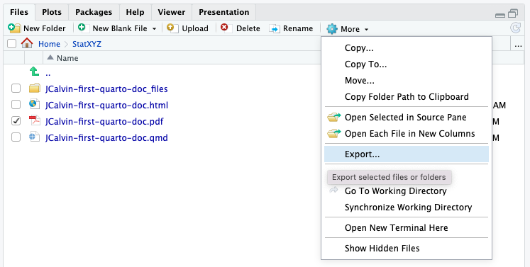
