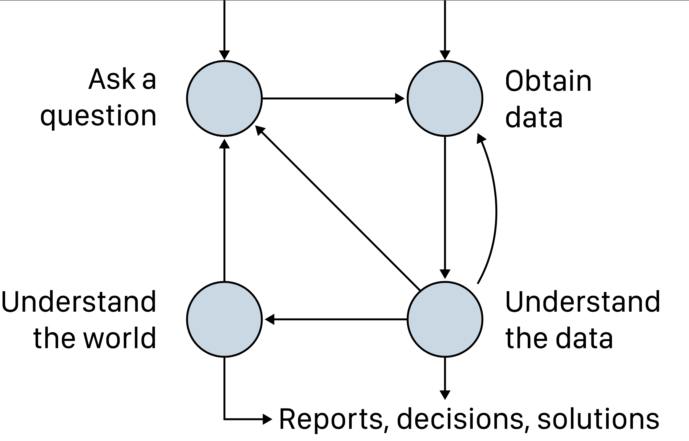
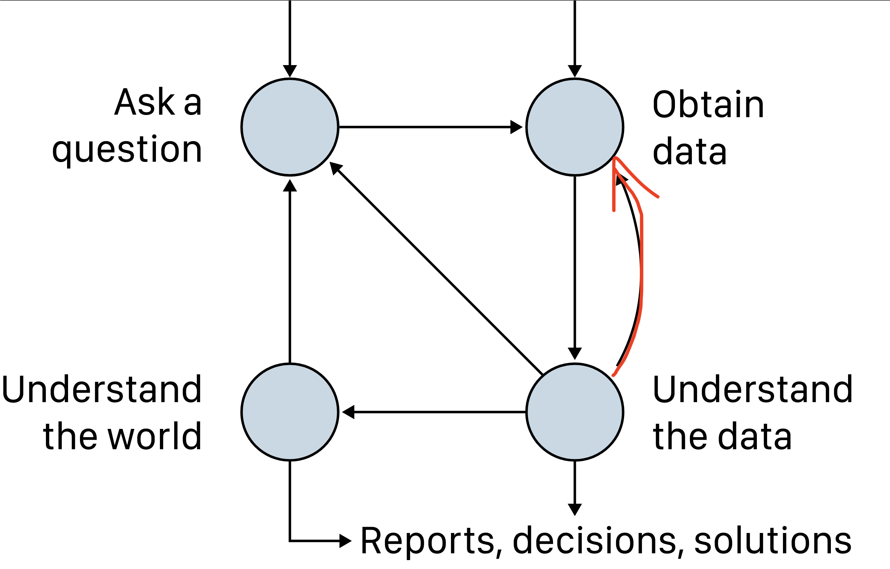
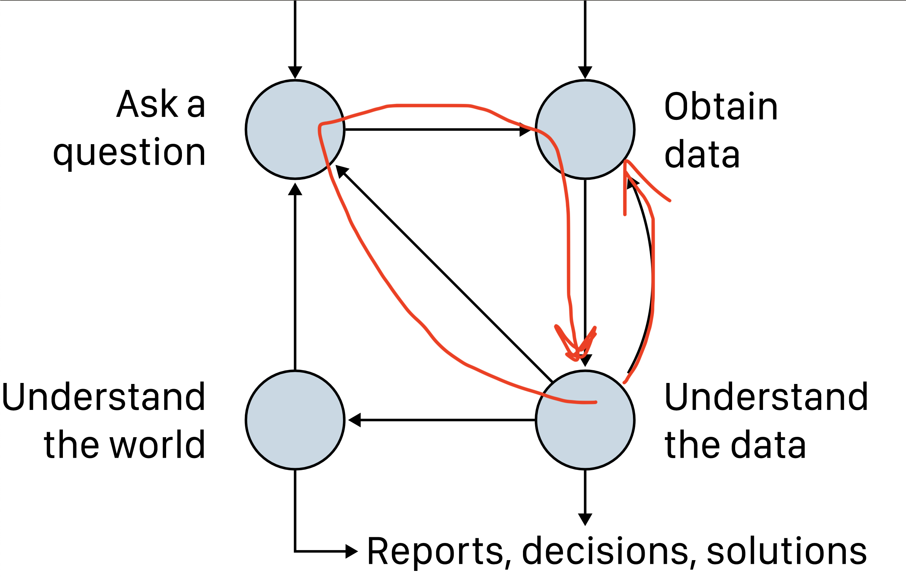
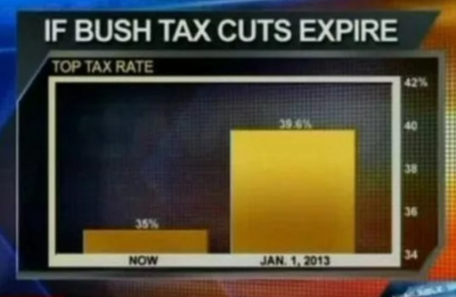

## The Purpose of Data Visualization 


```{python}
import pandas as pd
import plotly.express as px
```


```{python}
datasaurus_dozen = pd.read_csv("../../static/data/datasaurus/datasaurus.csv")
```

::: {.columns}
::: {.column width="50%"}

```{python}
#| echo: true
datasaurus_dozen
```

:::

. . .

::: {.column width="50%"}

```{python}
#| echo: true
datasaurus_dozen.groupby("dataset").size()
```

:::
:::

::: notes
This dataset includes multiple observations for each of the listed datasets. 
It's hard to see any patterns because there are so many observations.

There 142 observations for each of 13 datasets.
:::

## Let's look at summary statistics

```{python}
selected_datasets = datasaurus_dozen[datasaurus_dozen['dataset'].isin(["away", "bullseye", "dots", "star", "dino"])]
selected_datasets.groupby("dataset").mean()
```


::: notes
Interestingly, the means, std-deviations, and Pearson correlations are largely identical. 
And yet...
:::

## Visualize

```{python}
px.scatter(selected_datasets, x="x", y="y", 
           facet_col="dataset", 
           width=1000, height=300)
```

::: aside
See: https://cran.r-project.org/web/packages/datasauRus/vignettes/Datasaurus.html
:::

---


::: aside
[Same Stats, Different Graphs: Generating Datasets with Varied Appearance and Identical Statistics through Simulated Annealing](https://www.research.autodesk.com/publications/same-stats-different-graphs/)
:::

---


::: aside
[Same Stats, Different Graphs: Generating Datasets with Varied Appearance and Identical Statistics through Simulated Annealing](https://www.research.autodesk.com/publications/same-stats-different-graphs/)
:::

---


::: notes
Never trust summary statistics alone. 
Graphics can help distill *information* from *data*.

“The simple graph has brought more *information* to the *data* analyst’s mind than any other device.” — John Tukey, cited in R4DS
[J. Tukey&rsquo;s oft-cited quote](https://r4ds.had.co.nz/data-visualisation.html)

References:
- http://www.thefunctionalart.com/2016/08/download-datasaurus-never-trust-summary.html
- https://en.wikipedia.org/wiki/Anscombe%27s_quartet

:::

## The Foundations of Data Visualization {.smaller}

*Data Visualization* uses visual representations to help data scientists discover and present patterns in data. It takes advantage of the well-developed human visual system. 

Designing an effective visualization requires that we determine:

- The *purpose* of the visualization by identifying:
  - the key question
  - the context

- The most appropriate visual *composition* using:
  - Principles of effective graphic design
  - N. Yau&rsquo;s taxonomy (visual cues, coordinate systems, scale, context)

These ideas are summarized in the Novartis [Graphics Principles Cheat Sheet](https://github.com/GraphicsPrinciples/CheatSheet/blob/master/NVSCheatSheet.pdf)

::: aside

Cf.: M. Vandemeulenbroecke et al, [Effective Visual Communication for the Quantitative Scientist](https://ascpt.onlinelibrary.wiley.com/doi/full/10.1002/psp4.12455)
:::

::: notes
- Purpose/Function/Strategy (see: *Cheatsheet "Planning"*)
  - Identify the key *question* (cf. Question-driven scientific inquiry)
      - Communicating vs Exploring
  - Know the *context* (e.g., audience, domain, &hellip;)
- Composition/Form/Tactics
  - Principles of effective graphic design (for information)
      - Review: **Cheatsheet "Principles of Effective Graphic Design"**.
      - Review: **Cheatsheet "Selecting the right base graph"** (n.b., no pie charts)
      - Review: **Cheatsheet "Proximity improves association"**.
  - Yau&rsquo;s taxonomy (MDSR2.2 focuses on these.)
      - *Visual cues*: **Cheatsheet "Effectiveness Ranking"**.
          - *Color*: **Cheatsheet "Color for emphasis or distinction"**.
      - *Coordinate system*: Cartesian; polar; geographical
      - *Scale*: numeric (linear/logarithmic/percentage); categorical; time
      - *Context*: titles/labels
    
References:
- See: [Vandemeulebroeck, Figure 1](https://ascpt.onlinelibrary.wiley.com/doi/full/10.1002/psp4.12455#psp412455-fig-0001)
- See: [Vandemeulebroeck, Figure 2](https://ascpt.onlinelibrary.wiley.com/doi/full/10.1002/psp4.12455#psp412455-fig-0002)
- Graphics Principles
  - Website: <https://graphicsprinciples.github.io>
  - Paper: <https://ascpt.onlinelibrary.wiley.com/doi/full/10.1002/psp4.12455>
  - [DSBox Visualisation Tips](https://rstudio-education.github.io/datascience-box/course-materials/slides/u2-d14-effective-dataviz/u2-d14-effective-dataviz.html)
- Key researchers: J. Tukey, E. Tufte, W. Cleveland [& R. McGill]
:::

# Exploratory Data Analysis (EDA)

---

::: {.r-stack}


{.fragment}

{.fragment}
:::

::: aside
https://learningds.org/ch/01/lifecycle_cycle.html
:::

## Exploratory Data Analysis {.smaller}

EDA is the process by which a data scientist explores a dataset in a systematic ways looking for patterns. The process is iterative, focused on the data, and generally involves:

1. Asking questions about your data.
2. Searching for answers using visualization, transformation, and modelling of your data.
3. Using what you learn to refine your questions and/or generate new questions.


::: notes
One additional virtue: *curiosity*

This is how the scientific method plays out in DS. It's the "understand loop" in the DS diagram on slide 1.

References:
- https://rstudio.cloud/learn/primers/3.1 & https://r4ds.had.co.nz/exploratory-data-analysis.html
- https://en.wikipedia.org/wiki/Exploratory_data_analysis
- R4DS 7: EDA uses "visualisation and transformation to explore your data in a systematic way".
- MDSR 10: EDA identifies "patterns and multivariate relationships in data".
- IDS 2: EDA analyses "analysing data sets to summarize its main characteristics". https://ids-s1-20.github.io/slides/week-02/w2-d02-data-viz/w2-d02-data-viz.html#8
- ModernDive 5: "EDA gives you a sense of the distributions of the individual variables in your data, whether any potential relationships exist between variables, whether there are outliers and/or missing values, and (most importantly) how to build your model."
:::

## Plots to Communicate

::: {.columns}
::: {.column width="50%"}

```{python}
gapminder = px.data.gapminder()
px.scatter(gapminder, x="gdpPercap", y="lifeExp", color="continent",   
            animation_frame='year', animation_group='country',
           size="pop", hover_name="country",
           log_x=True, size_max=45, range_x=[100,100000], range_y=[25,90],
           labels=dict(pop="Population", gdpPercap="GDP per Capita", lifeExp="Life Expectancy", continent="Continent"))
```

:::

::: {.column width="50%"}

- Purpose <br><br>
  - Question <br><br>
  - Context <br><br><br>
- Composition <br><br>
  - Graphic Design <br><br>
  - Yau&rsquo;s taxonomy
:::
:::

::: notes
1. Purpose: 
  - To communicate the relationship between child health an over time across the world.
  - Narrowly, for his world health course; generally, for everyone

2. Composition
  - General principles of graphic design (see below)
  - N. Yau&rsquo;s taxonomy
      - *Visual cues*: 
          - Position (Scatter plot) shows correlation
          - Color (continent) & area (population) for less important data
      - *Coordinate system*
          - Cartesian (x-y) for most important numerical correlation
          - Categorical (color) for continent
      - *Scale*: numeric (logarithmic)
      - *Context*: titles/labels

:::

---
# Identifying Visualization Issues

Evaluate the following visualizations.

- [In the Barrel&hellip;](images/oil_prices.png)

- [Four score and seven years&hellip;](images/gettysburg_address.png)

- To truncate or not to truncate
  - [taxes](images/tax_cuts.png)
  - [temperatures](images/temperature_change.png)

- [Snow on Cholera](images/snow_cholera_map.jpg)

- [Napoleon&rsquo;s long, cold Russian winter](images/napoleon_march.png)

::: notes
Note that a picture can be worth a thousand words, either a thousand valuable words or a thousand malicious lies.

Notes:
- OPEC and the energy crisis
    - Tufte&rsquo;s *lie factor*
    - Dig up my old notes on this example. 

- Gettysburg address
    - Useless graph
    - See: <http://www.norvig.com/Gettysburg/>

- Scaling examples
    - Reference: <https://engineering.tableau.com/truncating-the-y-axis-threat-or-menace-d0bce66d4d08>

- J. Snow&rsquo;s cholera map
    - famous

- C. Minard's visualization of Napoleon's army in the Russian campaign, 1812-1813
    - famous
    - variables:
        - Location: x/y geographical points (see rivers and towns)
        - Army Size: line width (422K at start near Niemen; 100K in Moscow; 10K on leaving Russia)
        - Time: left-two right in brown; right to left in black.
        - Temperature: height (i.e., length) of temperature line at bottom

- Consider the scaling used in the following two visualizations.
    - 
    - That climate change temperature chart that looked flat. Where did I see it?

- The text's Challenger example
    - If we do this, keep Norman's critique in mind (see <https://jnd.org/in_defense_of_powerpoint/>).

Here are some more ugly chart examples:

- Flowing Data - <https://flowingdata.com/category/visualization/ugly-visualization/>
- Reddit - <https://www.reddit.com/r/dataisugly/>
- DataVis - <https://www.datavis.ca/gallery/missed.php>
- (Mostly Bad) Graphics and Tables - <http://users.stat.umn.edu/~rend0020/Teaching/STAT8801-resources/graphics/index.html>

References: 
- E. Tufte, *lie factor*, *data density*
- D. Huff, *How to Lie with Statistics*
- H. Wainer, *How to display data badly*
    - <https://www.wisdom.weizmann.ac.il/~zvika/course2015/announcements/WainerAmericanStatistician1984.pdf>

:::
