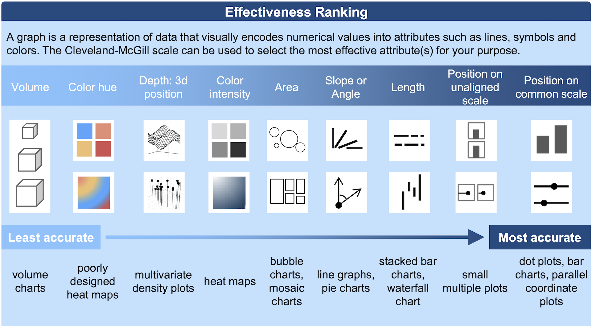

# Review

## Retrieval

Fill in the table using variables from the health and wealth gapminder plot.

| Variable | Type | Visual Cue |
|----------|------|------------|
| gdpPercap | | |
| lifeExp | | |
| continent | | |
| pop | | |
| country | | |
| year | | |

# Q&A

## Why does data type matter?

::: {.columns}
::: {.column width="50%"}


:::
::: {.column width="50%"}

:::
:::

Is date continuous or discrete?

## Composing a plot

::: {.incremental}
- What's the data? "Each row is a ___"
- What is the coordinate system? (What's `x` and `y`?)
- What graphical symbols are used? (dot? bar? line?)
- What data variables are mapped to what visual cues (aesthetics)?
  - What *scales* are used? (Any transformations?)
  - What *guides* are shown? (What labels for values?)
- What labels and annotations are added?
:::

## Grammar of Graphics ([2005](https://link.springer.com/book/10.1007/0-387-28695-0))

Concisely describe the components of a graphic


::: aside
Source: [BloggoType](http://bloggotype.blogspot.com/2016/08/holiday-notes2-grammar-of-graphics.html)
:::

---



::: aside
Source: Novartis [Graphics Principles Cheat Sheet](https://github.com/GraphicsPrinciples/CheatSheet/blob/master/NVSCheatSheet.pdf)
:::

## In Plotly... {.smaller}

::: {.columns}
::: {.column width="50%"}
e.g., `px.scatter(data, ...)`:

- Aesthetics (visual cues): `x`, `y`, `color`, `symbol`, `size`, `animation_frame`, `text`
- Scale: `log_x`, `log_y`, `range_x`, `range_y`
- Guides: `labels`
- Faceting: `facet_row`, `facet_col`, `facet_col_wrap`
- Other context: `title`, `hover_name` (tooltip), etc.

Other details can be customized with `update_layout`, `update_traces`, etc.
:::
::: {.column width="50%"}

```{python}
#| echo: false
import pandas as pd
import plotly.express as px

votes = pd.read_csv("../01intro/data/un_uk_us_tr.csv")
```

```{python}
(
  px.scatter(votes, x='year', y='percent_yes', color='country',
    facet_col='issue', facet_col_wrap=3, facet_col_spacing=.1, # <1>
    trendline='lowess', # <2>
    labels={"percent_yes": "% Yes Votes", "year": "Year", "country": "Country"}, # <3>
    title="Percentage of 'Yes' votes in the UN General Assembly", # <4>
  ).update_traces(marker_size=2) # <5>
)
```
1. **Faceting**
2. **Trendline**
3. **Labels**
4. Plot **title**.
5. Sets size directly (not based on data).

(See notes for details.)
:::
:::

# The Palmer Penguins

## Palmer Penguins

::: {.columns}
::: {.column width="30%"}

:::
::: {.column width="70%"}

```{python}
#| echo: true

penguins = pd.read_csv("https://raw.githubusercontent.com/allisonhorst/palmerpenguins/main/inst/extdata/penguins.csv")
penguins.info()
```

:::
:::

::: aside
Source: [palmerpenguins](https://allisonhorst.github.io/palmerpenguins/)

Artwork by @allison_horst
:::

---

```{python}
px.scatter(
    penguins,
    x='bill_depth_mm', y='bill_length_mm', color='species',
    title="Bill length vs depth",
    labels={
        "bill_depth_mm": "Bill Depth (mm)",
        "bill_length_mm": "Bill Length (mm)",
        "species": "Species"
    },
)
```

## Color vision deficiency 1 {.smaller}

1. **Redundant encoding**: use two visual cues to encode the same variable

```{python}
#| code-line-numbers: "3"
px.scatter(penguins,
    x='bill_depth_mm', y='bill_length_mm', color='species', 
    symbol='species',
    title="Bill length vs depth",
    labels={"bill_depth_mm": "Bill Depth (mm)", "bill_length_mm": "Bill Length (mm)", "species": "Species"},
)
```


## Color vision deficiency 2 {.smaller}

1. **Redundant encoding**: use two visual cues to encode the same variable
2. **Color palette**

```{python}
#| code-line-numbers: "6"
px.scatter(penguins,
    x='bill_depth_mm', y='bill_length_mm', color='species', 
    symbol='species',
    title="Bill length vs depth",
    labels={"bill_depth_mm": "Bill Depth (mm)", "bill_length_mm": "Bill Length (mm)", "species": "Species"},
    color_discrete_sequence=px.colors.qualitative.Safe
)
```

---

## Mapping vs Setting {.smaller}

```{python}
#| echo: false
penguins2 = penguins.dropna(subset=['body_mass_g'])
```

::: {.columns}
::: {.column width="50%"}

Mapping

```{python}
px.scatter(
    penguins2, x='bill_depth_mm', y='bill_length_mm', 
    color='species', size='body_mass_g', size_max=6,
)
```

:::

::: {.column width="50%"}

Setting

```{python}
(
  px.scatter(penguins2, x='bill_depth_mm', y='bill_length_mm')
  .update_traces(marker_color='red', marker_size=4)
)
```

:::
:::

## Mapping vs Setting Defined

- **Mapping:** Determine the color, size, etc. of points based on the values of a variable in the data
  - goes into the initial plot function (`px.scatter()`)
  - plotly computes the actual value using its *scales*

- **Setting:** Determine the color, size, etc. of points **not** based on the values of a variable in the data
  - in plotly we have to update the "traces" after we create the plot
  - plotly uses the value you give it directly (sets the color to literally "red")
  - "make all the points smaller"

## Faceting (Small Multiples)

```{python}
#| code-line-numbers: "4"
px.scatter(
    penguins,
    x='bill_depth_mm', y='bill_length_mm', color='species', 
    facet_col="island",
    width=1000
)
```

# Visualization Design Questions

## Bill depth vs length? {.smaller}

::: {.smaller}
```{python}
px.scatter(
    penguins,
    x='bill_depth_mm', y='bill_length_mm', 
    trendline='ols',
)
```
:::

## [Simpson's Paradox](https://en.wikipedia.org/wiki/Simpson%27s_paradox) {.smaller}

```{python}
px.scatter(
    penguins,
    x='bill_depth_mm', y='bill_length_mm', 
    trendline='ols',
    color='species',
)
```

## Most commonly observed species? {.smaller}

::: {.columns}
::: {.column width="50%"}

```{python}
px.pie(
    penguins,
    names='species',
    title="Penguin Species",
)
```

:::
::: {.column width="50%" .fragment}

```{python}
px.bar(
    penguins,
    x='species',
    title="Penguin Species",
)
```

:::
:::

## Even slightly better {.smaller}

::: {.columns}
::: {.column width="50%"}

```{python}
#| code-line-numbers: "1"
px.bar(
  penguins, x='species', height=400,
)
```

:::
::: {.column width="50%"}

```{python}
#| code-line-numbers: "1"
px.histogram(
  penguins, x='species', height=400,
)
```

:::
:::

- `px.bar`: *stack* one mark for each row (notice the little gaps between the bars)
- `px.histogram`: *count* how many rows have each species, make a single mark for each species

## Pie charts are useful for

- Evaluating whether one category is more or less than half
- And also for *groups of adjacent categories*
- and for cueing "part of a whole"

But *not* useful for comparing categories.

Just use a bar chart.

## Your Turn

[Extended activities in the plotting tutorial](https://connect.cs.calvin.edu/data202/intro/)
