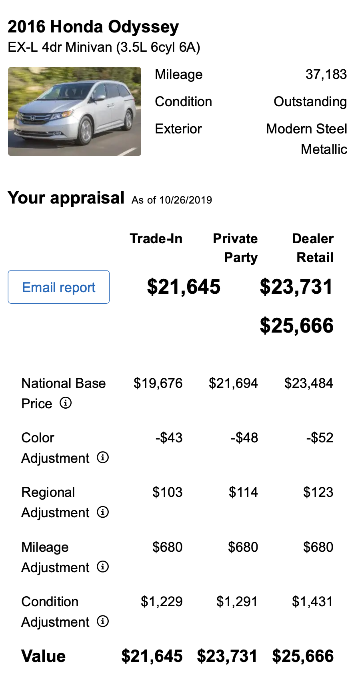
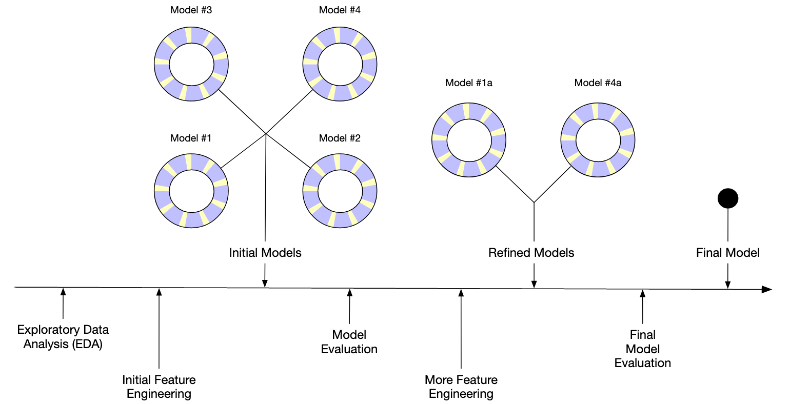

# Day 1: Introduction {data-stack-name="Intro"}

## Think of examples

How is data used to make decisions that affect you or your neighbors?

*Use whatever resources you like.*

## Predictive Analytics

- A powerful tool to turn data into action.
- It works because God made the universe predictable (and successful prediction rewarding), and *promised* order:
   - covenant with Noah that the seasons would continue (Gen 8:22)
   - guarantee in Psalms that the sun would rise (Ps 104:19)
    - promise to Jeremiah that the sun, moon, and stars would continue (Jer 31:35-36)
- **Need for wisdom**: It can be used for great good and great harm

---

## Power of Predictive Modeling {.smaller}

* **Medicine**: wearable monitor for seizures or falls, detect malaria from blood smears, find effective drug regimens from medical records
* **Drug Discovery**: predict the efficacy of a synthesis plan for a drug
* **Precision Agriculture**: predict effect of micro-climate on plant growth
* **Urban Planning**: forecast resource needs, extreme weather risks, ...
* **Government**: classify feedback from constituents
* **Retail**: predict items in a grocery order
* **Recommendation systems**: Amazon, Netflix, YouTube, ...
* **User interfaces**: gesture typing, autocomplete / autocorrect

and so much more...

---

## The universe is surprisingly predictable

* God created the world with actionable structure
  * We gradually learn how to perceive that structure and act within it.
  * The better our perceptions align with how the universe is structured, the better our actions
  * We can discover that structure by learning to be less surprised by what we see ( = predicting our perceptions)
* Perceptions are thus both accurate and fallable.

---

## Predictive modeling technology: Need for wisdom {.smaller}

* Potential for great good, but also great harm:
  * Lack of **fairness** in facial recognition, criminal risk, lending, job applicant scoring, ...
  * Lack of **transparency** in how "Big Data" systems make conclusions
  * Lack of **privacy** as data is increasingly collected and aggregated
  * Amplification of extreme positions in social media, YouTube, etc.
  * Oversimplification of human experience
  * Hidden human labor
  * Illusion of objectivity
  * ...!

See, for example, [Weapons of Math Destruction](https://en.wikipedia.org/wiki/Weapons_of_Math_Destruction)


## Reminders from Statistics

- We might wish we had all possible data...
- We must acknowledge our *uncertainty*.
  - Our measurements are partial.
  - Our inferences sometimes fail (and we may not know it!)
- But God made a world with *structure* that we can learn about even with imperfect tools.

# Activity {data-stack-name="Teachable Machine"}

## Teachable Machine {.smaller}

Pick a partner (or two). Decide who's *trainer* and who's *tester*.

**Trainer** (needs a laptop):

* Go to <https://teachablemachine.withgoogle.com/train/image>
* Train a simple classifier using your webcam. Ideas:
  - which hand are you holding up? happy or sad face? looking left or right? two colors?
* Don't worry about making it super accurate.

**Tester**:

* Try out your partner's classifier (without touching the computer or the same objects).
  * Try to find some situations where it works
  * Try to write a succinct description of what situations cause it to behave unexpectedly.

We'll share descriptions.

# Supervised Learning and the scikit-learn API {data-stack-name="Supervised"}

## Scikit-Learn (sklearn)

::: copilot
- A Python library for machine learning
- Provides a consistent API for many different kinds of models
- Provides many tools for data preparation, model evaluation, etc.
:::

## Model API: `fit`, `predict`

```{mermaid}
%%| echo: false
flowchart LR
    A1[("Training Data (X and y)")] --> B{{fit}}
    A2[Model Object] --> B
    B --> FM[Fitted Model]
    FM --> C{{Predict}}
    B2[(New data X)] --> C
    C --> D[("predicted y's")]
```

## Example: penguins

::: {.columns}
::: {.column width="30%"}

:::
::: {.column width="70%"}

```{python}
#| echo: true
import pandas as pd
penguins = pd.read_csv("https://raw.githubusercontent.com/allisonhorst/palmerpenguins/main/inst/extdata/penguins.csv")
penguins.info()
```


```{python}
penguins_simple = penguins[['bill_depth_mm', 'bill_length_mm', 'species']].dropna().copy()
```
:::
:::

::: aside
Source: [palmerpenguins](https://allisonhorst.github.io/palmerpenguins/)

Artwork by @allison_horst
:::

---

```{python}
#| echo: false
import plotly.express as px
px.scatter(
    penguins,
    x='bill_depth_mm', y='bill_length_mm', color='species',
    title="Bill length vs depth",
    labels={
        "bill_depth_mm": "Bill Depth (mm)",
        "bill_length_mm": "Bill Length (mm)",
        "species": "Species"
    },
)
```

## Which species is each penguin?

```{python}
#| code-line-numbers: "2|3-5|7-9"
#| echo: true
from sklearn.neighbors import KNeighborsClassifier
model = KNeighborsClassifier(n_neighbors=1)
model.fit(
    X=penguins_simple[['bill_depth_mm', 'bill_length_mm']],
    y=penguins_simple['species'])

penguins_simple['predicted_species'] = model.predict(
    X=penguins_simple[['bill_depth_mm', 'bill_length_mm']])
penguins_simple.head()
```

## Are those predictions are good?

```{python}
penguins_simple.groupby(['species', 'predicted_species'], as_index=False).size()
```

```{python}
#| echo: true
from sklearn.metrics import accuracy_score
accuracy_score(
    y_true=penguins_simple['species'],
    y_pred=penguins_simple['predicted_species'])
```

## Well, of course...

Why should we be unsurprised that this works?

## Train-test split!

```{mermaid}
%%| echo: false

flowchart LR
    A1[("All training data")] --> B{{Split}}
    B --> A2[("Training data")]
    B --> A3[("Test data")]
    A2 --> C{{Fit}}
    A3 -->|NEVER!| C
    C --> D[("Fitted model")]
```

```{python}
#| echo: false
penguins_simple = penguins[['bill_depth_mm', 'bill_length_mm', 'species']].dropna().copy()
```

```{python}
import numpy as np
np.random.seed(0)
penguins_simple["use_for_training"] = np.random.rand(len(penguins_simple)) < 0.5
penguins_train = penguins_simple.query("use_for_training").copy()
penguins_test = penguins_simple.query("not use_for_training").copy()    
print(f"{len(penguins_train)} training penguins, {len(penguins_test)} test penguins")
```

*Note*: Later we'll learn about the `train_test_split` function, which does this for us.

## Train *on the training set*

```{python}
#| code-line-numbers: "3-4"
model = KNeighborsClassifier(n_neighbors=1)
model.fit(
    X=penguins_train[['bill_depth_mm', 'bill_length_mm']],
    y=penguins_train['species']);
```

## How does it do?

```{python}
penguins_train['predicted_species'] = model.predict(
    X=penguins_train[['bill_depth_mm', 'bill_length_mm']])
penguins_train.groupby(['species', 'predicted_species'], as_index=False).size()
```

```{python}
penguins_test['predicted_species'] = model.predict(
    X=penguins_test[['bill_depth_mm', 'bill_length_mm']])
penguins_test.groupby(['species', 'predicted_species'], as_index=False).size()
```

```{python}
accuracy_score(
    y_true=penguins_test['species'],
    y_pred=penguins_test['predicted_species'])
```

## Other kinds of models

- Nearest Neighbors (`KNeighborsClassifier`)
- Decision Trees (`DecisionTreeClassifier`) and Random Forests (`RandomForestClassifier`)
- Linear Models (`LogisticRegression`, yes it's a classifier)
- Neural Networks (`MLPClassifier`)
- Boosting methods (`HistGradientBoostingClassifier`)

## Many models, same API

Decision tree:

```{python}
#| code-line-numbers: "3-4"
from sklearn.tree import DecisionTreeClassifier, plot_tree
model = DecisionTreeClassifier(max_depth=2)
model.fit(
    X=penguins_train[['bill_depth_mm', 'bill_length_mm']],
    y=penguins_train['species'])
```

## What does that tree do?

::: columns
::: {.column width="50%"}
```{python}
#| label: "fig-decision-tree-algorithm"
#| fig-cap: "Decision tree algorithm"
#| echo: false
plot_tree(model, feature_names=['bill_depth_mm', 'bill_length_mm'], impurity=False, class_names=model.classes_);
```
:::

::: {.column width="50%"}
```{python}
#| label: "fig-decision-tree-data-space"
#| fig-cap: "Decision tree, in data space"
#| echo: false
from sklearn.inspection import DecisionBoundaryDisplay
DecisionBoundaryDisplay.from_estimator(
    model,
    X=penguins_train[['bill_depth_mm', 'bill_length_mm']],
    xlabel='bill_depth_mm',
    ylabel='bill_length_mm',
)
```

:::
:::

## Linear Model (Logistic Regression)

```{python}
from sklearn.linear_model import LogisticRegression
model = LogisticRegression()
model.fit(
    X=penguins_train[['bill_depth_mm', 'bill_length_mm']],
    y=penguins_train['species'])
```


```{python}
model.coef_
```


```{python}
model.score(
    X=penguins_test[['bill_depth_mm', 'bill_length_mm']],
    y=penguins_test['species'])
```

## Neural Network

```{python}
from sklearn.neural_network import MLPClassifier
model = MLPClassifier(hidden_layer_sizes=(10, 10))
model.fit(
    X=penguins_train[['bill_depth_mm', 'bill_length_mm']],
    y=penguins_train['species'])
```

```{python}
model.score(
    X=penguins_test[['bill_depth_mm', 'bill_length_mm']],
    y=penguins_test['species'])
```

# Wednesday Slides {data-stack-name="Wednesday"}

## Types of Learning from Data {.smaller}

- **Supervised Learning**: Filling in a label for each item based on features
  - *Classification*: Labels are discrete (e.g. penguin species, spam/not spam, which word was swiped, ...)
  - *Regression*: Labels are continuous (e.g. sale price, seconds of video watched, ...)
    - **Forecasting**: predict how a sequence will continue (future observations)
- **Unsupervised Learning**: Finding relationships between items, doesn't need labels
  - *Clustering*: Grouping similar items (e.g. customer segments, ...)
  - *Dimensionality Reduction*: Finding a lower-dimensional representation of data (e.g. word embeddings, ...)

We'll focus on supervised learning and clustering in this course. Others:

- **Reinforcement Learning**: Learning to take actions to maximize a reward (e.g. game playing, robotics, ...)
- **Unsupervised learning**: identify *relationships* between items
- **Statistical inference**: fill in summary statistics (we wanted a population but only got a sample)
- **Causal inference**: fill in counterfactuals (what if?)


## Regression Example




## Regression: Concrete Mixture Strength {.smaller}


```{python}
from sklearn.datasets import fetch_openml
concrete = fetch_openml(data_id=4353)
concrete_all = concrete['data'].copy()

# clean up column names:
# remove everything after the first parenthesis,
# replace spaces with underscores
concrete_all.columns = [
    col.split('(', 1)[0].strip().replace(' ', '_').lower()
    for col in concrete_all.columns]
concrete_all = concrete_all.rename(columns={
    'concrete_compressive_strength': 'strength',
    'blast_furnace_slag': 'slag',
})
concrete_all.info()
```

```{python}
concrete_all.head()
```


## Modeling Workflow



::: aside
Source: [Tidy Modeling with R ch1](https://www.tmwr.org/software-modeling.html)
:::

## Step 1: Define the problem {.smaller}

- What are you trying to predict?
    - terms: *target*, *response*, *label*
- What data do you have?
    - terms: *features*, *predictors*, *covariates*
- What metrics will indicate success? (Measure success in multiple ways!)
    - terms: *loss*, *error*, *score*, *metric*
    - penguins example: accuracy (perhaps broken down by species)

Concrete example:

- **Task**: predict concrete strength (MPa) from mixture ingredients
- **Target**: concrete strength
- **Features**: mixture ingredients (cement, slag, ash, water, ...)
- **Metric**: how close are the predictions to the actual strength?

## Step 2: Explore the data {.smaller}

- What is the structure of the data?
- What are the distributions of the features and target?
- Anything unexpected? (e.g. missing values, outliers, ...): make lots of plots!

Concrete example:

```{python}
import plotly.express as px
px.histogram(concrete_all, x='strength', nbins=30)
```

```{python}
px.histogram(concrete_all, x='age', nbins=30)
```


```{python}
# Do we have duplicates of any mixtures that differ only in age and strength?
other_columns = [col for col in concrete_all.columns if col not in ['age', 'strength']]
concrete_all.groupby(other_columns, as_index=False).size().sort_values(by='size', ascending=False).head(10)
```

*We'll need to address this later.*

Are they all the same total weight?
    
```{python}
concrete_all[other_columns].sum(axis=1).describe()
```

## Step 3: Split the data

So we can evaluate the model.


::: aside
<https://xkcd.com/1122/>
:::

## Splitting concrete data

```{python}
from sklearn.model_selection import train_test_split

concrete_train, concrete_test = train_test_split(concrete_all, random_state=0, test_size=0.2)
print(f"{len(concrete_train)} training mixtures, {len(concrete_test)} test mixtures")
```

*Careful*: we just duplicated some mixtures in both sets (measurements at different ages).

## Step 4: Feature Engineering {.smaller}

Sometimes the features are already in a useful form, but sometimes we can get more useful features by transforming or combining the existing features.

Examples:

- ratios of ingredients
- log of age
- polynomial features (e.g. $x^2$)
- product of two features (*interactions*)
- date features (e.g., day of week, month)
- replace rare categories with "other"

We'll skip this for concrete for now.

## Step 5: Train (fit) and evaluate some models {.smaller}

- Pick a model (or several) that's appropriate for the task and data
- Fit the model to the training data
- Evaluate the model on the test data

Some models may require special preparation of the data:

- Missing values
- Categorical variables
- Scaling
- Feature engineering

Concrete example: let's try a linear model

```{python}
from sklearn.linear_model import LinearRegression
feature_columns = [col for col in concrete_train.columns if col != 'strength']
model = LinearRegression()
model.fit(
    X=concrete_train[feature_columns],
    y=concrete_train['strength'])

concrete_test['predicted_strength'] = model.predict(
    X=concrete_test[feature_columns])
```


## Metrics: Were those predictions good? {.smaller}

```{python}
# code to evaluate error using mae, mape, r2
from sklearn.metrics import mean_absolute_error, mean_absolute_percentage_error, mean_squared_error, r2_score

def evaluate(y_true, y_pred):
    return {
        'MAE': mean_absolute_error(y_true, y_pred),
        'MAPE': mean_absolute_percentage_error(y_true, y_pred),
        'R^2': r2_score(y_true, y_pred),
    }

pd.Series(
    evaluate(concrete_test['strength'], concrete_test['predicted_strength']))
```

- MAE: Mean Absolute Error ("predictions are usually off by xxx MPa")
- MAPE: Mean Absolute Percent Error ("predictions are usually off by yy%")
- Traditional R^2 (fraction of variance explained)

## Step 6: Tune the model {.smaller}

- Try different models and hyperparameters
- Try different feature engineering
- Analyze model errors (more EDA)
- Repeat steps 4-6 until model is good enough

Concrete example: analyze model errors

```{python}
concrete_test['error'] = concrete_test['predicted_strength'] - concrete_test['strength']
px.histogram(concrete_test, x='error', nbins=30)
```

Are there any patterns to the errors?

```{python}
px.scatter(
    concrete_test,
    x='predicted_strength', y='error',
    trendline='ols',
    labels={
        'predicted_strength': 'Predicted Strength (MPa)',
        'error': 'Error (MPa)',
    },
)
```

```{python}
px.scatter(
    concrete_test,
    x='water', y='error', trendline='ols',
)
```

Which mixtures are we worst at predicting?

```{python}
concrete_test.sort_values(by='error').head(5)
```

```{python}
concrete_test.sort_values(by='error').tail(5)
```

## Concrete: try a different model

e.g., random forest

```{python}
from sklearn.ensemble import RandomForestRegressor
model = RandomForestRegressor(n_estimators=100, random_state=0)
model.fit(
    X=concrete_train[feature_columns],
    y=concrete_train['strength'])

concrete_test['predicted_strength'] = model.predict(
    X=concrete_test[feature_columns])

pd.Series(
    evaluate(concrete_test['strength'], concrete_test['predicted_strength']))
```

## Step 7: Deploy the model {.smaller}

Often called "inference" (as opposed to "training")

- Use the model to make predictions on new data as it arrives
- Monitor the model's performance over time
- Retrain the model periodically
