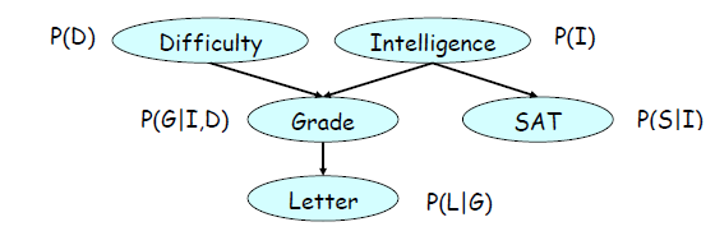
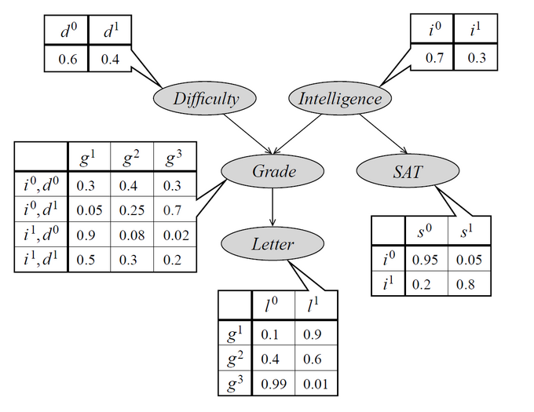
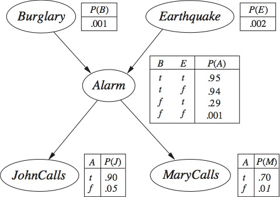

## Probabilistic Predictions {.smaller}

* What if we don't want just a prediction, but also to know **how certain** our model is about that prediction?
  -   For example, "given our model, we are 70% certain that it could be one disease, 20% it could be another, and 10% another".
  
* Let's use statistics! Starting with categorical variables...
  -   Say we have variables $A, B, C$.
  -   $A$ can assume values $a^0$ and $a^1$, $B$ can assume $b^0$ and $b^1$, and so on.
  -   Question: we want to know probabilities on $D$ having values $d^0$ or $d^1$ given we know values about $A, B$ and $C$.
      - For example, $P(d^0 | a^0, b^1, c^1)$ and $P(d^1 | a^0, b^1, c^1)$. Note that these would sum to $1$.
  -   What is our target and what are our features?
  
## Bayesian statistics {.smaller}

* At some point we would probably need a joint probability distribution: $P(A, B, C, D)$
  -   Then, we calculate $P(D | A, B, C) = \frac{P(A, B, C, D)}{P(A, B, C)}$
  
* We get $P(A, B, C)$ from **marginalization**:

$$
P(A,B,C) = \sum_{D}P(A,B,C,D)=P(A,B,C,d^0)+P(A,B,C,d^1)
$$

* However, how to get $P(A, B, C, D)$?
  -   4 variables with 2 values each: $2^4$ = 16 cells
  -   One way: just consult an expert and come up with the numbers
  -   But... can we estimate these probabilities from data? How much samples would we need?
  

## Probabilistic Graphical Models {.smaller}

* Maybe we can use a graphical representation that helps us simplify that probability?
* Several options: Markov Hidden Models, Bayesian networks...

* Bayesian networks take advantage on the *conditional independence* of the variables...

## Statistical independence {.smaller}

* Variables $A$ and $B$ are independent ($A⊥B$) if:
  -   $P(A,B)=P(A)P(B)$
  -   Which also means: $P(A | B) = P(A)$ and $P(B | A) = P(B)$
  
* Now, variables can be conditionally independent. $A$ and $B$ are said to be independent *given that** I already know some value of a third variable $C$ ($A⊥B|C$):
  -   $P(A,B|C)=P(A|C)P(B|C)$
  -   Which also means: $P(A | B, C) = P(A | C)$ and $P(B | A, C) = P(B | C)$
  -   And: $P(A,B,C)=P(A,B|C)P(C)=P(A|C)P(B|C)P(C)$

## An example {.smaller}

* Difficulty $D$ is clearly independent of Intelligence $I$.
* If I already know Intelligence $I$, knowing the Grade $G$ **wouldn't add anything** to knowing SAT $S$. It is "independent".
* But, if I don't know Intelligence $I$, knowing the Grade $G$ would really help knowing something about SAT. So, it is "dependent".
* So, $S⊥G|I$, in other words, $S$ is independent of $G$ on the condition of knowing $I$.

## Bayesian Networks {.smaller}

:::: {.columns}

::: {.column width="40%"}
* Represent the relationship between variables in terms of conditional independencies
  -   "Kind of" conveys the idea of how one variable causally influences another, but not always (causality is a complex and disputed notion)
* This is done with a **directed acyclic graph** (DAG) representation
  -   Every node has attributed to it a probability distribution conditioned on its parent nodes
  
:::

::: {.column width="60%"}

:::

::::

* What is most interesting about that is the possibility to decompose the joint probability distribution. For example:

$$
P(D,I,G,S,L) = P(D)P(I)P(G|I,D)P(S|I)P(L|G)
$$

* Why is this good? Each distribution can (in principle) be elaborated or trained separately!
  -   However, we also need to be sure about the conditional independencies

## Calculations {.smaller}

:::: {.columns}

::: {.column width="40%"}
* What's the probability of a recommendation letter given that a student's SAT is $s^0$?
  -   This means obtaining $P(L|s^0)$ through the **variable elimination algorithm**
  
:::

::: {.column width="60%"}

:::

::::

$$
P(L|s^0) = \frac{P(L,s^0)}{P(s^0)} = \sum_{D,I,G}\frac{P(D,I,G,L,s^0)}{P(s^0)}
$$
Applying the BN decomposition:

$$
P(L|s^0)= \frac{1}{P(s^0)}\sum_{D,I,G}P(D)P(I)P(G|I,D)P(s^0|I)P(L|G)
$$

Calculating $P(s^0)$:

$$
P(s^0) = \sum_{I}P(s^0,I) = \sum_{I}P(s^0|I)P(I) = P(s^0|i^0)P(i^0) + P(s^0|i^1)P(i^1) = 0.95\times0.7 + 0.2\times0.3
$$

Now, back to $P(L|s^0)$, let's eliminate variable $D$:

$$
P(L|s^0)=\frac{1}{P(s^0)}\sum_{I,G}P(I)P(s^0|I)P(L|G)\sum_{D}P(D)P(G|I,D)
$$

This gives us a table $\tau_1(G,I)=\sum_{D}P(D)P(G|I,D)$

Now, we eliminate $I$:

$$
P(L|s^0) = \frac{1}{P(s^0)}\sum_{G}P(L|G)\sum_{I}P(s^0|I)P(I)\tau_1(G,I)
$$

which gives us a table $\tau_2(G)=\sum_{I}P(s^0|I)P(I)\tau_1(G,I)$

Finally, we eliminate $G$:

$$
P(L|s^0) = \frac{1}{P(s^0)}\sum_{G}P(L|G)\tau_2(G)
$$

We thus get two numbers, $P(L=l^0|s^0)$ and $P(L=L=l^1|s^0)$, which would indicate the probability of each outcome.

## BNs in Python {.smaller}

* A nice example is implemented with the [sorobn library](https://github.com/MaxHalford/sorobn)

## Learning Bayesian Networks {.smaller}

* How to use data to fit a Bayesian network? Two tasks:
  -   Learning the network structure
  -   Learning the conditional distribution parameters

* Sometimes we mix a specialist knowledge with data, using a Bayesian learning approach

* For example, what is the most probable graph $G$ given we have dataset $D$? Bayes' theorem:

$$
P(G|D)=\frac{P(D|G)P(G)}{P(D)} \propto P(D|G)P(G)
$$
* $P(D|G$ can be calculated by exploring different network structures (likelihood of the data given a structure), and $P(G)$ is called the *a priori* and is a specialist knowledge (for example, certain structures may be attributed a greater probability given what we expect).
