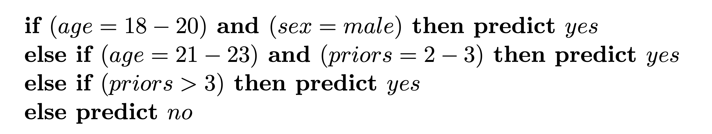
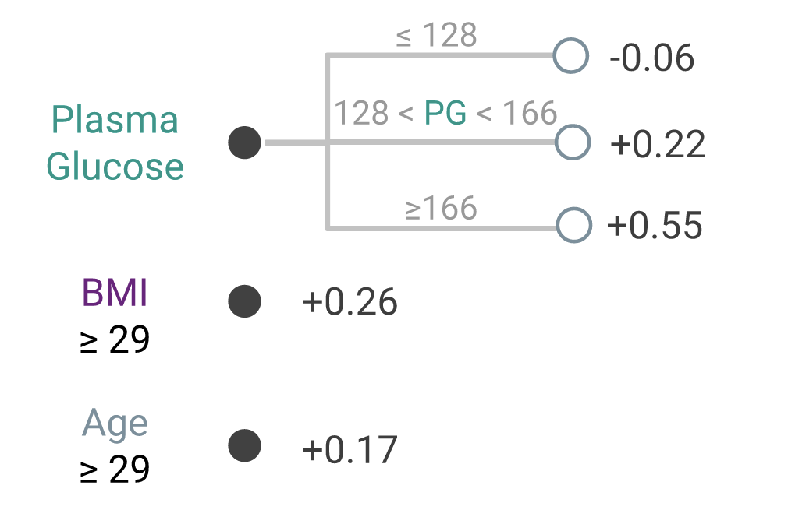

## High-Stakes Applications {.smaller}

- healthcare
    - Why does it say I'm at high risk for heart disease?
    - Why did my insurance company deny my claim?
- criminal justice (e.g., [ProPublica COMPAS](https://www.propublica.org/article/how-we-analyzed-the-compas-recidivism-algorithm)))
    - Why was this defendant denied bail?
    - Why target this neighborhood for increased policing?
- finance
    - Why was my loan application denied?
    - Why was my transaction flagged as fraudulent?
- hiring
    - Why was my job application rejected?
    - Why was I not promoted?

## Outline

- Explaining black-box models
  - Feature importance (permutaton)
  - Global explanations (partial dependence)
  - Local explanations (SHAP, LIME)
- Interpretable models
  - Decision rule lists
  - Additive risk score models

# Interpretability vs Explainability

- **Interpretability**: can we understand *how* the model works?
- **Explainability**: can we explain *why* the model made a particular prediction?

# Explaining Black-Box Models

**Black-box model**: a model that is difficult to interpret (e.g., random forest, gradient boosting model, deep neural network)

## Why explain?

- Debugging
- Feature Engineering
- Collaborating with domain experts
- Helping users understand when to trust a model

## Feature Importance {.smaller}

- We gave the model many features, but which ones did it use?
- Simple approach: remove each feature and see how much the model's performance decreases
  - but we'd have to retrain the model many times
  - if two features are correlated, removing one might not affect the model's performance
- Faster approach: **permutation feature importance**: scramble the values of each feature; how much does the model's performance decrease?
- But doesn't fix the problem of correlated features

Read more:

- [Interpretable Machine Learning book chapter](https://christophm.github.io/interpretable-ml-book/feature-importance.html)
- [sklearn User Guide: Permutation feature importance](https://scikit-learn.org/stable/modules/permutation_importance.html)

## Partial Dependence Plots

- How does the model's prediction change (in general) as we vary a feature?
- Individual conditional expectation (ICE) plot: compute the prediction for each row in the test set as we vary a feature
- Partial dependence plot: plot the *average* test-set prediction when we set a feature to a particular value; repeat for different values

Read more:

- [Interpretable Machine Learning book chapter](https://christophm.github.io/interpretable-ml-book/pdp.html)
- [sklearn User Guide: Partial dependence plots](https://scikit-learn.org/stable/modules/partial_dependence.html)

## Local Explanations

- For a particular prediction, which features were most important?
- Might be different from the global feature importance
- **SHAP**: Shapley values from game theory
  - How much would the prediction change if we removed each feature?

Read more:

- [Interpretable Machine Learning book chapter](https://christophm.github.io/interpretable-ml-book/shapley.html)
- Kaggle course: [SHAP Values](https://www.kaggle.com/dansbecker/shap-values)
- [SHAP: A Unified Approach to Interpreting Model Predictions](https://arxiv.org/abs/1705.07874)

## Local Explanations (LIME)

- Local Interpretable Model-Agnostic Explanations
- Train a simple model to approximate the black-box model's predictions

Read more:

- [Interpretable Machine Learning book chapter](https://christophm.github.io/interpretable-ml-book/lime.html)
- ["Why Should I Trust You?": Explaining the Predictions of Any Classifier | Abstract](https://arxiv.org/abs/1602.04938)
  - See screenshots [here](https://hackernoon.com/dogs-wolves-data-science-and-why-machines-must-learn-like-humans-do-41c43bc7f982)

# Interpretable Models

Instead of making a black-box model interpretable, we can use an interpretable model from the start.

## Decision Rule Lists

- A list of rules that can be used to make a prediction
- Example: CORELS (Certifiably Optimal RulE ListS) 

Read more:

- [Learning Certifiably Optimal Rule Lists for Categorical Data, Angelino et al.](https://www.jmlr.org/papers/volume18/17-716/17-716.pdf) (source of above figure)
- [Interpretable Machine Learning book chapter](https://christophm.github.io/interpretable-ml-book/rules.html)

## Additive Risk Score Models

Fast Interpretable Greedy Tree Sums (FIGS): [website](https://csinva.io/imodels/figs.html), [paper](https://arxiv.org/abs/2202.00858)

GroupFasterRisk

# Going Further

- [Interpretable Machine Learning](https://christophm.github.io/interpretable-ml-book/)
- [Interpretable Machine Learning: Fundamental Principles and 10 Grand Challenges](https://arxiv.org/pdf/2103.11251.pdf)
- [Stop explaining black box machine learning models for high stakes decisions and use interpretable models instead | Nature Machine Intelligence](https://www.nature.com/articles/s42256-019-0048-x)

