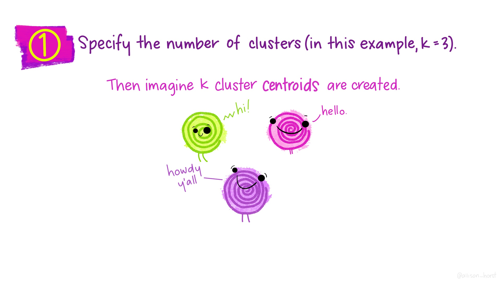
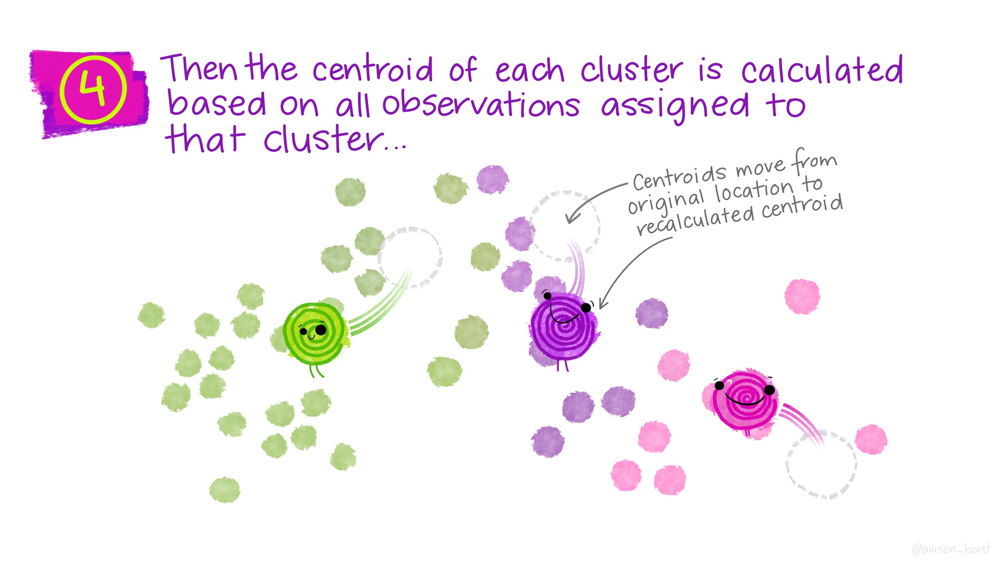
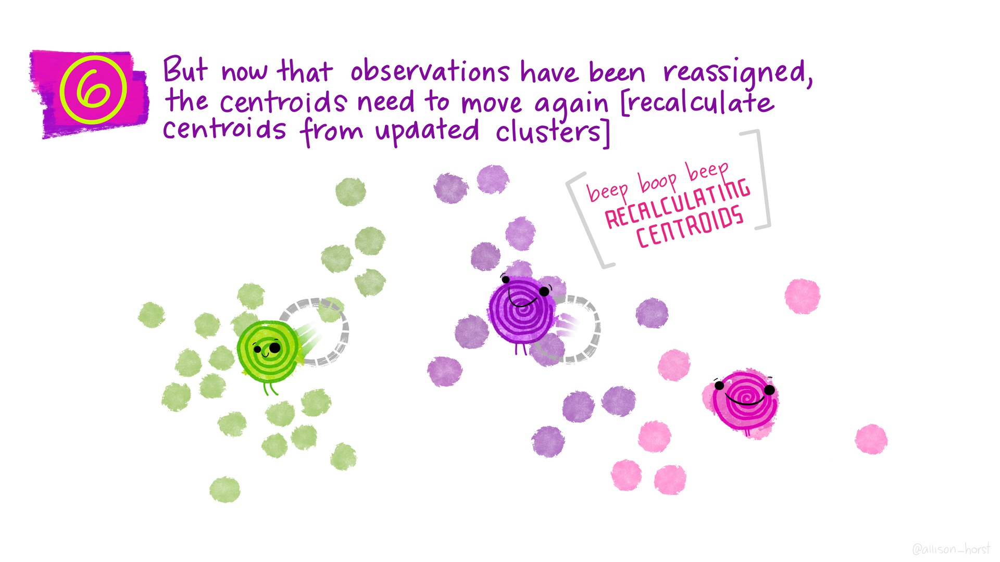
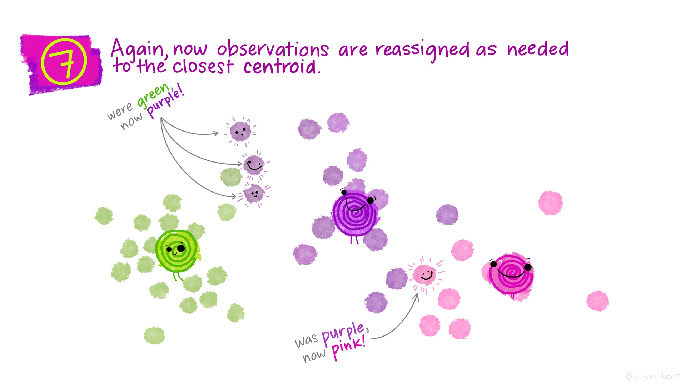
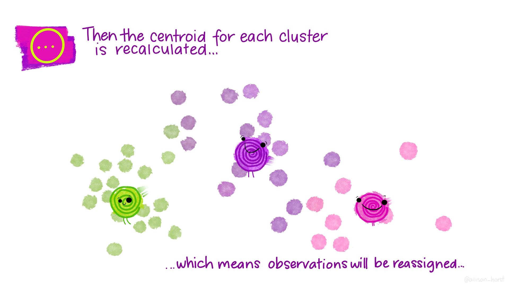
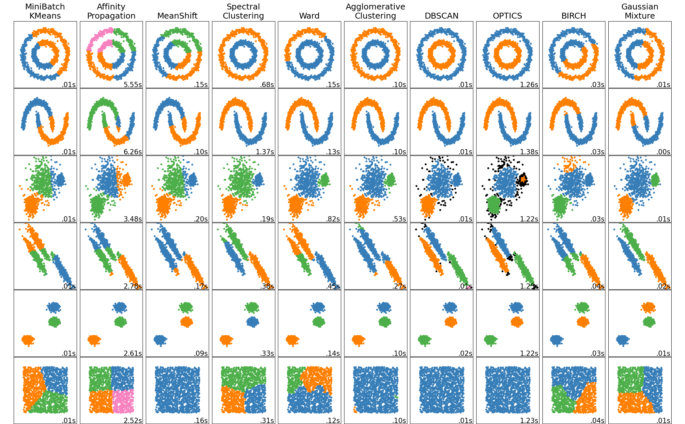

## Unsupervised Learning

* So far we have been doing *supervised* learning, where have a *target* we're trying to predict.
  * "How much will these homes sell for?"
  * "How long will this person spend watching this video?"
* **Unsupervised** learning works when we don't have an exact target to predict, or we want to explore relationships in the data.
  * "What general types of homes are on the market right now?"
  * "What are some different segments of our customer base?"
  * "[Are there distinct types of Covid-19 symptoms?](https://covid.joinzoe.com/us-post/covid-clusters)"
* **Clustering** is one very common type of unsupervised learning.

---

## Clustering

Goal: put observations into groups

* Those in the *same* group should be *similar to each other*
* Those in *different* groups should be *different*.

Crucial questions:

* How many groups?
* How do we define "similar" / "different"?

---

.floating-source[Artwork by [@allison_horst](https://github.com/allisonhorst/stats-illustrations)]
---

---

---

---

---

---

---

---

---

---

---

---

## *Many* types of clustering algorithms

[Source: [sklearn documentation](https://scikit-learn.org/stable/modules/clustering.html)]{.floating-source}

