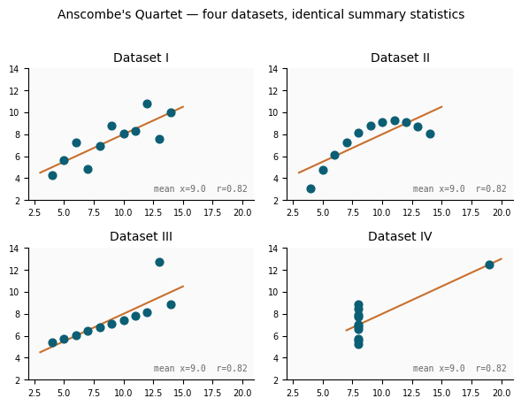

# What Is Machine Learning?

## From Rules to Learning

Traditional computer programs follow explicit instructions written by a programmer. If you wanted software to detect spam emails in 2000, you might write rules like: *"If the message contains the word 'free' and comes from an unknown sender, mark it as spam."* This works — until spammers change their language. You would have to update your rules constantly, playing an endless game of whack-a-mole.

Machine learning takes a different approach. Instead of writing the rules yourself, you collect **labeled examples** — thousands of emails that humans have already sorted into "spam" and "not spam" — and let the algorithm figure out the patterns on its own. Tom Mitchell's classic definition captures this precisely:

> *"A computer program is said to learn from experience E with respect to some class of tasks T and performance measure P, if its performance at tasks T, as measured by P, improves with experience E."*

- **Task (T):** what the program must do — classify an email, predict a price, detect fraud
- **Experience (E):** the data it learns from — labeled examples, historical transactions
- **Performance (P):** how we measure success — accuracy, error rate, false-positive rate

Notice how specific this definition is: learning always has a goal, a source of examples, and a way to measure success. Choosing the right measure P is one of the most consequential decisions you make in any ML project — we will return to this repeatedly.

---

## Traditional Programming vs. Machine Learning

<!-- width: 520 -->
| Traditional Programming | Machine Learning |
|---|---|
| Rules + Data → Output | Data + Output → Rules |
| You write the logic | The model learns the logic |
| Brittle when the world changes | Can be retrained on new data |
| Works well for well-defined, stable rules | Works well when rules are too complex to write |

This shift has made machine learning the dominant approach for problems where writing explicit rules is impractical — recognizing faces, understanding speech, recommending content, predicting disease from medical images, or detecting fraud.

---

## What Counts as Data?

Machine learning can work with many kinds of information, as long as it can be represented in a computer. The major types are:

- **Numerical** — temperatures, prices, counts, measurements. The most natural fit for ML.
- **Categorical** — labels like "spam / not spam," product categories, country names. Must be converted to numbers before modeling.
- **Text** — emails, articles, social media posts. Requires special preprocessing (tokenization, embeddings).
- **Image** — photos, medical scans, satellite imagery. Represented as grids of pixel values.
- **Time-series** — stock prices, sensor readings, patient vitals over time. Order matters.
- **Geospatial** — locations, trajectories, maps. Involves coordinate systems and distance calculations.

In this course we focus mostly on **tabular data** — tables of numerical and categorical columns — because it is the most common format in industry and the clearest way to build intuition for the core concepts.

---

## Three Types of Machine Learning

Not all ML problems look alike. There are three broad paradigms:

**Supervised learning** is the most common. Every training example has an input and a known correct answer — called a *label*. The model learns a mapping from inputs to outputs. Examples: predicting house prices, classifying whether a tumor is malignant, translating text between languages.

**Unsupervised learning** works with unlabeled data. The algorithm must find structure on its own — grouping similar items together, detecting anomalies, or compressing high-dimensional data. You use this when you do not know in advance what the groups or patterns should be.

**Reinforcement learning** is inspired by how animals learn through trial and error. An *agent* takes actions in an *environment* and receives *rewards* or *penalties*. Over time it learns a *policy* — a strategy that maximizes cumulative reward. This is how game-playing AIs (AlphaGo, chess engines) and robotic control systems are trained.

---

## The Machine Learning Workflow

A real ML project typically moves through these stages:

**1. Frame the problem.** What exactly are you trying to predict or decide? What does success look like? Who will use this system, and how?

**2. Collect and explore the data.** ML depends entirely on data. You need to understand its shape: How many examples? Are there missing values? Does it reflect the real world, or does it carry historical biases?

**3. Prepare features.** Raw data is rarely ready to feed into a model. Feature engineering — transforming raw inputs into useful numerical representations — can be the most time-consuming and impactful step.

**4. Choose and train a model.** Select an algorithm appropriate to your task, fit it to your training data, and tune its *hyperparameters*.

**5. Evaluate and iterate.** Measure performance on data the model has never seen. Is it accurate enough? Does it fail in systematic ways? Iterate on all prior steps as needed.

**6. Deploy and monitor.** Shipping a model to production is only the beginning. Data distributions shift over time, and a model that was accurate last year may degrade silently.

---

## Machine Learning Is Not Neutral

Machine learning is powerful, but it is not objective. Every dataset reflects the world that produced it — including its inequities. When a hiring algorithm trained on historical data learns to deprioritize resumes from certain demographic groups, it is not making a "mistake" in the technical sense; it is doing exactly what it was trained to do. The mistake happened earlier — in deciding to train on biased data, or in failing to audit the output.

Consider some well-documented cases:

- A recidivism prediction tool used in US courts was found to be **twice as likely** to falsely flag Black defendants as high-risk compared to white defendants.
- Facial recognition systems trained mostly on lighter-skinned faces perform significantly worse on darker-skinned faces — with error rates up to 35 percentage points higher.
- Recommendation algorithms amplify extreme content because *engagement* — not wellbeing or truth — is what is being optimized.

Technical skill alone is not enough. As you build ML systems, keep asking: *Who benefits? Who might be harmed? What is being optimized, and for whom? Whose data is missing?*

---

## Check Your Understanding

<!-- QUESTION:multiple-choice -->

**In Mitchell's definition, what does the "performance measure P" refer to?**

- [ ] The amount of training data used by the algorithm.
- [ ] The speed at which the model produces predictions.
- [x] The metric used to evaluate how well the model does its task on new, unseen data.
- [ ] The number of parameters inside the model.

<!-- END QUESTION -->

---

<!-- QUESTION:drag-the-words -->

Drag the correct word into each gap.

In *[supervised]* learning, every training example has a known correct answer called a *[label]*. In *[unsupervised]* learning the algorithm must discover structure without any labels. In *[reinforcement]* learning, an agent receives *[rewards]* or penalties for actions it takes in an environment.

<!-- END QUESTION -->

---

<!-- QUESTION:multiple-choice -->

**A data scientist trains a hiring algorithm on ten years of historical hiring decisions. The company historically hired fewer women into engineering roles. What is the most likely problem with this approach?**

- [ ] The model will run too slowly because historical data is large.
- [ ] There is not enough data — ten years is too short for ML to work.
- [x] The model will learn to replicate past biases, systematically disadvantaging women in future hiring.
- [ ] Hiring algorithms must use reinforcement learning, not supervised learning.

<!-- END QUESTION -->

---

<!-- QUESTION:true-false
answer: false
-->

Once a machine learning model is trained and deployed, it does not need further monitoring because it automatically adapts to changes in the real world.

<!-- END QUESTION -->

---

# Data as Tables — and What That Costs

## A 4,000-Year-Old Technology

Before any machine learning can happen, data must take a particular shape. The most common is the **table** — rows and columns, with each cell holding a single value. This structure is so familiar that it seems natural. But tables are a technology with a long history, and using them involves choices that have consequences.

The oldest known systematically structured tables originated in Mesopotamia around **1850 BCE**. Archaeologists have found cuneiform tablets — slabs of clay pressed with a stylus — that are strikingly recognizable to modern eyes.


One such tablet from the temple of Enlil at Nippur records revenue and disbursements to 46 temple personnel across months of the year. It has **column headings** (month names), **row labels** (names and professions of workers), **numerical values** in cells, subtotals every six months, and a summary column at the end. Rows for workers marked as "dead or fugitive" are left blank — the earliest missing-value notation we know of.

The grid structure, and the logic of flowing first down a column and then across a row, are unchanged after nearly four millennia. When you load a CSV into a pandas DataFrame, you are participating in one of humanity's oldest information technologies.

---

## Representing the World as Rows and Columns

To put something into a table, you must make a series of decisions:

**1. What is a row?** Each row represents one *instance* — one observation, one entity, one event. In a medical study, each row might be one patient visit. In a dataset of countries, each row is one country in one year.

**2. What is a column?** Each column represents one *feature* — a property measured for every row. Name, region, year, life expectancy. Crucially, every column must apply, at least in principle, to every row.

**3. What goes in each cell?** A single value — a number, a category label, a date. Not a sentence. Not ambiguity. Not "it's complicated."

These constraints are productive. They let us sort, filter, aggregate, and train models. But they have a cost. Imagine a dataset recording the reigns and deaths of Roman emperors — a historical exercise often used in data courses. When you decide that "Cause of Death" is a column and fill it with "Assassination" or "Natural/Illness," you are collapsing enormously complex historical events into a single categorical label. Caligula's assassination involved a conspiracy, praetorian guards, theatrical intrigue, and a disputed succession — but the table just says "Assassination," the same word used for a different emperor with a completely different story.

This is not a flaw you can fix by being more careful. It is a consequence of the table format itself. Tables impose **comparability** — the ability to place Augustus and Nero side by side and compute statistics — at the cost of erasing the particularity that makes each row unique.

---

## Vectorization: When Rows Become Numbers

In machine learning, the table becomes something even more abstract. Each row is eventually converted into a **vector** — a sequence of numbers. A row for a country might become `[1980, 62.4, 28000000, 4200.5, ...]` where each number encodes a feature (year, life expectancy, population, GDP per capita). ML algorithms operate entirely on these vectors: distance, similarity, and prediction all happen in this numerical space.

The scholar Adrian Mackenzie, in *Machine Learners: Archaeology of a Data Practice* (MIT Press, 2017), traces this process carefully. He argues that vectorization is not a neutral technical step:

> Every element of a training dataset must be expressible as a number or a set of numbers. This requirement is not neutral: it forces a decision about what aspects of a thing are countable, rankable, or encodable.

When an ML system learns to predict whether a job applicant will succeed, it does so on the basis of the **columns you gave it** — years of experience, degree field, prior employer. It cannot consider what is not in the table. Features left out of the dataset are features the model cannot use. And the choice of what to include, how to measure it, and what counts as the "right" answer to train toward — these decisions are made by humans, before the algorithm ever sees the data.

Mackenzie's point is not that machine learning is wrong, but that it is not magic. It inherits all the decisions embedded in the data collection process. The table is not a window onto reality; it is a *rendering* of reality, shaped by whoever built it.

---

## Check Your Understanding

<!-- QUESTION:multiple-choice -->

**Why does representing data as a table involve "erasing particularity"?**

- [ ] Because tables are limited to numeric data and cannot store text.
- [x] Because every row must share the same columns, forcing diverse entities into a single structure that ignores individual differences.
- [ ] Because CSV files lose precision when saved to disk.
- [ ] Because pandas DataFrames only support up to 1,000 rows before truncating data.

<!-- END QUESTION -->

---

<!-- QUESTION:true-false
answer: false
-->

A machine learning algorithm can consider any aspect of reality about each example, even if that aspect was not included as a column in the training dataset.

<!-- END QUESTION -->

---

<!-- QUESTION:multiple-choice -->

**A hospital is building a model to predict patient readmission risk. The dataset includes age, diagnosis codes, and insurance type — but not housing instability or food insecurity. What does Mackenzie's concept of vectorization suggest?**

- [ ] The model will still capture social factors because ML algorithms infer missing information from related columns.
- [ ] Social factors are irrelevant — only clinical data matters.
- [x] By leaving social factors out of the table, the team has made a consequential choice: the model cannot learn from what it cannot see.
- [ ] This is a reinforcement learning problem, so vectorization does not apply.

<!-- END QUESTION -->

---

# Pandas DataFrame Basics

## What Is a DataFrame?

In Python, the standard tool for working with tabular data is the **pandas** library. Its central data structure is the **DataFrame** — a table with labeled rows and columns, similar to a spreadsheet but backed by the full power of Python.

To illustrate the core operations, we will use a small example table of countries and development indicators. Imagine a CSV file with these columns:

<!-- width: 760 -->
| country | continent | year | life_exp | population | gdp_per_capita |
|---|---|---|---|---|---|
| Afghanistan | Asia | 2007 | 43.8 | 31889923 | 974.6 |
| Brazil | Americas | 2007 | 72.4 | 190010647 | 9065.8 |
| Germany | Europe | 2007 | 79.4 | 82400996 | 32170.4 |
| … | … | … | … | … | … |

This dataset — known as the **Gapminder** dataset — tracks life expectancy, population, and GDP per capita for countries over several decades. It is a clean, well-understood table that illustrates most of the operations you will need.

```python
import pandas as pd

countries = pd.read_csv("gapminder.csv")
countries.head()        # first 5 rows
countries.info()        # column names, types, non-null counts
countries.shape         # (n_rows, n_columns) as a tuple
```

`head()` gives you a quick visual of the structure. `info()` is more diagnostic: it shows data types and how many non-null values each column has — telling you immediately where missing data lives.

---

## Accessing Data (SLO 02A)

### Selecting columns

```python
countries["country"]                           # one column → Series (1-D)
countries[["country", "continent"]]            # multiple columns → DataFrame (2-D)
```

A single column returns a **Series** — a one-dimensional labeled array. Two or more columns return a **DataFrame**. This distinction matters because some operations only work on one type.

### Selecting rows by position

```python
countries.iloc[0]          # first row as a Series
countries.iloc[0:5]        # rows 0–4 as a DataFrame
countries.iloc[10, 2]      # value at row 10, column 2
```

`iloc` uses **integer positions** — think of it as "integer location." Count from zero, use slices exactly like Python lists.

### Adding and removing columns

```python
# Add a derived column
countries["high_gdp"] = countries["gdp_per_capita"] > 20000

# Remove a column (axis=1 means "column direction")
countries = countries.drop("gdp_per_capita", axis=1)

# Remove a row (axis=0 means "row direction")
countries = countries.drop(0, axis=0)
```

Always specify `axis`: `axis=1` for columns, `axis=0` for rows. Confusing them is a very common mistake.

---

## Sorting, Filtering, and Querying (SLO 02B)

### Sorting

```python
countries.sort_values("life_exp")                    # ascending (default)
countries.sort_values("life_exp", ascending=False)   # descending — highest first
```

### Boolean filtering — the core pattern

The most important pattern in pandas is the **boolean mask**: a Series of True/False values that selects matching rows.

```python
# Step 1: create the mask
wealthy = countries["gdp_per_capita"] > 20000

# Step 2: apply it
countries[wealthy]

# In one line — the most common style
countries[countries["continent"] == "Europe"]

# Combine conditions: & for AND, | for OR — each condition in its own parentheses
countries[(countries["continent"] == "Europe") & (countries["year"] == 2007)]
```

### Query syntax — readable one-liners

```python
countries.query("continent == 'Europe' and year == 2007")
```

### Handling missing values

```python
countries.isnull().sum()                     # count of NaN per column
countries[countries["continent"].notna()]    # keep only rows with a known continent
```

Missing values (`NaN`) silently break many operations if you do not handle them. **Always** check for them early with `isnull().sum()`.

---

## Check Your Understanding

<!-- QUESTION:fill-in-the-blank -->

Complete the pandas code to perform each operation.

Load a CSV: `df = pd.**[read_csv]**("file.csv")`

See the first 10 rows: `df.**[head]**(10)`

Select the "country" and "continent" columns: `df**[[ ]**"country", "continent"**]]**`

Select rows 5–9 by integer position: `df.**[iloc]**[5:10]`

Remove the "gdp_per_capita" column: `df = df.**[drop]**("gdp_per_capita", axis=**[1]**)`

<!-- END QUESTION -->

---

<!-- QUESTION:multiple-choice -->

**What does this code return?**

```python
countries[(countries["continent"] == "Asia") | (countries["continent"] == "Africa")]
```

- [ ] Only rows where continent is both Asia and Africa simultaneously.
- [x] All rows where continent is either Asia or Africa.
- [ ] All rows except those in Asia or Africa.
- [ ] This raises an error — you cannot combine conditions with `|`.

<!-- END QUESTION -->

---

<!-- QUESTION:true-false
answer: true
-->

`df.isnull().sum()` returns the count of missing values (`NaN`) in each column of the DataFrame.

<!-- END QUESTION -->

---

<!-- QUESTION:multiple-choice -->

**You want to keep only rows where `life_exp` is greater than 70. Which line is correct?**

- [ ] `df[df["life_exp"] = 70]`
- [x] `df[df["life_exp"] > 70]`
- [ ] `df.filter("life_exp > 70")`
- [ ] `df.drop("life_exp", axis=1)`

<!-- END QUESTION -->

---

# Visualization Basics with Plotly

## Why You Must Always Plot Your Data

A DataFrame full of numbers tells you very little by itself. Consider **Anscombe's Quartet** — four datasets that share nearly identical summary statistics (same mean, standard deviation, and correlation for both x and y), yet look completely different when plotted:



The **Datasaurus Dozen** extends this idea further — twelve datasets with identical statistics but wildly different shapes, including one that looks like a dinosaur. The lesson is direct: **always plot your data before trusting any summary** — and certainly before training a model on it. A model trained blindly on any one of these datasets would behave very differently from the others, despite the identical statistics.

---

## The Core Idea: Mapping Columns to Visual Channels (SLO 02C)

Plotly Express works by **mapping** DataFrame columns to visual properties of a chart. Each argument name is a **visual channel**; the value you pass is a column name. The data drives what the visual looks like.

To illustrate, we will use the same Gapminder dataset from Chapter 3: countries with columns for `continent`, `year`, `life_exp`, `population`, and `gdp_per_capita`.

```python
import plotly.express as px

# Built-in Gapminder dataset — no CSV needed
gapminder = px.data.gapminder()

# Basic scatter: two numerical variables
px.scatter(gapminder, x="gdp_per_capita", y="life_exp",
           title="GDP per Capita vs. Life Expectancy")
```

Now add more variables via additional channels:

```python
# Color encodes continent (categorical → distinct hues)
# Size encodes population (numerical → point area)
px.scatter(gapminder, x="gdp_per_capita", y="life_exp",
           color="continent",
           size="population",
           title="GDP, Life Expectancy, Continent, and Population")
```

Each additional visual channel lets you encode one more variable in the same plot. But there is a limit: too many channels at once makes the chart unreadable. A good rule of thumb is **three to four meaningful encodings**. Beyond that, use `facet_col` to split into separate panels:

```python
# facet_col splits into one panel per continent
px.scatter(gapminder, x="gdp_per_capita", y="life_exp",
           color="continent", size="population",
           facet_col="continent",
           title="GDP vs. Life Expectancy by Continent")
```

---

## Variable Type Drives Channel Choice

Not all channels work equally well for all variable types. Mismatching them produces misleading charts.

<!-- width: 650 -->
| Variable type | Best channels | Why |
|---|---|---|
| Numerical continuous | x, y, color gradient, size | Preserves sense of magnitude |
| Numerical discrete | x, y, size | Rank is meaningful |
| Categorical unordered | color (distinct hues), symbol, facet | Shows membership, not rank |
| Categorical ordered | color gradient, sorted x/y axis | Encodes the ordering visually |

Using a continuous color gradient for an *unordered* category implies a ranking that does not exist. Using distinct hues for a *continuous* number loses all magnitude information.

---

## Mapping vs. Styling

There are two fundamentally different kinds of arguments in Plotly Express:

<!-- width: 600 -->
| | Mapping | Styling |
|---|---|---|
| **What it is** | Data drives the visual | You choose the visual regardless of data |
| **Example** | `color="continent"` | `color_discrete_sequence=px.colors.qualitative.Safe` |
| **Changes with data?** | Yes | No |
| **Purpose** | Encode a variable | Make the chart readable and accessible |

Styling always includes human-readable labels, a descriptive title, an accessible color palette, and a clean template:

```python
px.scatter(gapminder, x="gdp_per_capita", y="life_exp",
    color="continent",
    size="population",
    title="Wealthier Countries Tend to Live Longer",
    labels={"gdp_per_capita": "GDP per Capita (USD)", "life_exp": "Life Expectancy (years)"},
    color_discrete_sequence=px.colors.qualitative.Safe,
    template="simple_white"
)
```

Never leave column names as axis labels — they are written for code, not for readers.

---

## Simpson's Paradox: Why Subgroups Matter

Adding `facet_col` or `color` to a chart is not just aesthetic — it can reveal patterns invisible in the aggregated view. **Simpson's Paradox** describes a situation where a trend visible in the whole dataset reverses or disappears within subgroups.

For example: if you plot GDP per capita vs. life expectancy for all countries combined, you see a positive trend — richer countries tend to live longer. But the shape and strength of that relationship looks very different when you facet by continent. Within Africa, the range of GDPs is much smaller; within Europe, the relationship is almost flat because most countries are already wealthy.

The same paradox shows up constantly in ML: a model that is 90% accurate overall may be 97% accurate for one group and 73% for another. Without splitting the evaluation by group, you would never see the disparity.

---

## Check Your Understanding

<!-- QUESTION:multiple-choice -->

**You have a `population` column with values ranging from 100,000 to 1.4 billion (continuous numerical). You want to encode it as the size of points in a scatter plot. Which argument is correct?**

- [ ] `color="population"`
- [ ] `symbol="population"`
- [x] `size="population"`
- [ ] `facet_col="population"`

<!-- END QUESTION -->

---

<!-- QUESTION:drag-the-words -->

Drag the correct term into each blank.

When you write `color="continent"`, you are creating a *[mapping]* — the data drives the visual. When you write `color_discrete_sequence=px.colors.qualitative.Safe`, you are applying *[styling]* — your choice is independent of the data. To split a chart into side-by-side panels by a categorical variable, use *[facet_col]*. To give axes human-readable names instead of column names, use the *[labels]* argument.

<!-- END QUESTION -->

---

<!-- QUESTION:multiple-choice -->

**A chart shows a positive trend between GDP per capita and life expectancy across all countries. When the data is faceted by continent, the trend looks very different within each group. What is this phenomenon called?**

- [ ] The Anscombe Effect
- [ ] Overfitting
- [x] Simpson's Paradox
- [ ] Confirmation bias

<!-- END QUESTION -->
