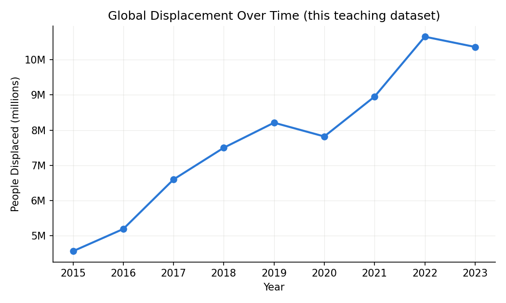
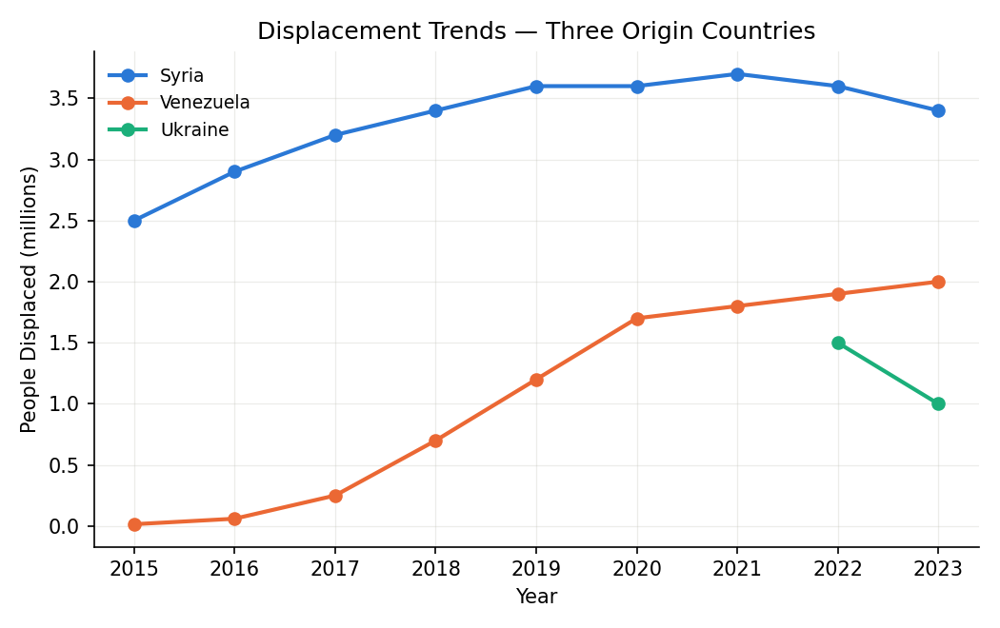
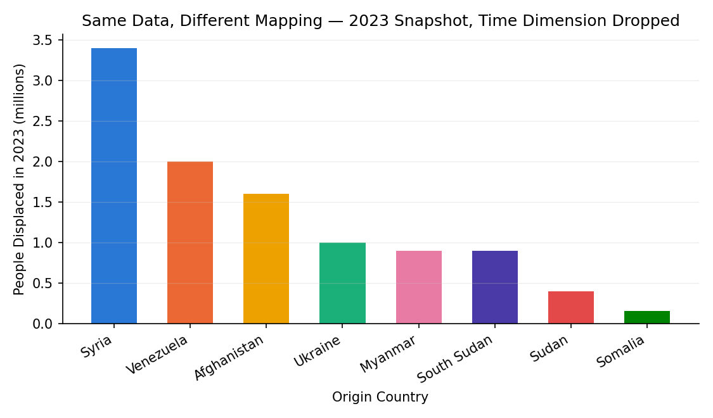

# One Table, Millions of Lives

## A Table About Displacement

Every year, humanitarian organizations try to answer a deceptively simple question: *how many people have been forced to leave their homes, and where did they go?* The United Nations Refugee Agency (UNHCR) and partner organizations answer it the same way people have answered questions like it for thousands of years — they build a table.

**📥 [Download the dataset: displacement.csv](https://cs.calvin.edu/courses/data/202/26fa/datasets/displacement.csv)**

This is a teaching dataset built to behave like real displacement reporting — eight origin/asylum country pairs, tracked year by year from 2015 to 2023. Treat the *shapes* of the trends as realistic and the *exact numbers* as illustrative, not as an authoritative UNHCR export. Download it now and follow along — every table and chart in this reading comes from running the code shown directly on this file.

Loading it and looking at the first few rows:

```python
import pandas as pd

displacement = pd.read_csv("displacement.csv")
displacement.head()
```

| year | origin_country | asylum_country | population |
|---:|:---|:---|---:|
| 2015 | Afghanistan | Pakistan | 1,400,000 |
| 2016 | Afghanistan | Pakistan | 1,400,000 |
| 2017 | Afghanistan | Pakistan | 1,400,000 |
| 2018 | Afghanistan | Pakistan | 1,400,000 |
| 2019 | Afghanistan | Pakistan | 1,400,000 |

Four plain columns. And yet every cell represents thousands of individual decisions to flee, individual border crossings, individual families rebuilding a life in an unfamiliar country. This tension — a table's cold simplicity next to the enormity of what it represents — is exactly where we start this course, because it is exactly where machine learning starts too. **Every model you will ever build sits on top of a table like this one.** Before we can talk about learning from data, we need to be honest about what a table can and cannot capture.

---

## Tables Are Ancient

The impulse to organize the world into rows and columns is not new. The first systematically structured tables appeared in Mesopotamia around **1850 BCE**: column headings, row labels, subtotals, blank cells for missing values.


This tablet from the temple of Enlil at Nippur records disbursements to 46 temple workers across months of the year — column headings (months), row labels (names and professions), numerical values in cells, and subtotals. Rows for workers marked "dead or fugitive" are left blank: the earliest missing-value notation we know of. Nearly four thousand years later, our displacement table follows the exact same logic — one row per situation, one column per property, one cell per fact — and, as you'll see later in this reading, it inherits the same blank spots: one row in `displacement.csv` is missing its `population` value entirely, the modern equivalent of that scribe's blank cell.

**Every row is a decision about what counts as "the same kind of thing."** To put displacement into a table, someone had to decide that a family fleeing conflict in one country and a family fleeing conflict in another belong in the same column of numbers, added together, sorted, and compared. That decision makes the table useful — you can ask "which countries host the most refugees?" — and it erases the difference between any two individual stories inside a summed number. This is not a flaw you can engineer away. It is the price every table charges for being usable at all, and it is the first thing to keep in mind whenever you load a CSV.

---

## From Rules to Learning

Now suppose an aid organization wants to *use* this table, not just publish it. They want to know: given how displacement has moved in the past, can we anticipate where the next surge in refugee arrivals will happen — early enough to pre-position shelter, medical staff, and supplies?

A traditional program would require a person to write explicit rules: *"If conflict indicator X rises above threshold Y in country Z, predict a surge."* Rules like this are brittle — every new conflict looks a little different from the last one, and the person writing the rules has to anticipate every pattern in advance.

**Machine learning takes a different approach.** Instead of hand-writing the rules, you give an algorithm years of historical rows from the displacement table — along with everything else you can reasonably attach to each row (conflict intensity reports, seasonal patterns, border-crossing counts) — and let it find the patterns that predict what happens next. Tom Mitchell's classic definition captures this precisely:

> *"A computer program is said to learn from experience E with respect to some class of tasks T and performance measure P, if its performance at tasks T, as measured by P, improves with experience E."*

Mapped onto our example:

- **Task (T):** predict next month's refugee arrivals into a given asylum country
- **Experience (E):** years of historical rows from the displacement table, plus related indicators
- **Performance (P):** how close the prediction comes to what actually happened

Notice that **P** — the performance measure — is itself a judgment call, just like every column in the table was. Do you measure success by how close the *number* is, or by whether you correctly flagged that *a surge was coming at all*? Get this wrong, and an aid agency could look successful on paper while missing the crises that mattered most. Choosing P is one of the most consequential decisions in any ML project, and we will return to it constantly.

<!-- width: 620 -->
| Traditional Programming | Machine Learning |
|---|---|
| Rules + Data → Output | Data + Output → Rules |
| A person writes the logic | The model learns the logic from examples |
| Brittle when the world changes | Can be retrained as new data arrives |
| Works when rules are well understood | Works when rules are too complex to write by hand |

---

## Check Your Understanding

<!-- QUESTION:multiple-choice -->

**In Mitchell's definition, applied to the displacement example above, what does "E" (experience) correspond to?**

- [ ] The accuracy of the surge predictions.
- [x] The historical rows of displacement data and related indicators the model learns from.
- [ ] The decision to pre-position shelter and supplies.
- [ ] The countries the model has never seen before.

<!-- END QUESTION -->

---

<!-- QUESTION:true-false
answer: true
-->

Choosing the wrong performance measure (P) can make a model look successful overall while still failing at the specific predictions that matter most.

<!-- END QUESTION -->

# Three Ways to Learn From the Same Table

## Supervised Learning: Predicting What Comes Next

Our displacement table already contains what supervised learning needs most: **a known correct answer for the past.** For every year and country pair already in the table, we know exactly how many people arrived — that number *is* the label. A supervised model is trained to take everything you know *before* an event (conflict indicators, prior-year trends, seasonal patterns) and predict the number you'll eventually observe.

This is the same structure behind predicting house prices, detecting tumors in scans, or classifying an email as spam: an input, paired with a known correct output, repeated across thousands of examples until the model generalizes to new inputs it hasn't seen.

## Unsupervised Learning: Finding Crises That Rhyme

Now imagine a different question: not "how many people will arrive," but "**do displacement crises fall into recognizable patterns**?" Look at the chart below, built directly from `displacement.csv` — one small panel per origin country, all sharing the same y-axis units (millions of people):


Nothing in our table labels a crisis as "sudden-spike" or "protracted" — no one has pre-sorted them that way. But look at how differently these eight shapes behave: **Ukraine and Sudan** appear abruptly from nothing — a sudden-onset crisis with no long history. **Syria and Afghanistan** sit at a high, slowly shifting plateau — a protracted crisis that has simply become the new normal. **Somalia** trends steadily downward — improving conditions, or at least fewer new departures. **Myanmar** jumps once, sharply, then flattens.

This is exactly the kind of question **unsupervised learning** is built for: given the shape of each crisis's year-by-year numbers, group the ones that behave similarly, without telling the algorithm in advance what the groups should be. The output isn't a prediction — it's structure the algorithm found on its own. An aid organization might use those clusters to plan differently for a "sudden-spike" cluster (surge capacity, temporary shelter) versus a "protracted" cluster (long-term housing, schooling, work permits).

## Reinforcement Learning: Deciding What to Do Next

Supervised and unsupervised learning both work on our table *as it already exists* — a static record of the past. Look again at the **Sudan** panel above: a single data point, appearing in 2023, with no history behind it at all. If you were the aid agency responding to that emerging crisis this week, there would be no table of "what happened in previous years" to learn from — because for this crisis, there is no previous year yet.

Suppose the aid agency has a limited number of shelters and case workers to distribute across several camps, **week after week**, as new arrivals keep changing each camp's needs. Every allocation decision changes the situation the next decision has to respond to. No historical table of "correct allocations" exists to learn from, because the right allocation depends on what happens *after* you act — exactly the position the agency is in with Sudan right now.

This is what **reinforcement learning** is built for. An *agent* (the allocation system) takes *actions* (how to distribute shelter and staff this week) inside an *environment* (the camps and the people arriving) and receives *rewards* or *penalties* based on outcomes (reduced overcrowding, met medical needs). Over many rounds, the agent learns a *policy* — a strategy for allocating resources that maximizes cumulative well-being, not just this week's numbers. This is the same idea behind how AlphaGo learned to play Go and how robots learn to walk: not from a table of labeled answers, but from acting, observing consequences, and adjusting.

<!-- width: 700 -->
| Paradigm | What the data looks like | Question it answers |
|---|---|---|
| Supervised | Rows with a known outcome | "What will happen, based on what has happened before?" |
| Unsupervised | Rows with no predefined labels | "What patterns exist that no one has named yet?" |
| Reinforcement | A sequence of actions and consequences | "What should I do next, given what happens after I act?" |

---

## Check Your Understanding

<!-- QUESTION:drag-the-words -->

Drag the correct paradigm into each gap.

Predicting next month's refugee arrivals from historical data with known outcomes is an example of *[supervised]* learning. Grouping past displacement crises into "sudden-spike" and "protracted" patterns without predefined categories is an example of *[unsupervised]* learning. Deciding how to reallocate shelter capacity week over week, learning from the consequences of each decision, is an example of *[reinforcement]* learning.

<!-- END QUESTION -->

---

<!-- QUESTION:multiple-choice -->

**Why can't a brand-new crisis like Sudan's — with a single data point and no history — be handled the same way as the Syria supervised-learning scenario?**

- [ ] It can — one data point is enough to train any supervised model.
- [x] There is no historical table of "correct" outcomes for this crisis yet — each response and its consequences would have to be learned as they unfold.
- [ ] Sudan's row is missing a `population` value, so pandas would refuse to load the file.
- [ ] Reinforcement learning only applies to countries that appear in the dataset more than five times.

<!-- END QUESTION -->

## The Machine Learning Workflow

Whichever paradigm applies, a real project moves through the same broad stages. Sticking with our aid organization's surge-prediction model:

**1. Frame the problem.** What exactly are we predicting — the exact number of arrivals, or just whether a surge is coming? Who will act on this prediction, and how quickly?

**2. Collect and explore the data.** How many years of data do we actually have? Which countries report consistently, and which have gaps? Does under-reporting from some regions mean our table already reflects whose crises get counted and whose don't?

**3. Prepare features.** Raw rows are rarely ready to train on. We might derive a "conflict intensity" feature, a "distance to nearest border crossing" feature, or a rolling average of the last three months' arrivals — transforming the table into something a model can actually learn from.

**4. Choose and train a model.** Select an algorithm suited to the task, fit it to historical rows, and tune its *hyperparameters*.

**5. Evaluate and iterate.** Test the model on data it has never seen — ideally a crisis it wasn't trained on at all. Does it fail systematically for certain regions? Iterate.

**6. Deploy and monitor.** A model trained on last decade's conflicts may not recognize next year's new kind of crisis. Displacement patterns shift with geopolitics; a model that quietly stops working is far more dangerous than one that visibly fails.

---

## Check Your Understanding

<!-- QUESTION:fill-in-the-blank -->

Complete the workflow steps for the surge-prediction model.

Deciding whether to predict an exact number or just a surge warning happens during **[Frame]** the problem.

Noticing that some countries under-report happens during **[Collect]** and explore the data.

Turning raw rows into a "conflict intensity" variable happens during **[Prepare]** features.

Testing the model on a crisis it has never seen happens during **[Evaluate]** and iterate.

<!-- END QUESTION -->

# From Story to DataFrame

## Loading the Table

In Python, the standard tool for working with tabular data like our displacement table is the **pandas** library. Its central structure is the **DataFrame** — rows and columns, labeled, backed by the full power of Python. Every output below is the *actual* result of running this code against `displacement.csv` — download it and run it yourself to check.

```python
import pandas as pd

displacement = pd.read_csv("displacement.csv")
displacement.info()
```

```text
<class 'pandas.DataFrame'>
RangeIndex: 57 entries, 0 to 56
Data columns (total 4 columns):
 #   Column          Non-Null Count  Dtype
---  ------          --------------  -----
 0   year            57 non-null     int64
 1   origin_country  57 non-null     object
 2   asylum_country  57 non-null     object
 3   population      56 non-null     float64
dtypes: float64(1), int64(1), object(2)
memory usage: 1.9+ KB
```

```python
displacement.shape
```
```text
(57, 4)
```

Two things worth noticing immediately: `population` has only **56 non-null** values out of 57 rows — one row's population is missing, exactly the kind of gap we talked about with the cuneiform tablet. We'll come back to that row directly. And the two text columns show up as `object` dtype — pandas' catch-all for text it can't type more specifically.

## Accessing Data

### Selecting columns

```python
displacement["origin_country"]                              # one column → Series
displacement[["origin_country", "asylum_country", "population"]]  # multiple columns → DataFrame
```

| origin_country | asylum_country | population |
|:---|:---|---:|
| Afghanistan | Pakistan | 1,400,000 |
| Afghanistan | Pakistan | 1,400,000 |
| Afghanistan | Pakistan | 1,400,000 |
| Afghanistan | Pakistan | 1,400,000 |
| Afghanistan | Pakistan | 1,400,000 |

A single column returns a **Series** (one-dimensional); two or more return a **DataFrame** (two-dimensional). This distinction matters — some operations only work on one type.

<!-- QUESTION:multiple-choice -->

**Which of the following returns a Series, not a DataFrame?**

- [x] `displacement["population"]`
- [ ] `displacement[["population"]]`
- [ ] `displacement[["origin_country", "population"]]`
- [ ] `displacement[["population", "year"]]`

<!-- END QUESTION -->

### Selecting rows by position

```python
displacement.iloc[0]          # first row, as a Series
displacement.iloc[10, 2]      # value at row 10, column 2
```

```text
year                     2015
origin_country    Afghanistan
asylum_country       Pakistan
population          1,400,000
Name: 0, dtype: object
```

`displacement.iloc[10, 2]` returns **`'Bangladesh'`** — row 10, third column (`asylum_country`, counting from 0), which lands on one of the Myanmar → Bangladesh rows.

`iloc` uses **integer position** — count from zero, slice exactly like a Python list.

### Adding and removing columns

```python
# A derived column: population as a share of that year's total displacement
displacement["share_of_year"] = (
    displacement["population"] / displacement.groupby("year")["population"].transform("sum")
)
displacement[displacement["origin_country"] == "Afghanistan"][["year", "population", "share_of_year"]].head()
```

| year | population | share_of_year |
|---:|---:|---:|
| 2015 | 1,400,000 | 0.307 |
| 2016 | 1,400,000 | 0.269 |
| 2017 | 1,400,000 | 0.212 |
| 2018 | 1,400,000 | 0.187 |
| 2019 | 1,400,000 | 0.171 |

Afghanistan's own population didn't change across these years — but its *share* of that year's global total kept shrinking, because the numerator stayed flat while other crises (Venezuela, later Syria) kept growing the denominator. The raw number and the relative story are not the same fact.

```python
# Remove a column (axis=1 = "column direction")
displacement = displacement.drop("share_of_year", axis=1)
```

Always specify `axis`: `1` for columns, `0` for rows. Confusing them is a very common mistake.

<!-- QUESTION:fill-in-the-blank -->

Complete the line so displacement.drop("share_of_year", axis=...) removes the share_of_year column rather than a row.

displacement.drop("share_of_year", axis=**[1]**)

<!-- END QUESTION -->

## Sorting, Filtering, and Missing Values

```python
# Sort by population, largest crisis first
displacement.sort_values("population", ascending=False).head()
```

| year | origin_country | asylum_country | population |
|---:|:---|:---|---:|
| 2021 | Syria | Turkey | 3,700,000 |
| 2019 | Syria | Turkey | 3,600,000 |
| 2020 | Syria | Turkey | 3,600,000 |
| 2022 | Syria | Turkey | 3,600,000 |
| 2023 | Syria | Turkey | 3,400,000 |

```python
# Boolean filtering — the core pandas pattern
displacement[(displacement["year"] >= 2020) & (displacement["asylum_country"] == "Turkey")]
```

| year | origin_country | asylum_country | population |
|---:|:---|:---|---:|
| 2020 | Syria | Turkey | 3,600,000 |
| 2021 | Syria | Turkey | 3,700,000 |
| 2022 | Syria | Turkey | 3,600,000 |
| 2023 | Syria | Turkey | 3,400,000 |

```python
# Missing values — remember the blank cells on the cuneiform tablet
displacement.isnull().sum()
```

```text
year              0
origin_country    0
asylum_country    0
population        1
dtype: int64
```

One missing `population` value, exactly as `.info()` warned us. Which row is it?

```python
displacement[displacement["population"].isnull()]
```

| year | origin_country | asylum_country | population |
|---:|:---|:---|---:|
| 2020 | South Sudan | Uganda | *(missing)* |

South Sudan simply has no reported figure for 2020. That row does not disappear from the table — it becomes a gap. Ignore `isnull().sum()` at your peril: a model silently trained only on the countries that report consistently will learn a version of the world with entire regions missing. Keep that one blank cell in mind — it comes back in the very next section.

---

## Check Your Understanding

<!-- QUESTION:multiple-choice -->

**According to `displacement.info()` above, how many of the 57 rows have a non-null `population` value?**

- [ ] 57
- [x] 56
- [ ] 4
- [ ] 0

<!-- END QUESTION -->

---

<!-- QUESTION:multiple-choice -->

**Which line correctly counts how many missing values are in each column of `displacement`?**

- [x] `displacement.isnull().sum()`
- [ ] `displacement.sum().isnull()`
- [ ] `displacement.dropna().sum()`
- [ ] `displacement.count()`

<!-- END QUESTION -->

---

<!-- QUESTION:true-false
answer: false
-->

Training a model only on the countries that report data consistently has no effect on what the model "knows" about the world.

<!-- END QUESTION -->

# Seeing the Pattern — and What Gets Lost

## Choosing a Visual Mapping

A table full of numbers tells you very little on its own. Turning it into a chart means deciding, for **every column**, which **visual channel** — x-position, y-position, color, size, or facet — will represent it. That decision is not automatic, and different choices about the *exact same three columns* (`year`, `origin_country`, `population`) produce genuinely different charts that answer genuinely different questions. Let's run the experiment: same data, four mappings.

**Plotly Express** works exactly this way — each argument name is a channel, and the column you hand it drives what the chart looks like.

## Start Simple: Everything Summed Together

```python
import plotly.express as px

by_year = displacement.groupby("year")["population"].sum().reset_index()

px.line(by_year, x="year", y="population",
        title="Global Displacement Over Time",
        labels={"population": "People Displaced", "year": "Year"})
```



*(Rendered here as a static image for the reading — running the code yourself in Plotly gives you an interactive version you can hover over.)*

Here `year → x` and `population → y`; `origin_country` isn't mapped to anything — it's been summed away entirely. **Look closely at 2020.** The line dips — total displacement appears to fall that year. Is that real, or is it the South Sudan row we just found? `groupby().sum()` silently skips `NaN` values, so South Sudan's missing 2020 report doesn't get counted as zero — it just isn't counted at all. The chart cannot tell the difference between "displacement genuinely went down" and "one country stopped reporting." **A visualization is only as honest as the missing-data check that came before it**, which is exactly why we ran `isnull().sum()` first. Keep this dip in mind — we'll see it again from a different angle in Mapping 3.

## Mapping 1: Time on X, Magnitude on Y, Identity on Color

```python
highlight = displacement[displacement["origin_country"].isin(["Syria", "Venezuela", "Ukraine"])]

px.line(highlight, x="year", y="population", color="origin_country",
        title="Displacement Trends — Three Origin Countries",
        labels={"population": "People Displaced", "year": "Year", "origin_country": "Origin"})
```



Now `origin_country → color` too. This is the natural choice when the *shape of change over time* for a handful of specific countries is the story — and it works well, for **three** countries. Notice this chart doesn't show all 8. That's deliberate: past three or four categories, telling colors apart by eye gets unreliable — colorblind readers lose the distinction first, but eventually everyone does. Try changing `isin([...])` to include all 8 countries yourself and watch the legend turn into a wall of similar-looking lines.

## Mapping 2: The Same Identity Column, Now on Facets Instead of Color

When a categorical column has too many levels for `color` to carry cleanly, `facet_col` is the usual alternative — one small panel per category instead of one overlapping line per category:

```python
px.line(displacement, x="year", y="population", facet_col="origin_country", facet_col_wrap=4,
        title="Displacement Trends by Country of Origin",
        labels={"population": "People Displaced", "year": "Year"})
```


Same two columns (`year`, `population`), same identity column (`origin_country`) as Mapping 1 — but `origin_country` is now mapped to `facet_col` instead of `color`. All 8 countries are legible at once, at the cost of not being able to compare exact heights across panels as directly (each panel gets its own y-axis scale). **There is no single "correct" mapping — only a mapping that fits the question you're asking.** Comparing a few trends directly → color. Surveying the shape of many at once → facet.

## Mapping 3: Trading Position for Size

What if `origin_country` goes on the y-axis instead — as a category, not a number — and `population` is encoded as the **size** of a marker rather than its height?

```python
px.scatter(displacement, x="year", y="origin_country", size="population",
           title="Population Encoded as Bubble Size",
           labels={"year": "Year", "origin_country": "Origin"})
```


Same three columns as Mapping 1 (`year`, `origin_country`, `population`) — but now none of them sits on a numeric y-axis. `year → x`, `origin_country → y (categorical)`, `population → size`. You lose the ability to read exact values at a glance (is that bubble 900,000 or 950,000?), but you gain something Mapping 1 couldn't give you with all 8 categories at once: every country visible in one chart — **and you can literally see the missing 2020 report**, as a gap where a bubble should be in South Sudan's row. This is the same missing-data story as the dip back in the aggregate chart, but now it points directly at the row responsible instead of hiding inside a summed total.

## Mapping 4: Dropping a Dimension Entirely

Every mapping so far kept `year` somewhere on the chart. What if the question is simply "who is affected *right now*," not "how did we get here"?

```python
snapshot = displacement[displacement["year"] == 2023].sort_values("population", ascending=False)

px.bar(snapshot, x="origin_country", y="population", color="origin_country",
       title="2023 Snapshot — Time Dimension Dropped",
       labels={"population": "People Displaced in 2023", "origin_country": "Origin"})
```



`year` isn't mapped to any channel here — it was used to *filter* the data down to a single snapshot, then set aside. `origin_country → x`, `population → y (bar height)`. This answers "who's biggest today" instantly, something none of the previous three charts could do at a glance — but it throws away every trend, spike, and decline this whole reading has been built around. **Choosing a mapping always means choosing what to give up.**

<!-- width: 780 -->
| Mapping | `year` | `origin_country` | `population` | Best for |
|---|---|---|---|---|
| Aggregate | x | *(summed away)* | y | One overall trend — but hides who's behind it |
| 1: Color | x | color (3 only) | y | Comparing a few trends directly |
| 2: Facet | x (per panel) | facet_col | y (per panel) | Surveying many shapes at once |
| 3: Bubble | x | y (categorical) | size | Every category, across time, in one glance |
| 4: Bar | *(dropped)* | x | y (bar height) | Comparing a single moment, not a trend |

Four mappings, three columns, five completely different pictures of the same 57 rows. **Aggregation and channel choice both hide as much as they show** — the chart you choose is not neutral; it decides what pattern a reader is allowed to see. This is the visual version of a fact you'll keep encountering all semester: a model's overall accuracy can look great while it fails badly for a specific subgroup, hidden entirely by the average.

---

## Check Your Understanding

<!-- QUESTION:multiple-choice -->

**In `px.line(highlight, x="year", y="population", color="origin_country")`, which column is mapped to the color channel?**

- [ ] year
- [ ] population
- [x] origin_country
- [ ] highlight

<!-- END QUESTION -->

---

<!-- QUESTION:true-false
answer: false
-->

A categorical column with 8 unique values is usually a good fit for the `color=` channel in a line chart with many overlapping lines.

<!-- END QUESTION -->

---

<!-- QUESTION:multiple-choice -->

**In the bubble chart (Mapping 3), which visual channel encodes the `population` column?**

- [ ] The x-axis position
- [ ] The y-axis position
- [x] The size (area) of each bubble
- [ ] The color of each bubble

<!-- END QUESTION -->

---

<!-- QUESTION:multiple-choice -->

**Which column was dropped entirely — mapped to no visual channel at all — in the 2023 bar chart (Mapping 4)?**

- [ ] origin_country
- [ ] population
- [x] year
- [ ] asylum_country

<!-- END QUESTION -->

---

## The Categories Were Never Neutral

Go back to the very first table in this reading. It has one column called `population`, but the real world UNHCR reports from actually track *several* legal categories: **refugees** (fled across an international border, recognized under international law), **asylum-seekers** (awaiting a decision on that status), **internally displaced persons** (fled their homes but never crossed a border), and **stateless persons** (recognized by no country at all). Notice something structural: our simple table — `year`, `origin_country`, `asylum_country`, `population` — cannot even represent an internally displaced person, because that row has no foreign "asylum country" to put in the third column. **The shape of the table itself decides whose situation counts as data and whose doesn't.**

And even within categories that do fit, someone had to decide where the line falls. Whether a person fleeing gang violence rather than war qualifies as a "refugee" under the legal definition is a contested judgment call with life-altering consequences — it can determine whether someone is granted protection or turned away. As the scholar Adrian Mackenzie writes in *Machine Learners: Archaeology of a Data Practice* (MIT Press, 2017):

> Every element of a training dataset must be expressible as a number or a set of numbers. This requirement is not neutral: it forces a decision about what aspects of a thing are countable, rankable, or encodable.

A model trained to predict "refugee arrivals" inherits every one of these upstream decisions. It cannot see the internally displaced person the table structure excluded, or the South Sudanese displacement that simply never got reported in 2020. **Later in this course we will read *Counting* by Deborah Stone, a book devoted entirely to this idea: that no number is "raw," because someone always had to decide what counts as alike before any counting could begin.** This reading has been your first encounter with that idea — you will meet it again all semester.

---

## Asking the Right Questions

Technical skill is not enough. As you build ML systems on tables like this one, keep asking:

- **Who decided what counts as a row, and what gets left out entirely** (like the internally displaced person our table structure cannot represent)?
- **Who benefits** from a model's predictions, and who might be harmed by them?
- **What is being optimized?** Overall accuracy can hide total failure for one region or one group.
- **Where did the data come from**, and whose crisis went unreported — like South Sudan's missing 2020 row?

These are not ethical add-ons bolted onto the engineering — they are part of the engineering. A model that performs well on average while systematically failing one group of people is not a good model.

---

## Check Your Understanding

<!-- QUESTION:multiple-choice -->

**Why can't the simple `year / origin_country / asylum_country / population` table represent an internally displaced person?**

- [ ] Internally displaced persons are not counted by any organization.
- [x] The table requires a foreign "asylum country," but an internally displaced person never crosses an international border.
- [ ] pandas cannot store more than three text columns at once.
- [ ] Internally displaced persons are always included under "asylum-seekers" instead.

<!-- END QUESTION -->

---

<!-- QUESTION:drag-the-words -->

Drag the correct term into each blank.

According to Mackenzie, requiring every element of a dataset to be expressed as a *[number]* is not a neutral step — it forces a decision about what is *[countable]*. A model trained only on the categories a table can represent will be unable to *[see]* whatever the table's structure leaves out. Later in the course, the book *[Counting]* by Deborah Stone develops this same idea in depth.

<!-- END QUESTION -->
