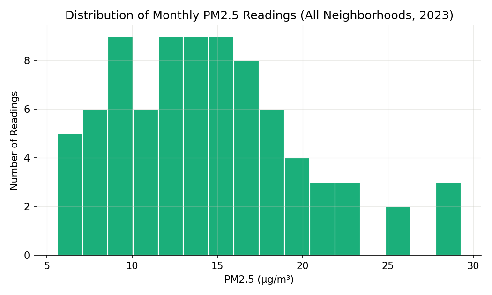
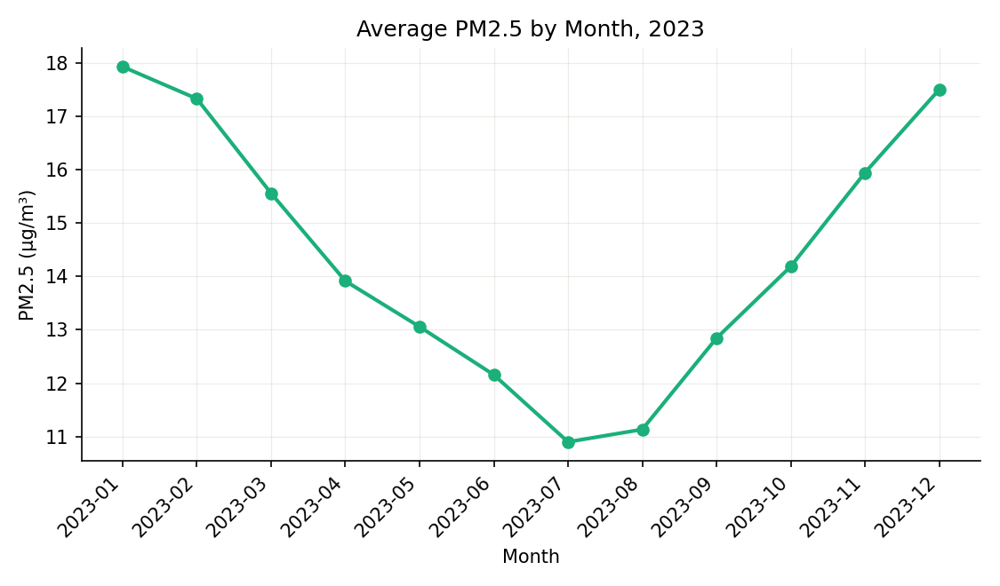

# The Air We Share

## A Table About Breathing

Every city that monitors air quality is trying to answer a question that sounds simple and isn't: *how much fine particulate matter — PM2.5, particles small enough to lodge deep in human lungs — are people actually breathing, where, and how does that change with the seasons?* Cities answer it the same way we've seen twice already this semester: they build a table, one row per place and time.

**📥 [Download the dataset: air_quality.csv](https://cs.calvin.edu/courses/data/202/26fa/datasets/air_quality.csv)**

This is a teaching dataset, built to behave like real municipal air-quality reporting — seven neighborhoods, monthly PM2.5 readings across 2023, each neighborhood's median household income, and a monitor type: an official **reference monitor** (the regulatory-grade instrument that counts toward legal compliance) or a cheaper **low-cost sensor** (less precise, but far less expensive to deploy). Treat the *shapes* of the patterns as realistic and the *exact numbers* as illustrative — this is not a real city's official record. Download it now; every table and chart below comes from running the code shown directly on this file.

```python
import pandas as pd

air = pd.read_csv("air_quality.csv")
air.head()
```

| date | neighborhood | monitor_type | median_income_usd | pm25 | notes |
|:---|:---|:---|---:|---:|:---|
| 2023-01 | Riverside | low-cost sensor | 32,000 | 29.3 | adjacent to I-95 corridor; industrial rail yard nearby |
| 2023-02 | RIVERSIDE | low-cost sensor | 32,000 | 28.2 | adjacent to I-95 corridor; industrial rail yard nearby |
| 2023-03 | riverside | low-cost sensor | 32,000 | 24.9 | adjacent to I-95 corridor; industrial rail yard nearby |
| 2023-04 | Riverside. | low-cost sensor | 32,000 | 21.6 | adjacent to I-95 corridor; industrial rail yard nearby |
| 2023-05 | Riverside | low-cost sensor | 32,000 | 20.2 | adjacent to I-95 corridor; industrial rail yard nearby |

Six plain columns, and already something is visible before we've cleaned a single cell: the same neighborhood, spelled four different ways in five rows. That is exactly where this reading starts — not with the pollution itself, but with the table that is supposed to represent it.

For context on the numbers to come: the **World Health Organization's 2021 Global Air Quality Guidelines** set an annual PM2.5 guideline of **5 µg/m³**, and the U.S. EPA's current annual health standard (revised in 2024) is **9 µg/m³**. Keep both numbers in mind as you read — you'll see how many of our seven neighborhoods clear them, and which don't.

---

## Why the Table Isn't Ready Yet

Real monitoring records look almost exactly like this excerpt: the same underlying place, typed by different people, on different forms, at different times, into slightly different strings. `"Riverside"`, `"RIVERSIDE"`, `"riverside"`, and `"Riverside."` are — to a human — obviously the same neighborhood. To `pandas`, they are four different strings, and `groupby("neighborhood")` right now would silently produce a dozen "neighborhoods" instead of seven.

This matters for more than tidiness. Sociologist and environmental-justice scholar **Robert D. Bullard**, in his foundational book *Dumping in Dixie: Race, Class, and Environmental Quality* (Westview Press, 1990), documented how the location of polluting infrastructure — highways, landfills, industrial sites — has historically clustered near lower-income communities and communities of color. If a dataset like ours can't even reliably tell you how many distinct neighborhoods it contains, it certainly can't yet tell you whether that pattern shows up here. **Cleaning the data is not a delay before the real analysis — it is the first and most consequential step of the analysis.**

---

## Check Your Understanding

<!-- QUESTION:multiple-choice -->

**Right now, before any cleaning, what would `air.groupby("neighborhood")["pm25"].mean()` actually compute?**

- [ ] The correct average PM2.5 for each of the seven real neighborhoods.
- [x] An average for every distinct *spelling* in the column — closer to a dozen groups than seven, since `"Riverside"` and `"RIVERSIDE"` are different strings to pandas.
- [ ] An error, because pandas cannot group text columns.
- [ ] The average across the whole dataset, ignoring the neighborhood column entirely.

<!-- END QUESTION -->

---

<!-- QUESTION:true-false
answer: true
-->

A dataset can be technically well-formed (no missing files, every row loads correctly) and still be unusable for grouping until its categorical text columns are cleaned.

<!-- END QUESTION -->

---

<!-- QUESTION:multiple-choice -->

**According to the WHO and EPA figures given above, which is true?**

- [ ] The WHO guideline (5 µg/m³) is less strict than the EPA standard (9 µg/m³).
- [x] The WHO guideline (5 µg/m³) is stricter than the EPA standard (9 µg/m³) — a reading can meet the U.S. legal standard while still exceeding the health-based international guideline.
- [ ] The two figures measure completely different pollutants and cannot be compared.
- [ ] Both organizations set the same annual PM2.5 limit.

<!-- END QUESTION -->

# Cleaning the Record

## Regex, in More Depth

A **regular expression (regex)** is a pattern language for describing *sets of strings* rather than one exact string. pandas' `.str.replace()`, `.str.contains()`, and `.str.match()` all accept `regex=True` to use this pattern language instead of a literal match.

| Syntax | Meaning | Example pattern | Matches |
|---|---|---|---|
| literal characters | the exact text | `shelter` | the string `shelter`, wherever it appears |
| `\|` | alternation (OR) | `industrial\|highway` | either word, in either order in the source text |
| `[...]` | a character class | `[A-Z]+` | one or more uppercase letters |
| `[^...]` | negated class | `[^a-zA-Z\s]` | anything that is *not* a letter or whitespace |
| `\d` `\s` `\w` | digit / whitespace / word character | `\d{4}` | exactly four digits, e.g. a year |
| `.` | any single character | `20.3` | `2023`, `20x3`, `20 3`... |
| `*` `+` `?` | zero-or-more / one-or-more / optional | `\s*` | zero or more whitespace characters |
| `{m,n}` | between *m* and *n* repetitions | `[0-9]{2,4}` | a 2-to-4-digit number |
| `^ ... $` | anchors: start / end of string | `^low` | the string *starts with* `low` |
| `(...)` | a group, for combining with `\|` or repeating | `(low-cost\|reference)` | either full phrase, treated as one unit |

Regex is old, general-purpose, and not unique to Python — the same syntax (with minor variations) works in R, JavaScript, `grep` at the command line, and most text editors' "find with pattern" feature. If you want a deeper reference than any single course can give, **Jeffrey Friedl's *Mastering Regular Expressions*** (O'Reilly, 3rd ed., 2006) is the classic, thorough treatment; for quick interactive practice, [regexone.com](https://regexone.com) and [regex101.com](https://regex101.com) (which also explains, piece by piece, why a pattern matches what it matches) are both free.

## Cleaning the Neighborhood Column

```python
air["neighborhood"] = (
    air["neighborhood"]
    .str.strip()                                  # remove stray leading/trailing spaces
    .str.replace("-", " ", regex=False)            # "Maple-Heights" -> "Maple Heights"
    .str.replace(r"[^a-zA-Z\s]", "", regex=True)   # drop stray punctuation: "Riverside." -> "Riverside"
    .str.title()                                   # -> consistent capitalization
)
air["neighborhood"].unique()
```

```text
['Riverside', 'Oakview', 'Fairview', 'Maple Heights', 'Downtown', 'Sunnyside', 'Highland Park']
```

Four lines collapsed twenty-eight raw spellings down to exactly the seven real neighborhoods — no explicit lookup table needed this time, because every messy variant here was a **case or punctuation** problem, not an **abbreviation** problem. (Contrast that with a dataset where `"SF"` needs to become `"San Francisco"` — no amount of case-normalizing or punctuation-stripping turns one into the other; that requires an explicit `.replace({...})` dictionary, which you practiced in Monday's class.) Knowing *which kind* of messiness you're looking at — spelling variation versus true abbreviation — is itself a skill, and it's one regex alone can't tell you; you have to look at the data.

```python
air["neighborhood"].value_counts()
```

| neighborhood | count |
|:---|---:|
| Oakview | 12 |
| Fairview | 12 |
| Maple Heights | 12 |
| Downtown | 12 |
| Sunnyside | 12 |
| Highland Park | 12 |
| Riverside | 10 |

Six neighborhoods report all twelve months. Riverside reports only **ten**. We'll come back to exactly why in a moment — but notice already that the gap is not random: it belongs to the one neighborhood with the lowest income and the only low-cost sensor we've seen so far.

---

## Filtering Against a Standard

Now that `neighborhood` is trustworthy, boolean filtering means what it looks like it means. The U.S. EPA's current annual PM2.5 standard is **9 µg/m³** — how many of our individual monthly readings exceed it?

```python
exceeds_epa = air[air["pm25"] > 9]
print(f"{len(exceeds_epa)} of {len(air)} monthly readings exceed the EPA standard")
air[air["pm25"] <= 9]["neighborhood"].value_counts()
```

```text
67 of 82 monthly readings exceed the EPA standard
```

| neighborhood | count |
|:---|---:|
| Highland Park | 10 |
| Sunnyside | 5 |

Only two neighborhoods ever dip under the standard at all, and only Highland Park does so consistently. Everywhere else, exceeding the annual health standard isn't the exception in this dataset — it's most months, in most neighborhoods. Filtering turned a vague impression ("some places seem worse") into an exact, checkable count.

---

## Flagging Text with `.str.contains()`

The `notes` column is unstructured — free text a city worker typed once per neighborhood — but it still holds a real signal: proximity to known pollution sources. Rather than reading eighty-two rows by hand, we can flag them with one regex:

```python
air["near_pollution_source"] = air["notes"].str.contains(
    r"industrial|highway|corridor|traffic", case=False, regex=True
)
air["near_pollution_source"].value_counts()
```

```text
near_pollution_source
True     46
False    36
Name: count, dtype: int64
```

Notice three choices packed into that one line: **`|`** lets one pattern check for any of four different words at once, instead of writing four separate `.str.contains()` calls and combining them with pandas' `|` (which is a *different* `|` — one combines regex alternatives inside a pattern string, the other combines boolean Series). **`case=False`** means we don't need `"Industrial"`, `"industrial"`, and `"INDUSTRIAL"` as three separate alternatives. And the words chosen are a judgment call: `"traffic"` catches Downtown's "dense traffic corridor," but it would just as easily flag a neighborhood whose only note was "light traffic, otherwise quiet" — regex matches *patterns of characters*, not *meaning*. A flag built this way is a starting point for investigation, not a finished conclusion.

## Pulling Text Out with `.str.extract()`

`.str.contains()` answers yes/no. Sometimes you want the matching *piece itself* pulled into its own column — that's what a **capture group**, `(...)`, is for:

```python
air["highway"] = air["notes"].str.extract(r"(I-\d+)")
air[air["highway"].notna()][["neighborhood", "notes", "highway"]].drop_duplicates("neighborhood")
```

| neighborhood | notes | highway |
|:---|:---|:---|
| Riverside | adjacent to I-95 corridor; industrial rail yard nearby | I-95 |

The pattern `(I-\d+)` means: match the literal text `I-`, followed by one-or-more digits, and *capture* that whole span in group 1. `.str.extract()` returns just what's inside the parentheses — here, `"I-95"` — as a new column, `NaN` for every row where the pattern didn't match at all. This is the same alternation-and-character-class toolkit from the syntax table above, just aimed at *extraction* instead of *filtering*.

---

## Check Your Understanding

<!-- QUESTION:fill-in-the-blank -->

Complete the missing piece of each regex idea from this section.

A pattern anchored with **[^]** at the start and **[$]** at the end must match the *entire* string, not just part of it.

The character class **[\d]** matches any single digit.

Writing `industrial|highway` inside a pattern uses **[alternation]** to match either word.

<!-- END QUESTION -->

---

<!-- QUESTION:multiple-choice -->

**Why did cleaning `neighborhood` need only `.str.strip()`, dash/punctuation removal, and `.str.title()` — with no explicit lookup dictionary — while a column with entries like `"SF"` and `"San Francisco"` would need one?**

- [ ] It wouldn't — both cases always need a lookup dictionary.
- [x] Every messy `neighborhood` variant differed only by case, punctuation, or a hyphen — regex and case rules can fix that. `"SF"` differs from `"San Francisco"` by *abbreviation*, a relationship no punctuation or case rule can derive on its own.
- [ ] Because `neighborhood` had no missing values, while a city column would.
- [ ] Because dictionaries only work on numeric columns.

<!-- END QUESTION -->

---

<!-- QUESTION:multiple-choice -->

**What is the key difference between `.str.contains()` and `.str.extract()`?**

- [ ] They do exactly the same thing; the names are interchangeable.
- [x] `.str.contains()` returns True/False for whether a pattern matches anywhere in the string; `.str.extract()` returns the actual text captured by a `(...)` group, or NaN if there's no match.
- [ ] `.str.extract()` only works on numeric columns.
- [ ] `.str.contains()` requires a capture group and `.str.extract()` does not.

<!-- END QUESTION -->

---

<!-- QUESTION:true-false
answer: false
-->

A regex like `r"industrial|highway|corridor|traffic"` matching a row's `notes` field is proof, by itself, that the neighborhood has an elevated pollution problem.

<!-- END QUESTION -->

# Summarizing Without Erasing

## Why Riverside Has Ten Rows, Not Twelve

```python
air[air["notes"].isnull()]   # any missing notes at all?
air.groupby("neighborhood")["pm25"].count()
```

Nothing is missing in `notes`, but two months of Riverside's `pm25` readings simply never appear as rows at all. The reason lives in `monitor_type`:

```python
air.groupby("monitor_type")["pm25"].agg(["count", "mean"]).round(1)
```

| monitor_type | count | mean |
|:---|---:|---:|
| low-cost sensor | 20 | 21.0 |
| reference | 62 | 12.1 |

Riverside and Oakview — the two lowest-income neighborhoods in this dataset — are the *only* ones monitored by low-cost sensors instead of regulatory-grade reference instruments. Low-cost sensors are cheaper to deploy, which is precisely why cash-constrained programs deploy them in exactly the places that most need reliable monitoring — and they are also more prone to downtime, which is why two of Riverside's twelve months are simply absent rather than recorded as `NaN`. This is not a hypothetical concern: a substantial public-health research literature (see, e.g., **Mikati et al., "Disparities in Distribution of Particulate Matter Emission Sources by Race and Poverty Status," *American Journal of Public Health*, 2018**) has documented that lower-income communities and communities of color in the U.S. bear a disproportionate share of PM2.5 exposure from industrial and traffic sources — the same pattern our synthetic dataset was built to illustrate. Missing monitoring data in the very neighborhoods with the worst air is not a coincidence anywhere it happens; it's a resourcing decision with a data trail.

## Aggregation, Several Ways

We've used `.mean()` on its own already. `.agg()` runs several statistics at once — and *which* statistics you choose changes what the summary can tell you:

```python
air.groupby("neighborhood")["pm25"].agg(["mean", "median", "std", "max"]).round(1)
```

| neighborhood | mean | median | std | max |
|:---|---:|---:|---:|---:|
| Riverside | 24.0 | 23.9 | 3.8 | 29.3 |
| Oakview | 18.5 | 18.3 | 2.8 | 22.3 |
| Downtown | 15.4 | 14.8 | 1.4 | 17.9 |
| Fairview | 14.9 | 14.4 | 2.3 | 18.3 |
| Maple Heights | 12.5 | 11.8 | 2.1 | 16.0 |
| Sunnyside | 10.1 | 9.8 | 1.7 | 12.6 |
| Highland Park | 7.4 | 7.2 | 1.4 | 9.6 |

**Mean** and **median** are close for every neighborhood here — a sign there's no single extreme month distorting the average. **std** (standard deviation) tells a second story entirely: Riverside's air doesn't just average worse, it *swings* more from month to month (3.8) than Highland Park's (1.4), meaning Riverside residents face more unpredictable air quality on top of worse average air quality. **max** shows the worst single month anyone actually experienced — a number the mean, by design, smooths away.

### The same computation, two syntaxes

You've seen the dict style for summarizing several *columns* at once:

```python
air.groupby("neighborhood").agg({
    "pm25": ["mean", "count"],
    "median_income_usd": "first",
})
```

**Named aggregation** does the same job with flatter, self-documenting output — often the more readable choice when you're building a table meant to be read by someone else, not just inspected by you:

```python
summary = air.groupby("neighborhood").agg(
    avg_pm25=("pm25", "mean"),
    n_readings=("pm25", "count"),
    income=("median_income_usd", "first"),
).round(1)
summary.sort_values("avg_pm25", ascending=False)
```

| neighborhood | avg_pm25 | n_readings | income |
|:---|---:|---:|---:|
| Riverside | 24.0 | 10 | 32,000 |
| Oakview | 18.5 | 12 | 38,000 |
| Downtown | 15.4 | 12 | 68,000 |
| Fairview | 14.9 | 12 | 45,000 |
| Maple Heights | 12.5 | 12 | 58,000 |
| Sunnyside | 10.1 | 12 | 72,000 |
| Highland Park | 7.4 | 12 | 95,000 |

Both cells above compute the same underlying statistics. Pick whichever reads more clearly for the audience of your specific summary — a habit worth building now, because you will choose between them constantly for the rest of the course.

### Grouping by a Column You Build Yourself

Nothing says the columns you `groupby()` have to already exist in the raw file. We can engineer a `season` column from `date` and then group by **two** columns at once — one original, one derived:

```python
air["month_num"] = air["date"].str[5:7].astype(int)
air["season"] = air["month_num"].apply(
    lambda m: "Winter" if m in (12, 1, 2) else ("Summer" if m in (6, 7, 8) else "Spring/Fall")
)

air.groupby(["neighborhood", "season"])["pm25"].mean().round(1)
```

```text
neighborhood   season
Downtown       Spring/Fall    15.1
               Summer         14.1
               Winter         17.2
Fairview       Spring/Fall    14.7
               Summer         12.3
               Winter         18.0
Highland Park  Spring/Fall     7.2
               Summer          5.8
               Winter          9.4
...            ...             ...
Riverside      Spring/Fall    22.5
               Summer         19.1
               Winter         28.7
```

Every neighborhood follows the same *seasonal* shape — winter worst, summer best — but the *size* of that swing differs: Highland Park's winter is only 3.6 µg/m³ above its summer low, while Riverside's is 9.6 higher. The neighborhood already breathing the worst air also swings the hardest between its best and worst season. A single annual average would never have shown you that the two problems compound.

One more shortcut worth knowing: `air["pm25"].describe()` runs count, mean, std, min, the quartiles, and max all in one call — a fast first look at any numeric column before you decide which of the techniques above is worth digging into further.

### When no built-in function does the job

`.agg()` also accepts **any function**, including a `lambda`, for statistics pandas doesn't ship by default — for instance, the *range* (worst month minus best month) per neighborhood:

```python
air.groupby("neighborhood")["pm25"].agg(lambda x: round(x.max() - x.min(), 1))
```

```text
neighborhood
Downtown          3.0
Fairview          4.2
Highland Park     2.4
Maple Heights     4.2
Oakview           2.1
Riverside         9.1
Sunnyside         2.8
Name: pm25, dtype: float64
```

Riverside's range — 9.1 µg/m³ between its best and worst month — is more than double every other neighborhood's. A single mean value (24.0) never would have surfaced that.

---

## Check Your Understanding

<!-- QUESTION:multiple-choice -->

**Why do Riverside and Oakview have fewer total readings than the other five neighborhoods?**

- [ ] Those neighborhoods don't exist for the full year.
- [x] They are monitored only by low-cost sensors, which are more prone to downtime — Riverside's sensor was offline for two months entirely.
- [ ] pandas drops rows automatically when income is below a threshold.
- [ ] Their `notes` column was empty, so pandas excluded those rows.

<!-- END QUESTION -->

---

<!-- QUESTION:drag-the-words -->

Drag the correct statistic into each blank.

The *[mean]* and *[median]* of Riverside's readings are close together, telling us no single month is an extreme outlier distorting the average. The *[std]* (standard deviation) reveals that Riverside's air quality is far more variable month-to-month than Highland Park's. The *[max]* shows the single worst month anyone in the dataset actually experienced — a value the *[mean]* smooths away entirely.

<!-- END QUESTION -->

---

<!-- QUESTION:true-false
answer: true
-->

Grouping by `["neighborhood", "season"]` revealed that Riverside's winter-to-summer swing (9.6 µg/m³) is noticeably larger than Highland Park's (3.6 µg/m³) — a pattern a single annual average per neighborhood would not have shown.

<!-- END QUESTION -->

---

<!-- QUESTION:multiple-choice -->

**A colleague wants a clean, self-documenting table with columns named `avg_pm25`, `n_readings`, and `income`. Which approach produces that most directly?**

- [ ] `.agg({"pm25": ["mean", "count"]})`
- [x] Named aggregation: `.agg(avg_pm25=("pm25", "mean"), n_readings=("pm25", "count"), income=("median_income_usd", "first"))`
- [ ] `.value_counts()`
- [ ] `.describe()`

<!-- END QUESTION -->

# Seeing the Pattern

## Histograms: The Shape of One Variable

```python
import plotly.express as px

px.histogram(air, x="pm25", nbins=16,
             title="Distribution of Monthly PM2.5 Readings (All Neighborhoods, 2023)",
             labels={"pm25": "PM2.5 (µg/m³)"})
```



Most readings sit between roughly 6 and 20 µg/m³ — but look at the small cluster near 28–29, separated from the rest by a gap. A histogram alone can't tell you *why* that cluster exists; it can only tell you that it's there and invite the question. (It's Riverside's winter months — you'll be able to confirm that yourself once you've combined this chapter's tools.)

## Scatter Plots: Two Variables, One Relationship

```python
px.scatter(summary, x="income", y="avg_pm25", text=summary.index,
           title="Median Household Income vs. Average PM2.5 by Neighborhood",
           labels={"income": "Median Household Income (USD)", "avg_pm25": "Average PM2.5 (µg/m³)"})
```


Six of the seven points fall along a clear downward slope: lower income, higher average pollution. The correlation across these seven neighborhoods is **-0.89** — strong, in this dataset. But look at **Downtown**: comparable income to Fairview and Maple Heights, yet noticeably worse air, because year-round traffic congestion doesn't respect income lines the way industrial siting historically has. A real analysis has to hold both facts at once: a strong overall pattern, *and* a genuine exception that a single correlation number would hide if you only reported the -0.89 and moved on. This is exactly the tension Deborah Stone will name directly when you read Chapter 1 of *Counting* this week: a single summary statistic is never merely descriptive — it's already a choice about what counts as the story.

### One More Channel: Color as a Third Variable

A scatter plot has two required channels (`x`, `y`) and several optional ones. Map `monitor_type` to `color`, and the same seven points reorganize themselves around a third question — not just "how much pollution," but "how well is it even being measured":

```python
px.scatter(summary.reset_index(), x="income", y="avg_pm25", color="monitor_type", text="neighborhood",
           title="Income, Pollution, and Monitoring Equipment",
           labels={"income": "Median Household Income (USD)", "avg_pm25": "Average PM2.5 (µg/m³)"})
```

`monitor_type` was never part of the income/pollution relationship itself — but coloring by it shows, at a glance, that the two `"low-cost sensor"` points sit at the *worst-measured, worst-polluted* end of the whole picture. Nothing about `x` or `y` changed; adding one more mapped column changed what the chart is *about*.

## Line Plots: Change Across an Order

```python
by_month = air.groupby("date")["pm25"].mean().reset_index()

px.line(by_month, x="date", y="pm25",
        title="Average PM2.5 by Month, 2023",
        labels={"date": "Month", "pm25": "PM2.5 (µg/m³)"})
```



A clear winter peak, summer trough — consistent with a well-documented seasonal pattern in many temperate cities, where cold weather traps pollutants near the ground (a **temperature inversion**) and increases heating-related emissions. Add Riverside's own line to the same chart and its winter months separate sharply from everyone else's:

```python
riverside_month = air[air["neighborhood"] == "Riverside"].groupby("date")["pm25"].mean().reset_index()
# plot both `by_month` and `riverside_month` as separate traces, same x-axis
```


Riverside tracks the same seasonal *shape* as everyone else — just shifted upward by roughly 8–10 µg/m³ every month. And notice the line's July–August gap: this is what a missing value looks like in a line chart. `pandas` doesn't invent a zero for a month that was never recorded; the line simply has nothing to plot there, which is a more honest failure mode than silently pretending the sensor read zero.

## Bar Charts: Comparing Categories

```python
px.bar(summary.sort_values("avg_pm25", ascending=False).reset_index(),
       x="neighborhood", y="avg_pm25",
       title="Average PM2.5 by Neighborhood (2023)",
       labels={"neighborhood": "Neighborhood", "avg_pm25": "Average PM2.5 (µg/m³)"})
```


The two tallest bars — the two worst-polluted neighborhoods — are marked with an asterisk here because they're also the *only two* without a reference-grade monitor. A bar chart ranks neighborhoods by pollution; it takes an extra annotation, deliberately added, to also show you which neighborhoods are being measured with the least reliable instruments. **Nothing about the chart type forces that annotation to appear** — a bar chart maker who wanted to understate the monitoring gap could simply leave it off, and the chart would look no less "correct."

---

## Choosing Well, and Citing Your Choices

Every chart in this reading made at least three decisions that never show up explicitly in the final image: which rows to include, which statistic to plot (mean? median? a single month?), and how to order or annotate the categories. **Claus O. Wilke's *Fundamentals of Data Visualization*** (O'Reilly, 2019) — already one of this course's supplemental references — devotes its opening chapters to exactly this: choosing a plot type is inseparable from choosing what you want a reader to conclude. And **Darrell Huff's *How to Lie with Statistics*** (1954) remains, seven decades later, a short and readable catalogue of how aggregation and chart choices — truncated axes, cherry-picked time windows, an average with no spread reported — can make a technically accurate chart actively misleading.

If you want to work with real air-quality data instead of this teaching dataset, **[OpenAQ](https://openaq.org)** aggregates open air-quality measurements from government and research monitors in dozens of countries, free to download — a real-world equivalent of the file you used today. The EPA's own environmental-justice mapping tool, **EJScreen**, was built specifically to let anyone check whether a given neighborhood's pollution burden and demographics look like the pattern in this reading, or not.

---

## Check Your Understanding

<!-- QUESTION:multiple-choice -->

**The correlation between income and average PM2.5 across these seven neighborhoods is -0.89. What does the Downtown data point demonstrate about relying on that single number alone?**

- [ ] Nothing — a correlation of -0.89 means every neighborhood must fall exactly on the trend line.
- [x] A strong overall correlation can still coexist with a genuine exception (Downtown: mid-range income, elevated pollution from traffic) that the correlation number alone doesn't reveal.
- [ ] It proves the correlation is calculated incorrectly.
- [ ] It shows that income has no relationship to air quality in this dataset.

<!-- END QUESTION -->

---

<!-- QUESTION:multiple-choice -->

**In the histogram of all PM2.5 readings, a small cluster of values sits near 28–29 µg/m³, separated by a gap from the main cluster of the data. What can the histogram tell you about that cluster, and what can't it tell you?**

- [ ] It can tell you exactly which neighborhood and month produced those readings.
- [x] It can show you *that* an unusual, separated cluster exists — but not *why*; identifying the cause requires going back to the grouped or filtered data.
- [ ] It proves those readings are measurement errors and should be deleted.
- [ ] A histogram cannot show gaps in a distribution; this would require a scatter plot.

<!-- END QUESTION -->

---

<!-- QUESTION:true-false
answer: false
-->

Once a chart is technically accurate — correct data, correctly plotted — the choices behind it (which statistic, which rows, which annotations) no longer matter for how a reader interprets it.

<!-- END QUESTION -->

---

<!-- QUESTION:drag-the-words -->

Drag the correct plot type into each blank.

To see the overall shape and spread of a single numeric variable like PM2.5, use a *[histogram]*. To examine whether two numeric variables — like income and average PM2.5 — move together, use a *[scatter]* plot. To track how a variable changes across an ordered sequence like months of the year, use a *[line]* plot. To compare a number across discrete categories like neighborhoods, use a *[bar]* chart.

<!-- END QUESTION -->
